# 算法4

[TOC]


## 1. 基础

### 1.1 栈

下压栈API：

`public class Stack<Item> implements Iterable<Item>`

- `boolean isEmpty();`
- `int size();`

- `void push(Item item);`
- `Item pop();`

#### 1.1.1  使用数组实现的下压栈

```java
import edu.princeton.cs.algs4.StdOut;
import java.util.Iterator;

public class ResizingArrayStack<Item> implements Iterable<Item> {
    private Item[] array = (Item[]) new Object[1];
    private int N = 0;

    public boolean isEmpty() {
        return N == 0;
    }

    public int size() {
        return N;
    }

    public void push(Item item) {
        if (N == array.length) resize(array.length * 2);
        array[N++] = item;
    }

    public Item pop() {
        Item item = array[--N];
        array[N] = null;
        if (N > 0 && N == array.length / 4)
            resize(array.length / 2);
        return item;
    }

    public Iterator<Item> iterator() {
        return new ReverseArrayIterator();
    }

    private void resize(int max) {
        Item[] temp = (Item[]) new Object[max];
        for (int i = 0; i < N; i++)
            temp[i] = array[i];
        array = temp;
    }

    private class ReverseArrayIterator implements Iterator<Item> {
        private int i = N;

        public boolean hasNext() {
            return i > 0;
        }

        public Item next() {
            return array[--i];
        }

        public void remove() {
            throw new UnsupportedOperationException();
        }
    }

    public static void main(String[] args) {
        ResizingArrayStack<Integer> resizingArrayStack = new ResizingArrayStack<Integer>();

        resizingArrayStack.push(20);
        resizingArrayStack.push(32);
        resizingArrayStack.push(321);
        StdOut.println(resizingArrayStack.pop());
        StdOut.println(resizingArrayStack.pop());
        StdOut.println(resizingArrayStack.pop());
    }
}
```


#### 1.1.2  使用链表实现的下压栈

```java
import edu.princeton.cs.algs4.StdOut;
import java.util.Iterator;

public class ListStack<Item> implements Iterable<Item> {
    private Node first;
    private int N = 0;

    private class Node {
        Item item;
        Node next;
    }

    private class ListIterator implements Iterator<Item> {
        private Node current = first;

        public boolean hasNext() {
            return current != null;
        }

        public Item next() {
            Item item = current.item;
            current = current.next;
            return item;
        }

        public void remove() {
            throw new UnsupportedOperationException();
        }
    }

    public boolean isEmpty() {
        return N == 0;
    }

    public int size() {
        return N;
    }

    public void push(Item item) {
        Node oldnode = first;
        first = new Node();
        first.item = item;
        first.next = oldnode;
        ++N;
    }

    public Item pop() {
        Item item = first.item;
        first = first.next;
        --N;
        return item;
    }

    public Iterator<Item> iterator() {
        return new ListIterator();
    }

    public static void main(String[] args) {
        ListStack<Integer> listStack = new ListStack<Integer>();

        listStack.push(12);
        listStack.push(2);
        listStack.push(234);
        StdOut.println(listStack.pop());
        StdOut.println(listStack.pop());
        StdOut.println(listStack.pop());
    }
}

```


### 1.2 队列

队列API：

`public class Queue<Item> implements Iterable<Item>`

- `int size();`
- `boolean isEmpty();`
- `void enqueue(Item item);`
- `Item dequeue();`

```java
import edu.princeton.cs.algs4.StdOut;

import java.util.Iterator;
import java.util.List;

public class Queue<Item> implements Iterable<Item> {
    private Node first;
    private Node last;
    int N = 0;

    private class Node {
        Item item;
        Node next;
    }

    private class ListIterator implements Iterator<Item> {
        private Node current = first;

        public boolean hasNext() {
            return current != null;
        }

        public Item next() {
            Item item = current.item;
            current = current.next;
            return item;
        }

        public void remove() {
            throw new UnsupportedOperationException();
        }
    }

    public boolean isEmpty() {
        return N == 0;
    }

    public int size() {
        return N;
    }

    public void enqueue(Item item) {
        Node oldlast = last;
        last = new Node();
        last.item = item;
        last.next = null;
        if (isEmpty()) first = last;
        else oldlast.next = last;
        N++;
    }

    public Item dequeue() {
        Item item = first.item;
        first = first.next;
        N--;
        if (isEmpty()) last = null;
        return item;
    }

    public ListIterator iterator() {
        return new ListIterator();
    }

    public static void main(String[] args) {
        Queue<Integer> queue = new Queue<Integer>();

        queue.enqueue(32);
        queue.enqueue(53);
        queue.enqueue(2340);
        for (Integer elem : queue) {
            StdOut.println(elem)
        }
        StdOut.println(queue.dequeue());
        StdOut.println(queue.dequeue());
        StdOut.println(queue.dequeue());
        StdOut.println("final size: " + queue.size());
    }
}
```


### 1.3 背包

背包API：

`public class Bag<Item> implements Iterable<Item>`

- `int size();`
- `boolean isEmpty();`
- `void add(Item item);`

```java
import edu.princeton.cs.algs4.In;
import edu.princeton.cs.algs4.ST;
import edu.princeton.cs.algs4.StdOut;

import java.util.Iterator;

public class Bag<Item> implements Iterable<Item> {
    private Node first;
    private int N = 0;

    private class Node {
        Item item;
        Node next;
    }

    private class ListIterator implements Iterator<Item> {
        private Node current = first;

        public boolean hasNext() {
            return current != null;
        }

        public Item next() {
            Item item = current.item;
            current = current.next;
            return item;
        }

        public void remove() {
            throw new UnsupportedOperationException();
        }
    }

    public boolean isEmpty() {
        return N == 0;
    }

    public int size() {
        return N;
    }

    public void add(Item item) {
        Node oldfirst = first;
        first = new Node();
        first.item = item;
        first.next = oldfirst;
        N++;
    }

    public Iterator iterator() {
        return new ListIterator();
    }

    public static void main(String[] args) {
        Bag<Integer> bag = new Bag<Integer>();

        bag.add(120);
        bag.add(32);
        bag.add(42);
        for (Integer elem : bag)
            StdOut.println(elem);
        StdOut.println("current size: " + bag.size());
    }
}
```


### 1.4 链表

使用C实现的单链表：

```c
#include <stdio.h>
#include <string.h>
#include <stdlib.h>


struct Node{
    struct Node*next;
    char value[1];/* 虽然value数组只有一个字节，但可以通过malloc扩展
                    字节大小，而且还能够很好的获取其指针 */
};


struct List{
    struct Node*first;
    struct Node*last;
    int ListSize;
};


/*
 * 链表初始化
 */
void ListInit(struct List*list){
    list->first=NULL;
    list->last=NULL;
    list->ListSize=0;
}


/*
 * 链表销毁 
 */
void ListDestroy(struct List*list){
    struct Node*node,*temp;

    node=list->first;
    while(node!=NULL){
        temp=node;
        node=node->next;
        free(temp);
    }
    list->first=NULL;
    list->last=NULL;
    list->ListSize=0;
}


/* 
 * 返回链表长度
 */
static inline 
int Size(const struct List*list){
    return list->ListSize;
}


/*
 * 链表是否为空
 */
static inline 
int isEmpty(const struct List*list){
    return list->ListSize==0;
}


/*
 * 链表前向插入数据
 */
struct Node* FInsert(struct List*list,void*value,size_t sz){
    struct Node*newNode;

    if((newNode=malloc(sizeof(struct Node)+sz-1))==NULL)
        return NULL;
    memcpy(newNode->value,value,sz);
    newNode->next=list->first;
    if(isEmpty(list)) list->last=newNode;
    list->first=newNode;
    list->ListSize++;
    return newNode;
}


/*
 * 链表后向插入 
 */
struct Node* BInsert(struct List*list,void*value,size_t sz){
    struct Node*newNode;

    if((newNode=malloc(sizeof(struct Node)+sz-1))==NULL)
        return NULL;
    memcpy(newNode->value,value,sz);
    newNode->next=NULL;
    if(isEmpty(list)) list->first=newNode;
    else list->last->next=newNode;
    list->last=newNode;
    list->ListSize++;
    return newNode;
}


/*
 * 链表普通插入，当node==NULL等同于FInsert() 
 */
struct Node* Insert(struct List*list,struct Node*node,void*value,size_t sz){
    struct Node*newNode;

    if(node==NULL)
        return FInsert(list,value,sz);
    else if(list->first==NULL)
        return NULL;
    if((newNode=malloc(sizeof(struct Node)+sz-1))==NULL)
        return NULL;
    memcpy(newNode->value,value,sz);
    newNode->next=node->next;
    node->next=newNode;
    if(list->last==node)
        list->last=newNode;
    list->ListSize++;
    return newNode;
}


/*
 * 链表前向删除元素 
 */
int FRemove(struct List*list,void*retval,size_t sz){
    struct Node*temp;

    if(isEmpty(list))
        return -1;
    if(retval!=NULL)//若retval非空才选择拷贝待删除元素中的数据
        memcpy(retval,list->first->value,sz);
    temp=list->first;
    list->first=list->first->next;
    free(temp);
    if(list->ListSize==1)
        list->last=NULL;
    list->ListSize--;
    return 0;     
}


//不支持bremove()


/*
 * 普通链表元素删除，当node==NULL时等同于FRemove()
 */
int Remove(struct List*list,struct Node*node,void*retval,size_t sz){
    struct Node*temp;

    if(node==NULL)
        return FRemove(list,retval,sz);
    if(node->next==NULL)
        return NULL;
    temp=node->next;
    node->next=temp->next;
    if(list->last==temp)
        list->last=node;
    if(retval!=NULL)
        memcpy(retval,temp->value,sz);
    free(temp);
    list->ListSize--;
    return 0;
}


/*
 * 链表遍历函数，使用用法类似于strtok() 
 */
struct Node* Iterator(struct List*list){
    static struct Node*node=NULL;
    struct Node*ret=NULL;
    
    if(list!=NULL)
        node=list->first;
    if(node!=NULL){
        ret=node;
        node=node->next;
    }
    return ret;
}


/*
 * 返回链表首元素指针
 */
inline static 
struct Node*First(struct List*list){
    return list->first;
}


/*
 * 返回链表尾元素指针 
 */
inline static 
struct Node*Last(struct List*list){
    return list->last;
}


/*
 * 在链表中查找指定元素 
 */
struct Node*Find(const struct List*list,const void*val,size_t sz,
                int(*pf)(const void*,const void*)){
    struct Node*node=list->first;

    while(node!=NULL){
        if(pf(node->value,val))
            return node;
        node=node->next;
    }
    return NULL;
}


int main(void){
    struct List list;
    double darr[10]={
        1.2,1.4,3.12,3.1,8.3,
        2.4,8.3,3.2,6.4,1.6
    };

    ListInit(&list);
    for(int i=0;i<5;i++)
        Insert(&list,NULL,(void*)&darr[i],sizeof(double));
    for(int i=5;i<10;++i)
        Insert(&list,list.last,(void*)&darr[i],sizeof(double));

    for(const struct Node*p=Iterator(&list);
            p!=NULL;p=Iterator(NULL)){
        printf("%.2f\n",*(double*)(p->value));
    }
    printf("current list size: %d\n",Size(&list));
    ListDestroy(&list);
    printf("final list size: %d\n",Size(&list));
    
    return 0;
}
```


### 1.5 算法分析

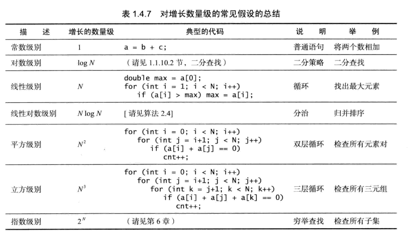


### 1.6 union-find算法

union-find的API：`public class UF`

- `UF(int N)`
- `void find(int p)`
- `int find(int pos)`
- `boolean connected(int p,int q)`
- `int count()`

UF1：使用数组遍历式方式进行连通实现

```java
import edu.princeton.cs.algs4.In;
import edu.princeton.cs.algs4.StdIn;
import edu.princeton.cs.algs4.StdOut;

public class UF1 {
    private int[] id;
    private int count;

    public UF1(int N) {
        id = new int[N];
        count = N;
        for (int i = 0; i < N; i++)
            id[i] = i;
    }

    public int count() {
        return count;
    }

    public int find(int pos) {
        return id[pos];
    }

    public boolean connected(int p, int q) {
        return find(p) == find(q);
    }

    public void union(int p, int q) {
        int pID = find(p);
        int qID = find(q);

        if (pID == qID) return;
        for (int i = 0; i < id.length; ++i)
            if (id[i] == pID) id[i] = qID;
        count--;
    }

    public static void main(String[] args) {
        int[] array = In.readInts(args[0]);
        int cnt = 0, N = array[cnt++];
        UF1 uf1 = new UF1(N);

        while (cnt < array.length) {
            int p = array[cnt++];
            int q = array[cnt++];
            if (uf1.connected(p, q)) continue;
            uf1.union(p, q);
            StdOut.println(p + " " + q);
        }
        StdOut.println(uf1.count() + " components");
    }
}
```


UF2：使用节点连接到同一个树根的方式完成连通分量的来链接

```java
import edu.princeton.cs.algs4.In;
import edu.princeton.cs.algs4.StdOut;

public class UF2 {
    private int[] id;
    private int count;

    public UF2(int N) {
        id = new int[N];
        count = N;
        for (int i = 0; i < N; i++)
            id[i] = i;
    }

    public int count() {
        return count;
    }

    public int find(int pos) {
        while (pos != id[pos]) pos = id[pos];
        return pos;
    }

    public boolean connected(int p, int q) {
        return find(p) == find(q);
    }

    public void union(int p, int q) {
        int pID = find(p);
        int qID = find(q);

        if (pID != qID) {
            id[pID] = qID;
            count--;
        }
    }

    public static void main(String[] args) {
        int[] array = In.readInts(args[0]);
        int cnt = 0, N = array[cnt++];
        UF2 uf2 = new UF2(N);

        while (cnt < array.length) {
            int p = array[cnt++];
            int q = array[cnt++];
            if (uf2.connected(p, q)) continue;
            uf2.union(p, q);
            StdOut.println(p + " " + q);
        }
        StdOut.println(uf2.count() + " connected");
    }
}
```

图示链接过程：


UF3：在UF2的基础上增加一个记录连通分量的节点数的数组，每次进行挂载（链接）的时候根据连通分量树的大小将小树挂在大树的根节点上

```java
import edu.princeton.cs.algs4.In;
import edu.princeton.cs.algs4.StdOut;

public class UF3 {
    private int[] id;
    private int[] sz;
    private int count;

    public UF3(int N) {
        id = new int[N];
        sz = new int[N];
        count = N;
        for (int i = 0; i < N; i++) {
            id[i] = i;
            sz[i] = 1;
        }
    }

    public int count() {
        return count;
    }

    public int find(int pos) {
        while (pos != id[pos]) pos = id[pos];
        return pos;
    }

    public boolean connected(int p, int q) {
        return find(p) == find(q);
    }

    public void union(int p, int q) {
        int pID = find(p);
        int qID = find(q);

        if (pID != qID) {
            //将小树挂在大树的根节点上
            if (sz[pID] < sz[qID]) {
                id[pID] = qID;
                sz[qID] += sz[pID];
            } else {
                id[qID] = pID;
                sz[pID] += sz[qID];
            }
            count--;
        }
    }

    public static void main(String[] args) {
        int[] array = In.readInts(args[0]);
        int cnt = 0, N = array[cnt++];
        UF3 uf3 = new UF3(N);

        while (cnt < array.length) {
            int p = array[cnt++];
            int q = array[cnt++];
            if (uf3.connected(p, q)) continue;
            uf3.union(p, q);
            StdOut.println(p + " " + q);
        }
        StdOut.println(uf3.count() + " connected");
    }
}
```

链接图示：


## 2. 排序

公共类API：`public class Sort`

- `private  static boolean less(Comparable lhs, Comparable rhs)`
- `private static void swap(Comparable[] a, int i,int j)`
- `private static void show(Comparable[] a)`
- `public static  boolean isSorted(Comparable[] a)`
- `public static void sort(Comparable[] a)`

封装sort静态方法的类展示如下，后面只展示sort()方法

```java
import edu.princeton.cs.algs4.In;
import edu.princeton.cs.algs4.StdOut;
import edu.princeton.cs.algs4.StdRandom;
import jdk.nashorn.internal.ir.LiteralNode;

public class Sort {
    private static boolean less(Comparable lhs, Comparable rhs) {
        return lhs.compareTo(rhs) < 0;
    }

    private static void swap(Comparable[] a, int i, int j) {
        Comparable temp = a[i];
        a[i] = a[j];
        a[j] = temp;
    }

    private static void show(Comparable[] a) {
        for (int i = 0; i < a.length; ++i)
            StdOut.println(a[i]);
    }

    public static boolean isSorted(Comparable[] a) {
        for (int i = 1; i < a.length; i++)
            if (less(a[i], a[i - 1]))
                return false;
        return true;
    }

    public static void sort(Comparable[] a) {
		//见下
    }

    public static void main(String[] args) {
        Integer[] array = new Integer[100];
        for (int i = 0; i < array.length; ++i)
            array[i] = (Integer) StdRandom.uniform(0, 100);

        sort(array);
        show(array);
    }
}

```


### 2.1 初级排序

#### 2.1.1  冒泡排序

慢慢的将当前剩余最大的值交换到相对最后位置，如同气泡向水面上冒一样。时间复杂度$N^2$

```java
    public static void sort(Comparable[] a) {
        for (int i = a.length; i > 0; i--) {
            for (int j = 1; j < i; ++j)
                if (less(a[j], a[j - 1]))
                    swap(a, j, j - 1);
        }
    }
```


#### 2.1.2  选择排序

核心思想就是将依次最小的元素放在数组最前面。时间复杂度$N^2$

```java
    public static void sort(Comparable[] a) {
        for (int i = 0; i < a.length; ++i) {
            int min = i;
            for (int j = i + 1; j < a.length; ++j) {//选取出最小下标
                if (less(a[j], a[min]))
                    min = j;
            }
            swap(a, i, min);
        }
    }
```


#### 2.1.3  插入排序

核心思想就是将第j个元素插入到数组前j-1个元素的某个恰当位置中。时间复杂度$N^2$

解法1：

```java
    public static void sort(Comparable[] a) {
        for (int i = 1; i < a.length; ++i) {
            for (int j = i; j > 0 && less(a[j], a[j - 1]); --j)
                swap(a, j, j - 1);
        }
    }
```

解法2：采用移动而不是交换，节省交换成本

```java
    public static void sort(Comparable[] a) {
        for (int i = 1, j; i < a.length; ++i) {
            Comparable temp = a[i];
            for (j = i; j > 0 && less(temp, a[j - 1]); j--)
                a[j] = a[j - 1];
            a[j] = temp;
        }
    }
```

图示：

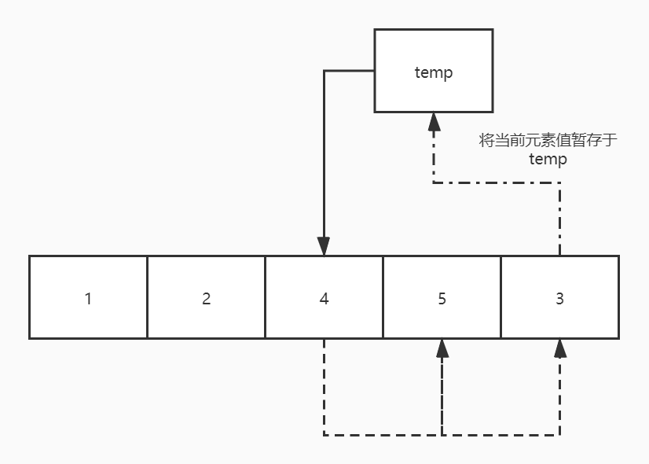


#### 2.14  希尔排序

希尔排序的核心思想就是：先对相隔一段间距的元素进行插入排序使得数组部分有序，然后减少间隔量最终变成完全的插入排序，此时达到最终的有序。时间复杂度小于$N^2$，递增序列$1/2(3^k-1)$可以做到$N^{3/2}$

解法1：

```java
    public static void sort(Comparable[] a) {
        for (int h = a.length / 3; h >= 1; h /= 3) {
            for (int i = h; i < a.length; i++)
                for (int j = i; j >= h && less(a[j], a[j - h]); j -= h)
                    swap(a, j, j - h);
        }
    }
```

解法2：

```java
    public static void sort(Comparable[] a) {
        for (int h = a.length / 3; h >= 1; h /= 3) {
            for (int i = h, j; i < a.length; ++i) {
                Comparable temp = a[i];
                for (j = i; j >= h && less(temp, a[j - h]); j -= h)
                    a[j] = a[j - h];
                a[j] = temp;
            }
        }
    }
```


### 2.2 归并排序

自顶向下的归并排序，即使用了分而治之的方法将大数组分解成小数组然后进行归并

```java
    private static Comparable[] aux;

	//归并操作
    public static void merge(Comparable[] a, int low, int mid, int high) {
        int i = low, j = mid + 1;
        for (int k = low; k <= high; ++k)
            aux[k] = a[k];

        for (int k = low; k <= high; ++k) {
            if (i > mid)
                a[k] = aux[j++];
            else if (j > high)
                a[k] = aux[i++];
            else if (less(aux[i], aux[j]))
                a[k] = aux[i++];
            else
                a[k] = aux[j++];
        }
    }

	//递归式归并排序操作
    private static void msort(Comparable[] a, int low, int high) {
        if (high - low <= 0) return;
//        else if(high-low<15)
//            InsertSort(a,low,high);

        int mid = low + (high - low) / 2;
        msort(a, low, mid);
        msort(a, mid + 1, high);
        merge(a, low, mid, high);
    }

	//封装了msort的归并排序操作
    public static void sort(Comparable[] a) {
        aux = new Comparable[a.length];
        msort(a, 0, a.length - 1);
    }
```

改进版归并排序：当分割后的数组规模小于15时采用插入排序进行解决，而不再继续使用分割（因为插入排序对于小数组而言可能比归并排序更快）

```java
    private static Comparable[] aux;

    //归并操作
    public static void merge(Comparable[] a, int low, int mid, int high) {
        int i = low, j = mid + 1;
        for (int k = low; k <= high; ++k)
            aux[k] = a[k];

        for (int k = low; k <= high; ++k) {
            if (i > mid)
                a[k] = aux[j++];
            else if (j > high)
                a[k] = aux[i++];
            else if (less(aux[i], aux[j]))
                a[k] = aux[i++];
            else
                a[k] = aux[j++];
        }
    }

    //插入排序
    public static void InsertSort(Comparable[] a, int low, int high) {
        for (int i = low, j; i <= high; ++i) {
            Comparable temp = a[i];
            for (j = i; j > low && less(temp, a[j - 1]); --j)
                a[j] = a[j - 1];
            a[j] = temp;
        }
    }

    //递归式的归并排序
    private static void msort(Comparable[] a, int low, int high) {
        if (high - low <= 0) return;
        else if (high - low < 15)
            InsertSort(a, low, high);
        else {
            int mid = low + (high - low) / 2;
            msort(a, low, mid);
            msort(a, mid + 1, high);
            //若该局部数组已经有序，则不需要再进入merge之中
            if (less(a[mid + 1], a[mid]))
                merge(a, low, mid, high);
        }
    }

    //封装递归之后的归并排序
    public static void sort(Comparable[] a) {
        aux = new Comparable[a.length];
        msort(a, 0, a.length - 1);
    }
```

自顶向下的归并排序，其运行方向与上面相反，从低端从顶端运行，先两两归并，然后44归并，。。最后整体归并

```java
    private static Comparable[] aux;

	//归并操作
    public static void merge(Comparable[] a, int low, int mid, int high) {
        int i = low, j = mid + 1;
        for (int k = low; k <= high; ++k)
            aux[k] = a[k];

        for (int k = low; k <= high; ++k) {
            if (i > mid)
                a[k] = aux[j++];
            else if (j > high)
                a[k] = aux[i++];
            else if (less(aux[i], aux[j]))
                a[k] = aux[i++];
            else
                a[k] = aux[j++];
        }
    }

    //封装递归之后的归并排序
    public static void sort(Comparable[] a) {
        int N = a.length;
        aux = new Comparable[N];
        for (int sz = 1; sz < N; sz *= 2) {
            for (int lo = 0; lo < N - sz; lo += sz * 2)
                merge(a, lo, lo + sz - 1, Math.min(N - 1, lo + sz * 2 - 1));
        }
    }
```


### 2.3 快速排序

#### 2.3.1  普通快速排序

```java
    private static int partition(Comparable[] a, int low, int high) {
        int i = low, j = high + 1;
        Comparable key = a[low];

        while (true) {
            while (less(a[++i], key))
                if (i == high) break;
            while (less(key, a[--j]))
                if (j == low) break;
            if (i >= j) break;
            swap(a, i, j);
        }
        swap(a, low, j);
        return j;
    }

    public static void qsort(Comparable[] a, int low, int high) {
        if (low >= high) return;

        int pos = partition(a, low, high);
        qsort(a, low, pos - 1);
        qsort(a, pos + 1, high);
    }

    public static void sort(Comparable[] a) {
        qsort(a, 0, a.length - 1);
    }
```

快速排序的改进版1：面对小数组使用插入排序进行代替

```java
    public static void InsertionSort(Comparable[] a, int low, int high) {
        for (int i = low, j; i < high; i++) {
            Comparable temp = a[low];
            for (j = i; j > 0 && less(a[j], a[j - 1]); --j)
                a[j] = a[j - 1];
            a[j] = temp;
        }
    }

    public static void qsort(Comparable[] a, int low, int high) {
        if (high - low <= 0) return;
        else if (high - low < 10) {
            InsertionSort(a, low, high);
            return;
        }

        int pos = partition(a, low, high);
        qsort(a, low, pos - 1);
        qsort(a, pos + 1, high);
    }

    public static void sort(Comparable[] a) {
        qsort(a, 0, a.length - 1);
    }
```

快速排序改进版2：使用三取样+小数组转而用插入排序完成的方式来加速数组排序

```java
    //三取样确定切分元素位置，保证key值不大不小
	private static int ThreeMid(Comparable[] a, int low, int high) {
        Integer[] temp = {low, low + (high - low) / 2, high};
        for (int i = 1, j; i < temp.length; ++i) {
            Integer t = temp[i];
            for (j = i; j > 0 && less(a[j], a[j - 1]); --j)
                temp[j] = temp[j - 1];
            temp[j] = t;
        }
        return temp[1];
    }

    public static int partition(Comparable[] a, int low, int high) {
        int i = low, j = high + 1;
        swap(a, ThreeMid(a, low, high), low);
        Comparable key = a[low];

        while (true) {
            while (less(a[++i], key))
                if (i == high) break;
            while (less(key, a[--j]))
                if (j == low) break;
            if (i >= j) break;
            swap(a, i, j);
        }
        swap(a, low, j);
        return j;
    }

    public static void InsertionSort(Comparable[] a, int low, int high) {
        for (int i = low, j; i <= high; ++i) {
            Comparable t = a[i];
            for (j = i; j > low && less(a[j], a[j - 1]); --j)
                a[j] = a[j - 1];
            a[j] = t;
        }
    }

    public static void qsort(Comparable[] a, int low, int high) {
        if (high - low <= 0) return;
        else if (high - low < 10) {
            InsertionSort(a, low, high);
            return;
        }

        int mid = partition(a, low, high);
        qsort(a, low, mid - 1);
        qsort(a, mid + 1, high);
    }

    public static void sort(Comparable[] a) {
        qsort(a, 0, a.length - 1);
    }
```

#### 2.3.2  三切分快速排序

```java
	//3取样    
	private static int ThreeMid(Comparable[] a, int low, int high) {
        Integer[] temp = {low, low + (high - low) / 2, high};
        for (int i = 1, j; i < temp.length; ++i) {
            Integer t = temp[i];
            for (j = i; j > 0 && less(a[j], a[j - 1]); --j)
                temp[j] = temp[j - 1];
            temp[j] = t;
        }
        return temp[1];
    }

    public static void qsort(Comparable[] a, int low, int high) {
        if (high - low <= 0) return;

        swap(a, low, ThreeMid(a, low, high));//用到了3取样方法
        int lt = low, i = low + 1, gt = high;
        Comparable v = a[low];
        
        while (i <= gt) {
            int cmp = a[i].compareTo(v);
            if (cmp < 0)
                swap(a, lt++, i++);
            else if (cmp > 0)
                swap(a, gt--, i);
            else
                i++;
        }
        qsort(a, low, lt - 1);
        qsort(a, gt + 1, high);
    }

    public static void sort(Comparable[] a) {
        qsort(a, 0, a.length - 1);
    }
```

图示：


### 2.4 优先队列

优先队列API：

`public class MaxPQ<Key extends Comparable<Key>>`

- `MaxPQ()`
- `MaxPQ(int max)`
- `MaxPQ(Key[] a)`
- `void insert(Key v)`
- `Key max()`
- `Key delMax()`
- `boolean isEmpty()`
- `int size()`

#### 2.4.1 最大堆

一个允许动态调整的最大二叉堆：

```java
import edu.princeton.cs.algs4.StdOut;

public class MaxPQ<Key extends Comparable<Key>> {
    private Key[] pq;
    private int capacity;
    private int N = 0;

    public MaxPQ(int maxN) {
        pq = (Key[]) new Comparable[maxN + 1];
        capacity = maxN;
    }

    public boolean isEmpty() {
        return N == 0;
    }

    public int size() {
        return N;
    }

    //插入操作
    public void insert(Key v) {
        if (isFull())
            resize(capacity * 2);
        pq[++N] = v;
        swim(N);
    }

    //删除最大堆中最大值元素，并返回
    public Key delMax() {
        //这里可以加入越界检查，不过也无所谓
        Key max = pq[1];
        pq[1] = pq[N--];
        pq[N + 1] = null;
        sink(1);

        if ((N + 1) < capacity / 4)
            resize(capacity / 2);
        return max;
    }

    /* 工具方法： */
    
    private boolean less(int i, int j) {
        return pq[i].compareTo(pq[j]) < 0;
    }

    private void swap(int i, int j) {
        Key temp = pq[i];
        pq[i] = pq[j];
        pq[j] = temp;
    }

    //使指定位置元素上浮，直到合理位置为止
    private void swim(int k) {
        while (k > 1 && less(k / 2, k)) {
            swap(k, k / 2);
            k /= 2;
        }
    }

    //使指定位置元素下沉，直到合理位置为止
    private void sink(int k) {
        while (2 * k <= N) {
            int j = k * 2;
            if (j < N && less(j, j + 1)) j++;
            if (!less(k, j)) break;
            swap(k, j);
            k = j;
        }
    }

    private void resize(int maxN) {
        Key[] temp = (Key[]) new Comparable[maxN];
        for (int i = 1; i <= N; ++i)
            temp[i] = pq[i];
        capacity *= 2;
        pq = temp;
    }

    private boolean isFull() {
        return N + 1 == capacity;
    }

    public static void main(String[] args) {
        MaxPQ<Integer> maxPQ = new MaxPQ<Integer>(110);

        for (int i = 0; i < 200; i++)
            maxPQ.insert(i);
        while (!maxPQ.isEmpty())
            StdOut.println(maxPQ.delMax());
    }
}

```

#### 2.4.2  索引优先队列

索引优先队列的作用在于允许用户引用；已经进入优先队列的元素，其关键就是给其中每一个元素添加一个索引。我们可以认为这种数据结构就是一种能够快速访问其中最小元素的数组。其API如下所示：

`public class IndexMinPQ<Item extends Comparable<Item>>`

- `IndexMinPQ(int maxN)`
- `void insert(int k,Item item)`
- `void change(int k,Item item)`
- `boolean contains(int k)`
- `void delete(int k)`
- `Item min()`
- `int minIndex()`
- `int delMin()`
- `boolean isEmty()`
- `int size()`

具体的原理可以参看如下这篇博文：

> [索引优先队列的工作原理与简易实现)](https://www.cnblogs.com/nullzx/p/6624731.html)

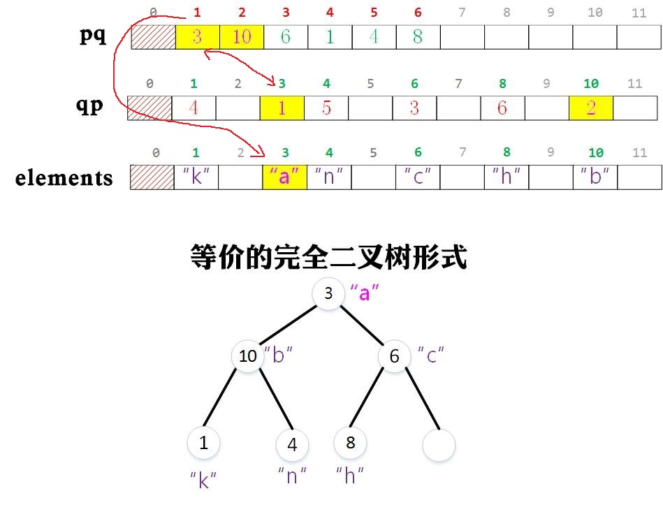

```java
public class IndexMinPQ<Key extends Comparable<Key>> {
    private int[] pq;//索引二叉堆，保存进行优先排序的元素在keys数组中的索引
    private int[] qp;//存储在某一个索引在索引二叉堆中的下标
    private Key[] keys;//保存索引二叉堆中的真正优先级元素，若值为-1表示没有存储元素
    int maxN;
    int n;

    public IndexMinPQ(int maxN) {
        this.maxN = maxN;
        this.n = 0;
        pq = new int[maxN + 1];
        qp = new int[maxN + 1];
        keys = (Key[]) new Comparable[maxN + 1];
        for (int i = 0; i <= maxN; ++i)
            qp[i] = -1;
    }

    public int size() {
        return n;
    }

    public boolean isEmpty() {
        return n == 0;
    }

    public boolean contains(int i) {
        return qp[i] != -1;
    }

    public void insert(int i, Key key) {
        validateIndex(i);
        if (contains(i))
            throw new IllegalArgumentException("");

        n++;
        qp[i] = n;
        pq[n] = i;
        keys[i] = key;
        swim(n);
    }

    public void delete(int i) {
        validateIndex(i);
        if (!contains(i))
            throw new IllegalArgumentException("");

        int index = qp[i];
        swap(index, n--);
        swim(index);
        sink(index);
        keys[i] = null;
        qp[i] = -1;
    }

    public void changeKey(int i, Key key) {
        validateIndex(i);
        if (!contains(i))
            throw new IllegalArgumentException("");

        keys[i] = key;
        swim(qp[i]);
        sink(qp[i]);
    }

    public Key min() {
        if (isEmpty())
            throw new IllegalArgumentException("");
        return keys[pq[1]];
    }

    public int minIndex() {
        if (isEmpty())
            throw new IllegalArgumentException("");
        return pq[1];
    }

    public int delMin() {
        if (isEmpty())
            throw new IllegalArgumentException("");

        int minIndex = pq[1];
        swap(1, n--);
        sink(1);
        qp[minIndex] = -1;
        keys[minIndex] = null;
        pq[n + 1] = -1;
        return minIndex;
    }

    private void validateIndex(int i) {
        if (i < 0 && i >= maxN)
            throw new IllegalArgumentException("");
    }

    private boolean greater(int i, int j) {
        return keys[pq[i]].compareTo(keys[pq[j]]) > 0;
    }

    //交换优先队列中的两个元素的索引，因此需要交换pq和qp
    private void swap(int i, int j) {
        int tmp = pq[i];
        pq[i] = pq[j];
        pq[j] = tmp;
        qp[pq[i]] = i;
        qp[pq[j]] = j;
    }

    private void sink(int k) {
        while (2 * k <= n) {
            int j = 2 * k;
            if (j < n && greater(j, j + 1)) j++;
            if (!greater(k, j)) break;
            swap(k, j);
            k = j;
        }
    }

    private void swim(int k) {
        while (k > 1 && greater(k / 2, k)) {
            swap(k / 2, k);
            k /= 2;
        }
    }
}
```


#### 2.4.3  堆排序

核心思想：先将需要排序的数组构建成为最大堆，然后与最后一个元素进行交换、递减堆大小并重新对根节点做下层操作，重复上述操作直到堆大小变成为0。构建最大堆是最初最重要的一步：*从底(N/2-1位置开始)向上对每一个元素执行下层操作*。

```java
import edu.princeton.cs.algs4.StdOut;

public class Sort {
    private static void swap(Comparable[] a, int i, int j) {
        Comparable temp = a[j];
        a[j] = a[i];
        a[i] = temp;
    }

    private static boolean less(Comparable lhs, Comparable rhs) {
        return lhs.compareTo(rhs) < 0;
    }

    //元素下沉函数
    private static void sink(Comparable[] a, int k, int N) {
        while (2 * k + 1 < N) {
            int j = 2 * k + 1;
            if (j < N - 1 && less(a[j], a[j + 1])) j++;
            if (!less(a[k], a[j])) break;
            swap(a, k, j);
            k = j;
        }
    }

    //堆排序
    public static void sort(Comparable[] a) {
        int N = a.length;
        /* 从底向上使用sink()函数构建最大堆（注意是从那个最后一个
        	右子节点的节点开始sink()最大堆有序化） */
        for (int k = N / 2 - 1; k >= 0; --k)
            sink(a, k, N);
        while (N > 0) {
            swap(a, 0, --N);
            sink(a, 0, N);
        }
    }

    public static void show(Comparable[] a) {
        for (Comparable item : a)
            StdOut.println(item);
    }

    public static void main(String[] args) {
        Integer[] array = new Integer[100];
        for (int i = 0; i < array.length; ++i)
            array[i] = array.length - i;
        sort(array);
        show(array);
    }
}
```

图示：


C语言实现：

```c
#include <stdio.h>
#include <stdlib.h>
#include <string.h>

#define ARRAYLENGTH 100

static void swap(int array[],int i,int j){
    int temp=array[i];
    array[i]=array[j];
    array[j]=temp;
}


/* 最大堆元素下沉操作 */
static void sink(int array[],int k,int N){
    int lchild,rchild,maxchild;

    while(2*k+1<N){
        lchild=2*k+1;
        rchild=2*k+2;
        maxchild=lchild;
        //想要实现逆序排序只要改变1、2两点的比较运算符即可
        if(rchild<N&&array[lchild]<array[rchild])//1
            maxchild=rchild;
        if(array[maxchild]<array[k])//2
            break;
        swap(array,k,maxchild);
        k=maxchild;
    }
}


/* 堆排序 */
void HeapSort(int array[],int N){
    for(int k=N/2-1;k>=0;--k)
        sink(array,k,N);
    while(N>0){
        swap(array,0,--N);
        sink(array,0,N);
    }
}


void show(int array[],int N){
    for(int i=0;i<N;++i)
        printf("%d\n",array[i]);
}


int main(void)
{
    int array[ARRAYLENGTH];
    for(int i=0;i<ARRAYLENGTH;++i)
        array[i]=ARRAYLENGTH-i;
    HeapSort(array,ARRAYLENGTH);
    show(array,ARRAYLENGTH);
}
```


## 3. 查找

### 3.1 符号表

无序符号表API（也同样是有序符号表共同拥有的）：`public class ST<Key,Value>`

- `ST()`
- `void put(Key key,Value value)`
- `Value get(Key key)`
- `void delete(Key key)`
- `boolean contains(Key key)`
- `boolean isEmpty()`
- `int size()`
- `Iterable<Key> keys()`

有序符号表增加的API：

- `Key min()`
- `Key max()`
- `Key floor(Key key)`
- `Key ceiling(Key key)`
- `int rank(Key key)`
- `Key select(int k)`
- `void deleteMin()`
- `void deleteMax()`
- `int size(Key lo,Key hi)`
- `Iterable<Key> keys(Key lo,Key hi)`
- `Iterable<Key> keys()`

对于符号表（键-值对容器，在C++对应于关联容器std::map）来说，最重要的两个操作为**`void put(Key key,Value val)`和`Value get(Key key) `，分别对应着符号表的插入和搜索操作，其时间复杂度关乎着该容器的好坏。**


#### 3.1.1  无序链表符号表

容器插入操作`put()`时间复杂度：$N$

容器查找操作`get()`时间复杂度：$N$

```java
import edu.princeton.cs.algs4.Queue;
import edu.princeton.cs.algs4.StdOut;

import java.util.Collection;
import java.util.Iterator;

public class SeqSearchST<Key, Value> {
    private Node first;
    private int N = 0;

    private class Node {
        Key key;
        Value val;
        Node next;

        public Node(Key key, Value val, Node next) {
            this.key = key;
            this.val = val;
            this.next = next;
        }
    }

    public SeqSearchST() {
    }

    //获取指定键key对应的值val
    public Value get(Key key) {
        for (Node x = first; x != null; x = x.next) {
            if (key.equals(x.key))
                return x.val;
        }
        return null;
    }

    //添加键值对
    public void put(Key key, Value val) {
        for (Node x = first; x != null; x = x.next) {
            if (key.equals(x.key)) {
                x.val = val;
                return;
            }
        }
        first = new Node(key, val, first);
        N++;
    }

    public void delete(Key key) {
        put(key, null);
        N--;
    }

    public boolean contains(Key key) {
        return get(key) != null;
    }

    public boolean isEmpty() {
        return N == 0;
    }

    public int size() {
        return N;
    }

    /* Iterable指的是一个可迭代的容器（它必然实现了一个iterator()成员）
    	，而Iterator是作用于其上的迭代器 */
    public Iterable<Key> keys() {
        Queue<Key> queue = new Queue<Key>();
        for (Node x = first; x != null; x = x.next)
            queue.enqueue(x.key);
        return queue;
    }

    public static void main(String[] args) {
        SeqSearchST<String, Integer> seqSearchST =
                new SeqSearchST<String, Integer>();

        seqSearchST.put("hello", 32);
        seqSearchST.put("show", 3);
        seqSearchST.put("world", 5);
        seqSearchST.put("code", 6);
        for (String key : seqSearchST.keys())
            StdOut.println(key + " " + seqSearchST.get(key));
        StdOut.println("size: " + seqSearchST.size());
    }
}
```


#### 3.1.2  有序数组符号表

容器插入操作`put()`时间复杂度：$N$

容器查找操作`get()`时间复杂度：$logN$

```java
import edu.princeton.cs.algs4.Queue;
import edu.princeton.cs.algs4.StdOut;

public class BinarySearchST<Key extends Comparable<Key>, Value> {
    private Key[] keys;
    private Value[] vals;
    private int capacity = 0;
    private int N = 0;

    //重新调整符号表容器大小
    private void resize(int capacity) {
        this.capacity = capacity;
        Key[] newkeys = (Key[]) new Comparable[capacity];
        Value[] newvals = (Value[]) new Object[capacity];
        for (int i = 0; i < N; ++i) {
            newkeys[i] = keys[i];
            newvals[i] = vals[i];
        }
        keys = newkeys;
        vals = newvals;
    }

    public BinarySearchST(int capacity) {
        this.capacity = capacity;
        this.keys = (Key[]) new Comparable[capacity];
        this.vals = (Value[]) new Object[capacity];
    }

    public boolean contains(Key key) {
        return get(key) != null;
    }

    public boolean isEmpty() {
        return N == 0;
    }

    public int size() {
        return N;
    }

    //返回小于等于指定键key的键的数量
    public int rank(Key key) {
        int low = 0, high = N - 1;
        while (low <= high) {
            int mid = low + (high - low) / 2;
            int cmp = key.compareTo(keys[mid]);
            if (cmp < 0) high = mid - 1;
            else if (cmp > 0) low = mid + 1;
            else return mid;
        }
        return low;
    }

    public Value get(Key key) {
        if (isEmpty()) return null;
        int i = rank(key);
        if (i < N && keys[i].compareTo(key) == 0)
            return vals[i];
        return null;
    }

    public void put(Key key, Value val) {
        int i = rank(key);
        if (i < N && keys[i].compareTo(key) == 0) {
            vals[i] = val;
            return;
        }
        if (N == capacity)
            resize(capacity * 2);
        for (int j = N; j > i; --j) {
            keys[j] = keys[j - 1];
            vals[j] = vals[j - 1];
        }
        keys[i] = key;
        vals[i] = val;
        N++;
    }

    public void delete(Key key) {
        if (isEmpty()) return;
        int i = rank(key);
        if (i < N && keys[i].compareTo(key) == 0) {
            for (int j = i; j < N - 1; j++) {
                keys[j] = keys[j + 1];
                vals[j] = vals[j + 1];
            }
            keys[N - 1] = null;
            vals[N - 1] = null;
            N--;
        }
    }

    public Key min() {
        if (isEmpty()) return null;
        return keys[0];
    }

    public Key max() {
        if (isEmpty()) return null;
        return keys[N - 1];
    }

    public void deleteMin() {
        delete(min());
    }

    public void deleteMax() {
        delete(max());
    }

    //取大于等于指定键的键
    public Key ceiling(Key key) {
        return keys[rank(key)];
    }

    //取小于等于指定键的键
    public Key floor(Key key) {
        if (isEmpty()) return null;
        int i = rank(key);
        if (i < N) {
            if (keys[i].compareTo(key) == 0)
                return keys[i];
            return keys[i - 1];
        }
        return null;
    }

    public Key select(int k) {
        if (k < 0 || k >= size()) return null;
        return keys[k];
    }

    public int size(Key low, Key high) {
        if (high.compareTo(low) < 0)
            return 0;
        else if (contains(high))
            return rank(high) - rank(low) + 1;
        else
            return rank(high) - rank(low);
    }

    //返回指定键范围的键集合容器，该容器提供了一个iterator()方法
    public Iterable<Key> keys(Key low, Key high) {
        Queue<Key> q = new Queue<Key>();
        for (int i = rank(low); i < rank(high); ++i)
            q.enqueue(keys[i]);
        if (contains(high))
            q.enqueue(keys[rank(high)]);
        return q;
    }

    public Iterable<Key> keys() {
        return keys(min(), max());
    }

    public static void main(String[] args) {
        BinarySearchST<String, Integer> binarySearchST =
                new BinarySearchST<String, Integer>(10);

        binarySearchST.put("a", 32);
        binarySearchST.put("b", 5);
        binarySearchST.put("e", 43);
        binarySearchST.put("d", 64);
        for (String str : binarySearchST.keys())
            StdOut.println(str + " " + binarySearchST.get(str));
        binarySearchST.delete("a");
        StdOut.println(binarySearchST.size());
        StdOut.println(binarySearchST.min());
        StdOut.println(binarySearchST.max());
        StdOut.println(binarySearchST.floor("c"));
        StdOut.println(binarySearchST.ceiling("c"));
    }
}
```


#### 3.1.3  不同类型符号表对比

使用不同数据结构构造符号表（键-值对关联数组）的优缺点：

|    使用的数据结构    |                   实现                    | 插入时间复杂度 | 查找时间复杂度 |                        优点                        |                             缺点                             |
| :------------------: | :---------------------------------------: | :------------: | :------------: | :------------------------------------------------: | :----------------------------------------------------------: |
|   链表（顺序查找）   |            SequentialSearchST             |      $N$       |      $N$       |                   适用于小型问题                   |                   当问题规模变大时处理很慢                   |
| 有序数组（二分查找） |              BinarySearchST               |      $N$       |     $logN$     | 最优的查找效率和空间需求，能够进行有序性相关的操作 |                         插入操作很慢                         |
|      二叉查找树      |                    BST                    |   $logN$~$N$   |   $logN$~$N$   |         实现简单，能够进行有序性相关的操作         |            没有性能上界的保证，链接需要额外的空间            |
|   平衡二叉树查找树   |                RedBlackBST                |     $logN$     |     $logN$     |   最优的查找和插入效率，能够进行有序性相关的操作   |                      链接需要额外的空间                      |
|        散列表        | SeparateChain HashST LinearProbing HashST |   $1$~$logN$   |   $1$~$logN$   |         能够快速地查找和插入常见类型的数据         | 需要计算每种类型数据地散列，无法进行有序性相关的操作，链接和空节点需要额外的空间 |


### 3.2 二叉查找树

容器插入操作`put()`时间复杂度：$logN$~$N$

容器查找操作`get()`时间复杂度：$logN$~$N$

```java
import edu.princeton.cs.algs4.Queue;
import edu.princeton.cs.algs4.StdOut;

public class BST<Key extends Comparable<Key>, Value> {
    private Node root;

    //二叉树节点私有类定义
    private class Node {
        private Key key;
        private Value val;
        private Node left, right;
        private int N;

        public Node(Key key, Value val, int N) {
            this.left = this.right = null;
            this.key = key;
            this.val = val;
            this.N = N;
        }
    }

    private int size(Node x) {
        if (x == null) return 0;
        return x.N;
    }

    public int size() {
        return size(root);
    }

    public boolean contains(Key key) {
        return get(key) != null;
    }

    public boolean isEmpty() {
        return size() == 0;
    }

    private Value get(Node x, Key key) {
        if (x == null) return null;

        int cmp = key.compareTo(x.key);
        if (cmp < 0)
            return get(x.left, key);
        else if (cmp > 0)
            return get(x.right, key);
        else return x.val;
    }

    //在二叉搜索树中查找指定键的元素
    public Value get(Key key) {
        return get(root, key);
    }

    private Node put(Node x, Key key, Value val) {
        if (x == null) return new Node(key, val, 1);

        int cmp = key.compareTo(x.key);
        if (cmp < 0)
            x.left = put(x.left, key, val);
        else if (cmp > 0)
            x.right = put(x.right, key, val);
        else x.val = val;
        //对于当前节点而言，更新N没什么用，但是对其父节点及其祖先节点是必要的
//        x.N=size(x.left)+size(x.right)+1;
        x.N++;
        return x;
    }

    //向二叉搜索树元素插入操作
    public void put(Key key, Value val) {
        root = put(root, key, val);
    }

    private Node min(Node x) {
        if (x.left == null) return x;
        return min(x.left);
    }

    public Key min() {
        return min(root).key;
    }

    private Node max(Node x) {
        if (x.right == null) return x;
        return max(x.right);
    }

    public Key max() {
        return max(root).key;
    }

    //下取整
    private Node floor(Node x, Key key) {
        if (x == null) return null;

        int cmp = key.compareTo(x.key);
        if (cmp == 0) return x;
        else if (cmp < 0) //若key小于当前节点的key，则继续到该节点的左子树去找
            return floor(x.left, key);
        Node t = floor(x.right, key);
        if (t != null) return t;
        else return x;
    }

    public Key floor(Key key) {
        Node t = floor(root, key);
        if (t == null) return null;
        else return t.key;
    }

    //上取整
    private Node ceiling(Node x, Key key) {
        if (x == null) return null;

        int cmp = key.compareTo(x.key);
        if (cmp == 0) return x;
        else if (cmp > 0)
            return ceiling(x.right, key);
        Node t = ceiling(x.left, key);
        if (t != null) return t;
        else return x;
    }

    public Key ceiling(Key key) {
        Node t = ceiling(root, key);
        if (t == null) return null;
        return t.key;
    }

    //选取排位顺序的键
    private Node select(Node x, int k) {
        if (x == null) return null;

        int t = size(x.left);
        if (t > k) return select(x.left, k);
        else if (t < k) return select(x.right, k - t - 1);
        else return x;
    }

    public Key select(int k) {
        Node t = select(root, k);
        if (t == null) return null;
        else return t.key;
    }

    //获取指定键的位置
    private int rank(Node x, Key key) {
        if (x == null) return 0;

        int cmp = key.compareTo(x.key);
        if (cmp < 0)
            return rank(x.left, key);
        else if (cmp > 0)
            return size(x.left) + 1 + rank(x.right, key);
        else return size(x.left);
    }

    public int rank(Key key) {
        return rank(root, key);
    }

    private void keys(Node x, Queue<Key> queue, Key low, Key high) {
        if (x == null) return;

        int lcomp = low.compareTo(x.key);
        int hcomp = high.compareTo(x.key);
        if (lcomp < 0) keys(x.left, queue, low, high);//先将左子树中符合要求的元素加入queue中
        if (lcomp <= 0 && hcomp >= 0) queue.enqueue(x.key);//再将自己也加入到queue中
        if (hcomp > 0) keys(x.right, queue, low, high);//最后将右子树中符合要求的元素加入到queue中
    }

    //返回存储指定范围键的可迭代容器
    public Iterable<Key> keys(Key low, Key high) {
        Queue<Key> queue = new Queue<Key>();
        keys(root, queue, low, high);
        return queue;
    }

    public Iterable<Key> keys() {
        return keys(min(), max());
    }

    private Node deleteMin(Node x) {
        if (x.left == null) return x.right;
        x.left = deleteMin(x.left);
        x.N = size(x.left) + size(x.right) + 1;
        return x;
    }

    public void deleteMin() {
        root = deleteMin(root);
    }

    private Node deleteMax(Node x) {
        if (x.right == null) return x.left;
        x.right = deleteMax(x.right);
        x.N = size(x.left) + size(x.right) + 1;
        return x;
    }

    public void deleteMax() {
        root = deleteMax(root);
    }

    private Node delete(Node x, Key key) {
        if (x == null) return null;

        int cmp = key.compareTo(x.key);
        if (cmp < 0)
            x.left = delete(x.left, key);
        else if (cmp > 0)
            x.right = delete(x.right, key);
        else {
            //待删结点只有一个子树
            if (x.right == null) return x.left;
            else if (x.left == null) return x.right;
            Node t = x;//保存待删结点
            x = min(x.left);//获取待删结点右子树最小结点引用x
            x.right = deleteMin(t.right);//将待删结点右子树最小结点删除，并将剩余部分挂载到x的右边
            x.left = t.left;//待删结点的左子树挂在新结点的左边
        }
        return x;
    }

    public void delete(Key key) {
        root = delete(root, key);
    }

    private void show(Node x) {
        if (x == null) return;
        show(x.left);
        StdOut.println(x.key);
        show(x.right);
    }

    public void show() {
        show(root);
    }
}
```

C语言实现：

```c
#include <stdio.h>
#include <string.h>
#include <stdlib.h>

#define MAXLINE 64
#undef min
#undef max

struct Node {
	char str[MAXLINE];
	int val;
	struct Node* left, * right;
};

struct BST {
	struct Node* root;
};


struct Node* CreateNode(const char* buf, int value) {
	struct Node* node;

	if ((node = malloc(sizeof(struct Node))) == NULL)
		return NULL;
	strcpy(node->str, buf);
	node->val = value;
	node->left = NULL;
	node->right = NULL;
	return node;
}


void InitBST(struct BST* bst) {
	bst->root = NULL;
}


void destroy(struct Node* h) {
	if (h == NULL)return;

	if (h->left)  destroy(h->left);
	if (h->right) destroy(h->right);
	free(h);
}


void BSTDestroy(struct BST* bst) {
	if (bst == NULL)return;
	destroy(bst->root);
	bst->root = NULL;
}


//插入操作
struct Node* insert(struct Node* h, const char* buf, int value) {
	if (h == NULL)
		return CreateNode(buf, value);

	int cmp = strcmp(buf, h->str);
	if (cmp < 0)
		h->left = insert(h->left, buf, value);
	else if (cmp > 0)
		h->right = insert(h->right, buf, value);
	else
		h->val = value;
	return h;
}


void BSTInsert(struct BST* bst, const char* buf, int value) {
	bst->root = insert(bst->root, buf, value);
}


//查找操作
int get(const struct Node* h, const char* buf) {
	int cmp;

	if (h == NULL)return -1;
	if ((cmp = strcmp(buf, h->str)) < 0)
		return get(h->left, buf);
	else if (cmp > 0)
		return get(h->right, buf);
	else return h->val;
}


int BSTGet(const struct BST* bst, const char* buf) {
	if (bst == NULL)return -1;
	return get(bst->root, buf);
}


//最小值
struct Node* min(struct Node* h) {
	if (h == NULL)return NULL;
	if (h->left != NULL)
		return min(h->left);
	else return h;
}


const char* BSTMin(const struct BST* bst) {
	if (bst == NULL)return NULL;
	return min(bst->root)->str;
}


//最大值
struct Node* max(struct Node* h) {
	if (h == NULL)return NULL;
	if (h->right != NULL)
		return max(h->right);
	else return h;
}


const char* BSTMax(const struct BST* bst) {
	if (bst == NULL) return NULL;
	return max(bst->root)->str;
}


//删除最小值
struct Node* deleteMin(struct Node* h) {
	struct Node* t;

	if (h == NULL)return NULL;
	if (h->left != NULL) {
		h->left = deleteMin(h->left);
		return h;
	}
	else {
		t = h->right;
		free(h);
		return t;
	}
}


void BSTDeleteMin(struct BST* bst) {
	if (bst == NULL)return;
	bst->root = deleteMin(bst->root);
}


//删除最大值
struct Node* deleteMax(struct Node* h) {
	struct Node* t;

	if (h == NULL)return NULL;
	if (h->right != NULL) {
		h->right = deleteMax(h->right);
		return h;
	}
	else {
		t = h->left;
		free(h);
		return t;
	}
}


void BSTDeleteMax(struct BST* bst) {
	if (bst == NULL)return;
	bst->root = deleteMax(bst->root);
}


//任意删除
struct Node* delete(struct Node* h, const char* buf) {
	//t表示替代删除结点的结点指针,right用来表示右子树的根节点（可能跟原来不一样）
	struct Node* t/*, * right*/;
	int cmp;

	if (h == NULL)return NULL;
	if ((cmp = strcmp(buf, h->str)) < 0) {
		h->left = delete(h->left, buf);
		return h;
	}
	else if (cmp > 0) {
		h->left = delete(h->right, buf);
		return h;
	}
	else {
		//若当前结点的右子树为空
		if (h->right == NULL) {
			t = h->left;
			free(h);
			return t;
		}
		//若当前结点的右子树非空
		else {
			strcpy(h->str, min(h->right)->str);
			h->val = min(h->right)->val;
			h->right = deleteMin(h->right);
			return h;
		}
	}
}


void BSTDelete(struct BST* bst, const char* buf) {
	if (bst == NULL)return;
	bst->root = delete(bst->root, buf);
}


//打印操作（中序）
void print(const struct Node* h) {
	if (h == NULL)return;

	if (h->left != NULL)
		print(h->left);
	printf("str: %s, value: %d\n", h->str, h->val);
	if (h->right != NULL)
		print(h->right);
}


void BSTPrint(const struct BST* bst) {
	print(bst->root);
	putchar('\n');
}
```


#### 3.2.1  插入操作

在递归前沿着树向下走寻找合适的位置，然后以递归创建了新结点，递归调用返回途中沿着树向上爬时更新结点的计数值

```java
    private Node put(Node x, Key key, Value val) {
        if (x == null) return new Node(key, val, 1);

        int cmp = key.compareTo(x.key);
        if (cmp < 0)
            x.left = put(x.left, key, val);
        else if (cmp > 0)
            x.right = put(x.right, key, val);
        else x.val = val;
//		对于当前节点而言，更新N没什么用，但是对其父节点及其祖先节点是必要的
//      x.N=size(x.left)+size(x.right)+1;
        x.N++;
        return x;
    }

    //向二叉搜索树元素插入操作
    public void put(Key key, Value val) {
        root = put(root, key, val);
    }
```

图示：


> 注意：这里采用的是使用return返回更新好结点的指针（引用）的方式递归向上传递给父结点，通知其最新的左/右子结点的指针（引用），从而来完成子结点的更新（删除或者删除）。例如如下形式就是典型的使用形式：
>
> `struct Node *deleteMin(struct Node*h);`
>
> `h->left=deleteMin(h->left);`
>
> 通过递归返回的时候更新父结点的指向子结点的指针（引用）会使用很方便。但若使用二级指针的方式来更新的话，会显得比较麻烦。可能需要如下的形式：
>
> `voide deleteMin(struct Node**h);`


#### 3.2.2  查找操作

类似于插入操作

```java
    private Value get(Node x, Key key) {
        if (x == null) return null;

        int cmp = key.compareTo(x.key);
        if (cmp < 0)
            return get(x.left, key);
        else if (cmp > 0)
            return get(x.right, key);
        else return x.val;
    }

    //在二叉搜索树中查找指定键的元素
    public Value get(Key key) {
        return get(root, key);
    }
```


#### 3.2.3  删除操作

*删除最小结点*的关键在于：将待删除结点的右结点接到待删除结点的父结点的左边

```java
    private Node deleteMin(Node x) {
        if (x.left == null) return x.right;
        x.left = deleteMin(x.left);
        x.N = size(x.left) + size(x.right) + 1;
        return x;
    }

	public void deleteMin() {
        root = deleteMin(root);
    }
```

图示：


*删除任意结点*的关键在于：`区分只有一个或者无子树的结点（可以看作是像deleteMin()一样的操作）和左右子树同时存在的结点`。无子树或者只有一个子树的结点只要将左子树（若存在）或者右子树接到待删结点的父结点的左/右边。而**左右子树同时存在的结点，需要在删除时暂时记录待删结点的引用，然后取出待删结点右子树中的最小结点用其来替代待删结点（需要将其执行deleteMin()操作），然后将调整后的左右子树挂在该替代节点的左右两边。**

```java
    private Node delete(Node x, Key key) {
        if (x == null) return null;

        int cmp = key.compareTo(x.key);
        if (cmp < 0)
            x.left = delete(x.left, key);
        else if (cmp > 0)
            x.right = delete(x.right, key);
        else {
            //待删结点只有一个子树
            if (x.right == null) return x.left;
            else if (x.left == null) return x.right;
            //保存待删结点
            Node t = x;
            //获取待删结点右子树最小结点引用x
            x = min(x.left);
            //将待删结点右子树最小结点删除，并将剩余部分挂载到x的右边
            x.right = deleteMin(t.right);
            //待删结点的左子树挂在新结点的左边
            x.left = t.left;
        }
        return x;
    }

    public void delete(Key key) {
        root = delete(root, key);
    }
```

图示：


#### 3.2.4  范围(遍历)操作

这里的范围操作关键就是使用中序遍历，将二叉搜索树中的结点按照从小到大的顺序加入到队列之中

```java
    private void keys(Node x, Queue<Key> queue, Key low, Key high) {
        if (x == null) return;

        int lcomp = low.compareTo(x.key);
        int hcomp = high.compareTo(x.key);
        //先将左子树中符合要求的元素加入queue中
        if (lcomp < 0) keys(x.left, queue, low, high);
        //再将自己也加入到queue中
        if (lcomp <= 0 && hcomp >= 0) queue.enqueue(x.key);
        //最后将右子树中符合要求的元素加入到queue中
        if (hcomp > 0) keys(x.right, queue, low, high);
    }

    //返回存储指定范围键的可迭代容器
    public Iterable<Key> keys(Key low, Key high) {
        Queue<Key> queue = new Queue<Key>();
        keys(root, queue, low, high);
        return queue;
    }

    public Iterable<Key> keys() {
        return keys(min(), max());
    }
```

图示：


#### 3.2.5 上下取整操作

以下取整为例，其关键点在于：若在结点遍历过程中遇到一个比自己小的结点，就先暂时记录它然后在它的右子树中继续查找（试图找到比这个节点更合适的结点）。若找不到就仍然使用这个暂存的点进行返回，否则使用找到的合适点进行返回。

```java
    //下取整
    private Node floor(Node x, Key key) {
        if (x == null) return null;

        int cmp = key.compareTo(x.key);
        if (cmp == 0) return x;
        else if (cmp < 0) //若key小于当前节点的key，则继续到该节点的左子树去找
            return floor(x.left, key);
        Node t = floor(x.right, key);
        if (t != null) return t;
        else return x;
    }

    public Key floor(Key key) {
        Node t = floor(root, key);
        if (t == null) return null;
        else return t.key;
    }
```

图示：


#### 3.2.6  排位选择操作

选取指定位顺序的键select()方法的关键在于：根据每一个结点中的N成员与欲取结点的位置进行比较，若欲取结点位置大于当前节点的N则到该节点的右结点去寻找（不过欲取结点位置要减去左边的结点数量）；若小于则在左边递归寻找；若相等则返回当前结点。

```java
    //选取排位顺序的键
    private Node select(Node x, int k) {
        if (x == null) return null;

        int t = size(x.left);
        if (t > k) return select(x.left, k);
        else if (t < k) return select(x.right, k - t - 1);
        else return x;
    }

    public Key select(int k) {
        Node t = select(root, k);
        if (t == null) return null;
        else return t.key;
    }
```

图示：


而返回指定键位置的rank()方法，则很容易用size()方法递归计算出来

```java
    //获取指定键的位置
    private int rank(Node x, Key key) {
        if (x == null) return 0;

        int cmp = key.compareTo(x.key);
        if (cmp < 0)
            return rank(x.left, key);
        else if (cmp > 0)
            return size(x.left) + 1 + rank(x.right, key);
        else return size(x.left);
    }

    public int rank(Key key) {
        return rank(root, key);
    }
```


 ### 3.3 平衡查找树

#### 3.3.1  2-3树

2-3树指的是由2-结点和3-结点共同构成的二叉树，其中2-结点具有两个指向孩子结点的链接（左孩子比它小，右孩子比它大），而3-结点具有三个指向孩子结点的链接（左孩子比它小，中间孩子键值介于3-结点中两个键之间，右孩子比它大）。**一棵完美平衡的2-3查找树中的所有空链接null到根结点的距离总是相同的，且查找/插入操作总是能够在$logN$时间复杂度内完成**。


2-3树的插入操作可以总体分成如下两种情况：

1. 向2-结点进行插入：

   此时的处理很简单，2-结点直接变成3-结点即可。

2. 向3-结点进行插入：

   则操作时会临时产生一个临时的4-结点，该4-结点然后就会分解将中键（中间结点）提出给父结点（此时等效于向其父结点又进行了一次插入操作）。①*若父结点原来是2-结点*，则其结果就如同1）的结果相同（父结点变成了一个3-结点），此时插入操作就到此为止；②*若父结点原来是3-结点*，则父结点也同样的会临时变成一个4-结点，此时该父结点又一次提出一个中间结点给它的父结点...若此递归下去，直到其遇到一个为2-结点的父结点（*一种比较特殊的情况就是若该中间结点向上插入的过程中遇到了根结点*，使得根结点变成了一个临时4-结点，此时该临时4-结点会直接分解成3个2结点，使树增高1层）。

   

   

#### 3.3.2  红黑树

**红黑树(左倾)的本质就是通过普通二叉搜索树来实现完美平衡2-3树**，而通过这种方式实现的2-3树可以保证我们的查找和插入操作都维持在$logN$级别

```java
import edu.princeton.cs.algs4.BlockFilter;
import edu.princeton.cs.algs4.Queue;
import edu.princeton.cs.algs4.StdOut;

public class RedBlackBST<Key extends Comparable<Key>, Value> {
    private static final boolean RED = true;
    private static final boolean BLACK = false;

    private Node root;

    private class Node {
        Key key;
        Value val;
        Node left, right;
        boolean color;
        int size;

        public Node(Key key, Value val, boolean color, int size) {
            this.key = key;
            this.val = val;
            this.color = color;
            this.size = size;
        }
    }

    public RedBlackBST() {
    }

    private boolean isRed(Node x) {
        if (x == null) return false;
        return x.color == RED;
    }

    private int size(Node x) {
        if (x == null)
            return 0;
        return x.size;
    }

    //左旋
    private Node rotateLeft(Node h) {
        Node x = h.right;
        h.right = x.left;
        x.left = h;

        x.color = h.color;
        h.color = RED;
        x.size = h.size;
        h.size = size(h.left) + size(h.right) + 1;
        return x;
    }

    //右旋
    private Node rotateRight(Node h) {
        Node x = h.left;
        h.left = x.right;
        x.right = h;

        x.color = h.color;
        h.color = RED;
        x.size = h.size;
        h.size = size(h.left) + size(h.right) + 1;
        return x;
    }

    //翻转当前结点和左右孩子结点的颜色
    private void flipColors(Node h) {
        h.color = !h.color;
        h.left.color = !h.left.color;
        h.right.color = !h.right.color;
    }

    /* 从当前结点的右子结点中借一个结点给左子结点，使左子结点
       变成一个3-结点；或者3者合并成为3-结点 */
    private Node moveRedLeft(Node h) {
        flipColors(h);
        /* 若右子结点是一个3-结点，则提取一个结点给左子结点
           使其成为3-结点 */
        if (isRed(h.right.left)) {
            h.right = rotateRight(h.right);
            h = rotateLeft(h);
            flipColors(h);
        }
        return h;
    }

    /* 从当前结点的左子结点中借一个结点给右子结点，使右子结点
        变得有剩余结点使得删除一个不影响红黑树的平衡 */
    private Node moveRedRight(Node h) {
        flipColors(h);
        /* 若左子结点是一个3-结点，则提取一个结点给右子结点
           使其成为3-结点 */
        if (isRed(h.left.left)) {
            h = rotateRight(h);
            flipColors(h);
        }
        return h;
    }

    //在删除后做局部平衡处理
    private Node balance(Node h) {
        if (isRed(h.right))
            h = rotateLeft(h);
        if (isRed(h.left) && isRed(h.left.left))
            h = rotateRight(h);
        if (isRed(h.left) && isRed(h.right))
            flipColors(h);
        h.size = size(h.left) + size(h.right) + 1;
        return h;
    }

    private Node put(Node h, Key key, Value val) {
        if (h == null)
            return new Node(key, val, RED, 1);

        int cmp = key.compareTo(h.key);
        if (cmp < 0)
            h.left = put(h.left, key, val);
        else if (cmp > 0)
            h.right = put(h.right, key, val);
        else h.val = val;

        /* 红黑树比普通二叉查找树多就多在如下部分： */
        if (!isRed(h.left) && isRed(h.right))
            h = rotateLeft(h);
        if (isRed(h.left) && isRed(h.left.left))
            h = rotateRight(h);
        if (isRed(h.left) && isRed(h.right))
            flipColors(h);
        h.size = size(h.left) + size(h.right) + 1;
        return h;
    }

    private Value get(Node h, Key key) {
        while (h != null) {
            int cmp = key.compareTo(h.key);
            if (cmp < 0)
                h = h.left;
            else if (cmp > 0)
                h = h.right;
            else return h.val;
        }
        return null;
    }

    private Node deleteMin(Node h) {
        if (h.left == null)
            return null;

        /* 左子结点不是3-结点的情况下需要进行moveRedLeft
            局部调整作业，使得左子结点变成一个3结点 */
        if (!isRed(h.left) && !isRed(h.left.left))
            h = moveRedLeft(h);
        h.left = deleteMin(h.left);
        return balance(h);
    }

    private Node deleteMax(Node h) {
        if (isRed(h.left))
            h = rotateRight(h);
        if (h.right == null)
            return null;

        /* 右子结点不是3-结点的情况下需要进行moveRedRight
            局部调整作业，使得右子结点变成一个3-结点 */
        if (!isRed(h.right) && !isRed(h.right.left))
            h = moveRedRight(h);
        h.right = deleteMax(h.right);
        return balance(h);
    }

    private Node delete(Node h, Key key) {
        //欲删除结点在左子树中
        if (key.compareTo(h.key) < 0) {
            if (!isRed(h.left) && !isRed(h.left.left))
                h = moveRedLeft(h);
            h.left = delete(h.left, key);
        }
        /* 欲删除结点为当前结点或在右子树上。其中最需要注意的是要在前往右边
           的删除路径上让途径的结点变成向右偏的3-结点（即红链接只存在于父结
           点和其右子结点之间，而不是父结点和其左子结点之间），这样递归下去
           方便从无子3-结点中删除一个结点*/
        else {
            if (isRed(h.left))
                h = rotateRight(h);
            if (key.compareTo(h.key) == 0 && h.right == null)
                return null;
            if (!isRed(h.right) && !isRed(h.right.left))
                h = moveRedRight(h);
            if (key.compareTo(h.key) == 0) {
                h.val = get(h.right, min(h.right).key);
                h.key = min(h.right).key;
                h.right = deleteMin(h.right);
            } else h.right = delete(h.right, key);
        }
        return balance(h);
    }

    private void keys(Node h, Queue<Key> queue, Key low, Key high) {
        if (h == null) return;

        int lcmp = low.compareTo(h.key);
        int hcmp = high.compareTo(h.key);
        if (lcmp < 0)
            keys(h.left, queue, low, high);
        if (lcmp <= 0 && hcmp >= 0)
            queue.enqueue(h.key);
        if (hcmp > 0)
            keys(h.right, queue, low, high);
    }

    private Node min(Node h) {
        if (h.left == null) return h;
        return min(h.left);
    }

    private Node max(Node h) {
        if (h.right == null) return h;
        return max(h.right);
    }

    private int rank(Node h, Key key) {
        if (h == null) return 0;

        int cmp = key.compareTo(h.key);
        if (cmp < 0)
            return rank(h.left, key);
        else if (cmp > 0)
            return rank(h.right, key) + size(h.left) + 1;
        else return size(h.left);
    }

    private Node select(Node h, int k) {
        if (h == null) return null;

        int t = size(h.left);
        if (t > k)
            return select(h.left, k);
        else if (t < k)
            return select(h.right, k - t - 1);
        else return h;
    }

    private Node floor(Node h, Key key) {
        if (h == null) return null;

        int cmp = key.compareTo(h.key);
        if (cmp < 0)
            return floor(h.left, key);
        Node t = floor(h.right, key);
        if (t != null) return t;
        return h;
    }

    private Node ceiling(Node h, Key key) {
        if (h == null) return null;

        int cmp = key.compareTo(h.key);
        if (cmp > 0)
            return ceiling(h.right, key);
        Node t = ceiling(h.left, key);
        if (t != null) return t;
        return h;
    }

    public boolean isEmpty() {
        return root == null;
    }

    public int size() {
        return size(root);
    }

    public int size(Key low, Key high) {
        if (low.compareTo(high) >= 0)
            return 0;
        else if (!contains(high))
            return rank(high) - rank(low);
        else
            return rank(high) - rank(low) + 1;
    }

    public boolean contains(Key key) {
        return get(key) != null;
    }

    public int rank(Key key) {
        if (!contains(key))
            throw new RuntimeException("No this key");
        return rank(root, key);
    }

    public Key select(int k) {
        Node t = select(root, k);
        if (t == null) return null;
        return t.key;
    }

    public Key floor(Key key) {
        Node t = floor(root, key);
        if (t == null) return null;
        return t.key;
    }

    public Key ceiling(Key key) {
        Node t = ceiling(root, key);
        if (t == null) return null;
        return t.key;
    }

    public Value get(Key key) {
        if (root == null)
            return null;
        return get(root, key);
    }

    public void put(Key key, Value val) {
        root = put(root, key, val);
        root.color = BLACK;
    }

    public void deleteMin() {
        if (!isRed(root.left) && !isRed(root.right))
            root.color = RED;
        root = deleteMin(root);
        if (isEmpty()) root.color = BLACK;
    }

    public void deleteMax() {
        if (!isRed(root.left) && !isRed(root.right))
            root.color = RED;
        root = deleteMax(root);
        if (isEmpty()) root.color = BLACK;
    }

    public void delete(Key key) {
        if (!isRed(root.left) && !isRed(root.right))
            root.color = RED;
        root = delete(root, key);
        if (!isEmpty()) root.color = BLACK;
    }

    public Iterable<Key> keys(Key low, Key high) {
        Queue<Key> queue = new Queue<Key>();
        keys(root, queue, low, high);
        return queue;
    }

    public Iterable<Key> keys() {
        return keys(min(), max());
    }

    public Key min() {
        if (root == null) return null;
        return min(root).key;
    }

    public Key max() {
        if (root == null) return null;
        return max(root).key;
    }

    public static void main(String[] args) {
        RedBlackBST<String, Integer> redBlackBST =
                new RedBlackBST<String, Integer>();

        redBlackBST.put("a", 22);
        redBlackBST.put("b", 32);
        redBlackBST.put("c", 5);
        redBlackBST.put("d", 24);
        redBlackBST.put("h", 2);
        for (String str : redBlackBST.keys())
            StdOut.print(str + " ");
        StdOut.println();

        StdOut.println("ceiling of k: " + redBlackBST.ceiling("k"));
        StdOut.println("floor of k: " + redBlackBST.floor("k"));

        redBlackBST.delete("d");
        redBlackBST.deleteMin();
        redBlackBST.deleteMax();
        for (String str : redBlackBST.keys())
            StdOut.print(str + " ");
        StdOut.println();
    }
}
```

C语言实现：

```c
/**
 * 左倾红黑树实现
 */
#include <stdio.h>
#include <stdlib.h>
#include <string.h>

#define NODESTRLEN 64
#define RED 1
#define BLACK 0

#define MAX(l,r) ((l)>(r)?(l):(r))

struct Node {
	char str[NODESTRLEN];
	int val;
	int color;
	struct Node* left, * right;
};

struct RBT {
	struct Node* root;
};


//结点创建
struct Node* NodeCreate(const char* buf, int value) {
	struct Node* node;
	if ((node = malloc(sizeof(struct Node))) == NULL)
		return NULL;
	strncpy(node->str, buf, NODESTRLEN - 1);
	node->str[NODESTRLEN - 1] = '\0';
	node->val = value;
	node->color = RED;
	node->left = NULL;
	node->right = NULL;
	return node;
}


//红黑树初始化
void RBTInit(struct RBT* rbt) {
	rbt->root = NULL;
}


void NodeDestroy(struct Node* h) {
	if (h == NULL)return;

	if (h->left)NodeDestroy(h->left);
	if (h->right)NodeDestroy(h->right);
	free(h);
}


//红黑树销毁
void RBTDestroy(struct RBT* rbt) {
	if (rbt == NULL)return;
	NodeDestroy(rbt->root);
	rbt->root = NULL;
}


int isEmpty(const struct RBT* rbt) {
	return (rbt == NULL || rbt->root == NULL) ? 1 : 0;
}


//判断当前结点是否为红结点
int isRed(const struct Node* node) {
	return node == NULL ? 0 : node->color ? 1 : 0;
}


int NodeSize(const struct Node* h) {
	if (h == NULL)return 0;
	return NodeSize(h->left) + NodeSize(h->right) + 1;
}


//结点总数
int RBTSize(const struct RBT* rbt) {
	if (rbt == NULL)return 0;
	return NodeSize(rbt->root);
}


int height(const struct Node* node) {
	if (node == NULL)return 0;
	int hs = MAX(height(node->left), height(node->right));
	return hs + ((node->color == BLACK) ? 1 : 0);
}


//树高
int RBTHeight(const struct RBT* rbt) {
	return rbt == NULL ? 0 : height(rbt->root);
}


//颜色翻转
void flipColors(struct Node* h) {
	h->color = !h->color;
	h->left->color = !h->left->color;
	h->right->color = !h->right->color;
}


//左旋
struct Node* rotateLeft(struct Node* h) {
	struct Node* x = h->right;

	h->right = x->left;
	x->left = h;
	x->color = h->color;
	h->color = RED;
	return x;
}


//右旋
struct Node* rotateRight(struct Node* h) {
	struct Node* x = h->left;

	h->left = x->right;
	x->right = h;
	x->color = h->color;
	h->color = RED;
	return x;
}


/**
 * 从当前结点的右子树中提出个结点使左子结点变成非2-结点
 */
struct Node* removeLeft(struct Node* h) {
	flipColors(h);
	if (isRed(h->right->left)) {
		h->right = rotateRight(h->right);
		h = rotateLeft(h);
		flipColors(h);
	}
	return h;
}


/**
 * 从当前结点的左子树中提出个结点使右子结点变成非2-结点
 */
struct Node* removeRight(struct Node* h) {
	flipColors(h);
	if (isRed(h->left->left)) {
		h = rotateRight(h);
		flipColors(h);
	}
	return h;
}


struct Node* NodeMin(struct Node* node) {
	if (node == NULL)return NULL;
	return node->left ? NodeMin(node->left) : node;
}


//返回最小键
const char* RBTMin(const struct RBT* rbt) {
	return isEmpty(rbt) ? NULL : NodeMin(rbt->root)->str;
}


struct Node* NodeMax(struct Node* node) {
	if (node == NULL)return NULL;
	return node->right ? NodeMax(node->right) : node;
}


//返回最大键
const char* RBTMax(const struct RBT* rbt) {
	return isEmpty(rbt) ? NULL : NodeMax(rbt->root)->str;
}


struct Node* NodePut(struct Node* h, const char* buf, int value) {
	int cmp;

	if (h == NULL)
		return NodeCreate(buf, value);
	if ((cmp = strcmp(buf, h->str)) < 0) {
		h->left = NodePut(h->left, buf, value);
	}
	else if (cmp > 0) {
		h->right = NodePut(h->right, buf, value);
	}
	else h->val = value;

	if (!isRed(h->left) && isRed(h->right))
		h = rotateLeft(h);
	if (isRed(h->left) && isRed(h->left->left))
		h = rotateRight(h);
	if (isRed(h->left) && isRed(h->right))
		flipColors(h);
	return h;
}


//插入操作
void RBTPut(struct RBT* rbt, const char* buf, int value) {
	if (rbt == NULL) {
		fprintf(stderr, "rbt is null\n");
		return;
	}
	rbt->root = NodePut(rbt->root, buf, value);
	rbt->root->color = BLACK;
}


int get(const struct Node* h, const char* buf) {
	int cmp;

	if (h == NULL)return -1;
	if ((cmp = strcmp(buf, h->str)) < 0)
		return get(h->left, buf);
	else if (cmp > 0)
		return get(h->right, buf);
	return h->val;
}


//查找
int RBTGet(const struct RBT* rbt, const char* buf) {
	return rbt == NULL ? -1 : get(rbt->root, buf);
}


//检测是否存在该键
int contains(const struct RBT* rbt, const char* buf) {
	return RBTGet(rbt, buf) != -1;
}


//在删除结点后调用该函数来重新对结点进行调整，使其保持平衡
struct Node* balance(struct Node* h) {
	if (isRed(h->right))
		h = rotateLeft(h);
	if (isRed(h->left) && isRed(h->left->left))
		h = rotateRight(h);
	if (isRed(h->left) && isRed(h->right))
		flipColors(h);
	return h;
}


struct Node* deleteMin(struct Node* h) {
	if (h == NULL)return NULL;
	if (h->left == NULL) {
		free(h);
		return NULL;
	}
	if (!isRed(h->left) && !isRed(h->left->left))
		h = removeLeft(h);
	h->left = deleteMin(h->left);
	return balance(h);
}


//删除最小结点
void RBTDeleteMin(struct RBT* rbt) {
	if (rbt == NULL)return;
	if (!isRed(rbt->root->left) && !isRed(rbt->root->right))
		rbt->root->color = RED;
	rbt->root = deleteMin(rbt->root);
	if (!isEmpty(rbt))rbt->root->color = BLACK;
}


struct Node* deleteMax(struct Node* h) {
	if (h == NULL)return NULL;
	if (isRed(h->left))
		h = rotateRight(h);
	if (h->right == NULL) {
		free(h);
		return NULL;
	}
	if (!isRed(h->right) && !isRed(h->right->left))
		h = removeRight(h);
	h->right = deleteMax(h->right);
	return balance(h);
}


//删除最大结点
void RBTDeleteMax(struct RBT* rbt) {
	if (rbt == NULL)return;
	if (!isRed(rbt->root->left) && !isRed(rbt->root->right))
		rbt->root->color = RED;
	rbt->root = deleteMax(rbt->root);
	if (!isEmpty(rbt))rbt->root->color = BLACK;
}


struct Node* delete(struct Node* h, const char* buf) {
	if (h == NULL)return NULL;

	if (strcmp(buf, h->str) < 0) {
		if (!isRed(h->left) && !isRed(h->left->left))
			h = removeLeft(h);
		h->left = delete(h->left, buf);
	}
	else {
		if (isRed(h->left))
			h = rotateRight(h);
        /* 算法4书中使用的key.compareTo(h.key)其实没有什么用，
        	其比较顶多就是确保就是我们需要找的结点，但实际上即使
        	不适用这个我们也可以确保。因为我们要删的结点肯定会通过
        	上面执行的局部调整变成一个3-结点中的一个，这样才可以
        	使删除操作变得方便，而且它一定是既没有左子结点也肯定
        	没有右子结点!😋*/
		if (/*strcmp(buf,h->str)==0 && */h->right == NULL) {
			free(h);
			return NULL;
		}
		if (!isRed(h->right) && !isRed(h->right->left))
			h = removeRight(h);

		if (strcmp(buf, h->str) == 0) {
			struct Node* t = NodeMin(h->right);
			strcpy(h->str, t->str);
			h->val = t->val;
			h->right = deleteMin(h->right);
		}
		else h->right = delete(h->right, buf);
	}
	return balance(h);
}


//任意删除
void RBTDelete(struct RBT* rbt, const char* buf) {
	if (isEmpty(rbt)) {//检查红黑树是否为空？
		fprintf(stderr, "rbt is null or is empty\n");
		return;
	}
	if (!contains(rbt, buf)) {//检测红黑树中是否包含该键
		fprintf(stderr, "key: %s is not contain!\n", buf);
		return;
	}

	if (!isRed(rbt->root->left) && !isRed(rbt->root->right))
		rbt->root->color = RED;
	rbt->root = delete(rbt->root, buf);
	if (!isEmpty(rbt))rbt->root->color = BLACK;
}


static void printNode(const struct Node* node) {
	if (node == NULL)return;
	if (node->left)
		printNode(node->left);
	printf("str: %s, val: %d, color: %d\n", node->str, node->val, isRed(node));
	if (node->right)
		printNode(node->right);
}


//打印
static void RBTPrint(const struct RBT* rbt) {
	if (rbt == NULL) {
		fprintf(stderr, "rbt is null\n");
		return;
	}
	printNode(rbt->root);
}
```


##### 3.3.2.1  二叉搜索树改造

为了使得上述普通的二叉搜索树能够支持红黑树的实现，我们需要在`private class Node`中加入一个名为color的布尔类型变量，当color==RED(true)表示该结点是一个红结点，这意味着该结点和其父结点组成了一个逻辑上的3-结点；否则为黑结点，这意味着该结点单独组成一个2-结点。


除此之外我们还对红黑树做出如下的规定（这样我们的红黑树就如同下图一样）：

- 红链接均为左链接（纯粹是为了处理的情况少点，方便）
- 没有任何一个结点同时与两条红链接同时相连
- 该树是完美黑色平衡的，即任意空链接到它的黑链接数量都是相同的
- 根结点永远都是黑结点，空结点也永远都是黑结点


这样做的好处在于代码复用性高，只要稍微对二叉搜索树进行改进，基本上只要对结点类定义、`put()`和`delete()`等方法进行改造就可以。

##### 3.3.2.1  左右旋操作

为了实现结点的插入，我们必须在之前了解下结点的左旋和右旋操作。**左旋**指的是以当前结点为中心进行逆时针方向旋转，该操作本质就是将该子树的根结点设置为原根结点的右子结点。比如它可以使得一个红链接为右链接的3-结点变成一个红链接为左链接的3-结点。

```java
    private Node rotateLeft(Node h) {
        Node x = h.right;
        h.right = x.left;
        x.left = h;

        x.color = h.color;
        h.color = RED;
        x.size = h.size;
        h.size = size(h.left) + size(h.right) + 1;
        return x;
    }
```


而**右旋**与之相反，它以当前节点为中心进行顺时针方向旋转，该操作本质上就是将该指数的根结点设置为原根结点的左子结点。比如它可以将一个红链接为左链接的3-结点变成一个红链接为右链接的3-结点。

```java
    private Node rotateRight(Node h) {
        Node x = h.left;
        h.left = x.right;
        x.right = h;

        x.color = h.color;
        h.color = RED;
        x.size = h.size;
        h.size = size(h.left) + size(h.right) + 1;
        return x;
    }
```


##### 3.3.2.2  插入操作

在此之前，我们需要做如下规定：*新插入的结点总是红结点*

1. **向2-结点进行插入**

若向一个2-结点进行插入，则2-结点会直接变成3-结点。对于一个向左插入的红结点而言，新的结点对符合我们的要求，因此我们不需要做什么；但是对于一个向右插入的红结点而言，由于其插入的结点的红链接是右链接不符合我们“红链接必须是右链接”的前提假设，因此我们需要对其根结点进行左旋操作。


2. **向3-结点进行插入**

若向一个3-结点进行插入，则按照2-3树的插入规则该结点会临时变成一个4-结点，然后取出其中间结点向上给原3-结点的父结点（本质就是将中间结点插入到其父结点中。而插入操作又等同于新来的结点的color==RED，所以在处理3-结点插入的时候特别需要面对子结点是红色的多种情况）。向3-结点插入新结点有如下3种情况：

- 向3-结点的右边插入

此时的处理就是直接变成临时4-结点，然后向上传递中间结点，而左右结点被分解变成了两个单独的2-结点。在程序中操作就只是简单的翻转颜色`flipColors()`而已

- 向3-结点的左边插入

此时的处理是让其直接变成临时4-结点，然后做右旋操作，最后向上传递中间结点，然后左右结点被分解成两个独立的2-结点。在程序中操作为左旋`rotateLeft()`+翻转颜色`flipColors()`

- 向3-结点的中间插入

此时的处理是让其直接变成临时的4-结点，然后做左旋操作，然后再右旋，最后向上传递中间结点，左右结点被分解成两个独立的2-结点。在程序中操作为左旋`rotateLeft()`+右旋`rotateRight()`+翻转颜色`flipColors()`


3. **中间结点的向上（插入）传递**

因为我们上面提到过，特别是对于向3-结点插入的时候必然存在一个向父结点插入中间结点的过程，因此简简单单找到合适的插入点然后做相应的旋转操作什么的显然是不够的。我们必须使用递归的方式，通过递归不断向下查找到合适的位置插入，然后再递归返回的途中使用相应的处理手段（旋转、翻转颜色使红结点变黑，黑结点变红）不断从下向上调整好所有路径上的结点，这样即使途中有向上传递中间结点的情况这样也能够完美的处理。

由于只有向3-结点插入新结点才会发生向上传递的情况，所以我们可以以向3-结点插入的三种情况（左边插入、中间插入、右边插入）为模板做出`if() {  /*...*/ }`的调整，下图是3-结点插入后状态转移图（其中囊括了所有的处理情况），其中的①②③是我们的处理顺序：


```java
    private Node put(Node h, Key key, Value val) {
        if (h == null)
            return new Node(key, val, RED, 1);

        int cmp = key.compareTo(h.key);
        if (cmp < 0)
            h.left = put(h.left, key, val);
        else if (cmp > 0)
            h.right = put(h.right, key, val);
        else h.val = val;

        /* 红黑树比普通二叉查找树多就多在如下部分： */
        if (!isRed(h.left) && isRed(h.right))
            h = rotateLeft(h);
        if (isRed(h.left) && isRed(h.left.left))
            h = rotateRight(h);
        if (isRed(h.left) && isRed(h.right))
            flipColors(h);
        h.size = size(h.left) + size(h.right) + 1;
        return h;
    }
```


##### 3.3.2.2  删除最小/大值操作

在2-3树删除最小/大值过程中，我们能够发现若最左边或最右边的结点是一个3-结点，那么我们以普通二叉搜索树的删除方式直接删除这个结点就行了，此时3-结点变成了2-结点，但丝毫不影响我们红黑树的完美平衡。但是当最左边或者最右边的结点为2-结点的时候就不一样了，此时若直接删除这个结点就会影响到红黑树的完美平衡性。因此删除最小/大值操作的关键在于：**沿着左链接或者右链接向下，保证不能直接删除一个2-结点，要确保当前结点总不是2-结点**（对于向左删除一定是向左偏的非2-结点，对于向右删除的一定向右偏的非2-结点，其中临时产生的4-结点一定是既向右又向左）。

1. **删除最小值**

因此在沿着左链接向下的过程中，当前结点有如下的3种情况：

- 若当前结点的左子结点是3-结点

则此时我们并不需要特别的处理，因为它本身就一定是一个向左偏的3-结点

- 若当前节点的左子结点是2-结点，但右子结点不是2-结点

  则此时左子结点需要到右子结点中“借”一个键移动到左子结点。因此在递归之前需要做出如下操作：①先进行颜色翻转处理（联想到插入时分解一个4-结点的时候也有一个颜色翻转的操作，这个和其下面的颜色翻转可以是其逆操作，不止一次是因为插入时本身也存在中间结点上提而多次调用的过程）；②然后对当前结点的右子结点进行右旋操作；③接着对当前结点做左旋操作，使得右子结点成为新的根结点（替代当前结点）；④最后再对根结点进行颜色翻转操作。

  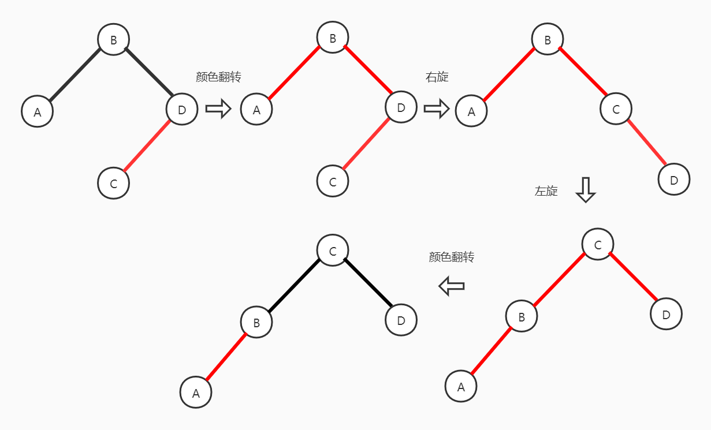

- 若当前节点的左子结点和其右子结点都是2-结点

  则此时需要将左子结点、右子结点和父结点中的最小键（其实这是从2-3树角度考虑的，在二叉搜索树实现的红黑树中不需要这个考虑，直接称当前结点即可）合并成一个4-结点（这里也不用像书上那样过多的考虑2-3-4树那样）。因此在递归向下前需要做出如下的操作：直接进行颜色翻转使得当前结点变成4-结点。

  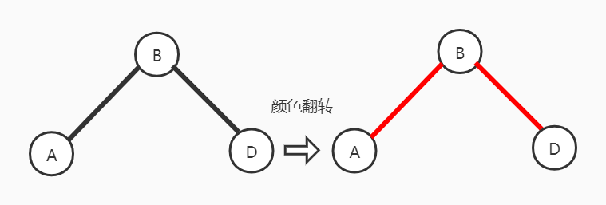

当完成上述的递归左链接向下的过程后，`deleteMin()`就可以被递归调用以对真正的欲删除的结点进行删除操作。需要注意的是：当完成删除操作之后，需要在递归返回的路径中依次对每一个结点执行再平衡操作，以保持我们对红黑树的预先规定。（当然其中很多细节需要不断查看源码进行体悟）

```java
    //翻转当前结点和左右孩子结点的颜色
    private void flipColors(Node h) {
        h.color = !h.color;
        h.left.color = !h.left.color;
        h.right.color = !h.right.color;
    }

    /* 从当前结点的右子结点中借一个结点给左子结点，使左子结点
       变成一个3-结点；或者3者合并成为3-结点 */
    private Node moveRedLeft(Node h) {
        flipColors(h);
        /* 若右子结点是一个3-结点，则提取一个结点给左子结点
           使其成为3-结点 */
        if (isRed(h.right.left)) {
            h.right = rotateRight(h.right);
            h = rotateLeft(h);
            flipColors(h);
        }
        return h;
    }

    private Node deleteMin(Node h) {
        if (h.left == null)
            return null;

        /* 左子结点不是3-结点的情况下需要进行moveRedLeft
            局部调整作业，使得左子结点变成一个3结点 */
        if (!isRed(h.left) && !isRed(h.left.left))
            h = moveRedLeft(h);
        h.left = deleteMin(h.left);
        return balance(h);
    }

    public void deleteMin() {
        if (!isRed(root.left) && !isRed(root.right))
            root.color = RED;
        root = deleteMin(root);
        if (isEmpty()) root.color = BLACK;
    }
```


2. **删除最大值**

   其操作类似于删除最小值，但可能有一些细节上的不同。

```java
    //翻转当前结点和左右孩子结点的颜色
    private void flipColors(Node h) {
        h.color = !h.color;
        h.left.color = !h.left.color;
        h.right.color = !h.right.color;
    }

    /* 从当前结点的左子结点中借一个结点给右子结点，使右子结点
        变得有剩余结点使得删除一个不影响红黑树的平衡 */
    private Node moveRedRight(Node h) {
        flipColors(h);
        /* 若左子结点是一个3-结点，则提取一个结点给右子结点
           使其成为3-结点 */
        if (isRed(h.left.left)) {
            h = rotateRight(h);
            flipColors(h);
        }
        return h;
    }

    //在删除后做局部平衡处理
    private Node balance(Node h) {
        if (isRed(h.right))
            h = rotateLeft(h);
        if (isRed(h.left) && isRed(h.left.left))
            h = rotateRight(h);
        if (isRed(h.left) && isRed(h.right))
            flipColors(h);
        h.size = size(h.left) + size(h.right) + 1;
        return h;
    }

    private Node deleteMax(Node h) {
        if (isRed(h.left))
            h = rotateRight(h);
        if (h.right == null)
            return null;

        /* 右子结点不是3-结点的情况下需要进行moveRedRight
            局部调整作业，使得右子结点变成一个3-结点 */
        if (!isRed(h.right) && !isRed(h.right.left))
            h = moveRedRight(h);
        h.right = deleteMax(h.right);
        return balance(h);
    }

    public void deleteMax() {
        if (!isRed(root.left) && !isRed(root.right))
            root.color = RED;
        root = deleteMax(root);
        if (isEmpty()) root.color = BLACK;
    }
```


##### 3.3.2.3  删除操作

红黑树的任意删除操作其实本质上就是删除最小值操作和删除最大值操作的的扩展版，它结合向了左删除或者向右删除的特征。**若我们想要删除的结点在当前结点的左子树上，则要确保当前结点一定是一个向左偏的非2-结点；若我们想要删除的结点在当前结点的右子树上（或欲删除结点在就是当前结点），则要确保当前结点一定是向右偏的非2-结点**。我们会惊奇地发现：删除当前结点和删除右子树上的结点都被归为了一类处理。

**即使在删除的过程中红黑树也仍然保持着完美平衡**（因为我们删除前的操作都是通过局部微调的方式维持着平衡的状态，顶多就是出现某一个非2-结点的红链接方向向右而已，这都是为了在要在3-结点身上删除一个键值对使其变成2-结点做准备）。所以我们有理由相信当即将删除那个指定结点的时候，它一定是一个向左偏的3-结点（向左删除）或者是一个向右偏的3-结点（向右删除）或者是一个临时4-结点或者本来就单单一个结点。

当我们需要向右删除或者删除当前结点时仍然是基本上如同处理一个删除最小值的情况：①当前结点的右子结点本身就是3-结点；②当前结点的右子结点为2-结点，但是左子结点为3-结点；③当前结点、左右子结点都是2-结点。所以处理它们的方法基本上相同，就是让当前结点变成向右偏的非2-结点。

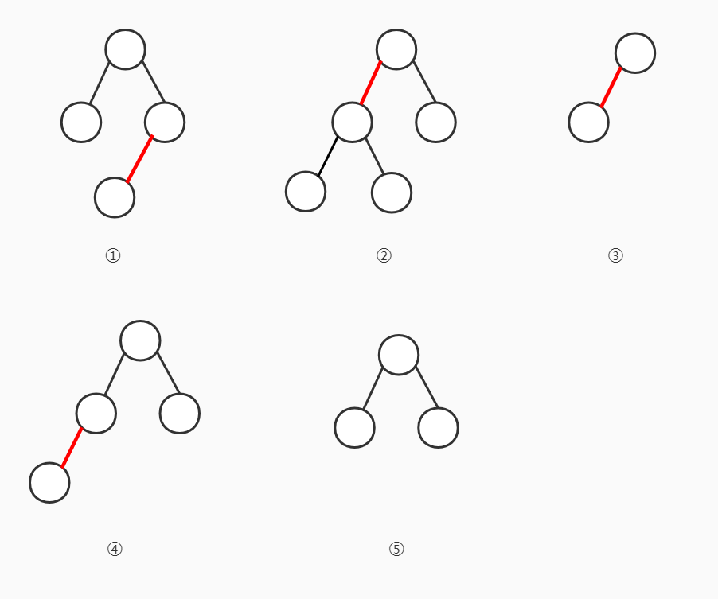

还是通过代码进行理解更好：

```java
    private Node delete(Node h, Key key) {
        //欲删除结点在左子树中
        if (key.compareTo(h.key) < 0) {
            if (!isRed(h.left) && !isRed(h.left.left))
                h = moveRedLeft(h);
            h.left = delete(h.left, key);
        }
        //欲删除结点在右子树或者当前结点就是
        else {
            if (isRed(h.left))
                h = rotateRight(h);
            /* 若当前结点确实是欲删除结点，若右边没有子结点，则由于红黑树在删除
            	的过程中仍然是平衡的，所以当前结点左边是绝对没有子结点，即使有
                也被上一步的右旋操作处理掉了。所以这里直接删除返回null本质上与
                上面的deleteMax()我个人觉得区别不大。*/
            if (key.compareTo(h.key) == 0 && h.right == null)
                return null;
            if (!isRed(h.right) && !isRed(h.right.left))
                h = moveRedRight(h);
            
            if (key.compareTo(h.key) == 0) {
                h.val = get(h.right, min(h.right).key);
                h.key = min(h.right).key;
                h.right = deleteMin(h.right);
            } else h.right = delete(h.right, key);
        }
        return balance(h);
    }

    public void delete(Key key) {
        if (!isRed(root.left) && !isRed(root.right))
            root.color = RED;
        root = delete(root, key);
        if (!isEmpty()) root.color = BLACK;
    }
```


### 3.4  散列表

#### 3.4.1  散列函数

散列的查找算法分为两步：

1. 使用散列函数（主要是除留余数法）将被查找的键转化为数组中的一个索引；
2. 然后使用一些方法（主要有拉链法和线性探测法）处理碰撞冲突问题

#### 3.4.2  基于拉链法的散列表

基于拉链法的散列表使用一个大小为M（素数）、每一个元素指向一条链表的数组，将多个散列值相同的键-值对存放在同一个元素指向链表之中，从而避免碰撞冲突。


插入时间复杂度：$N/M$(在散列值均匀的前提下)~$logN$

查找时间复杂度：$N/M$(在散列值均匀的前提下)~$logN$

```java
import edu.princeton.cs.algs4.Queue;
import edu.princeton.cs.algs4.SequentialSearchST;
import edu.princeton.cs.algs4.StdOut;

public class SeparateChainingHashST<Key, Value> {
    private SequentialSearchST<Key, Value>[] st;
    private int N;//键值对数
    private int M;//散列表大小

    //根据键key，使用散列函数计算该键在散列表中的索引
    private int hash(Key key) {
        return (key.hashCode() & 0x7fffffff) % M;
    }

    private void resize(int newM) {
        SeparateChainingHashST<Key, Value> temp =
                new SeparateChainingHashST<Key, Value>(newM);
        for (int i = 0; i < M; i++)
            for (Key key : st[i].keys())
                temp.put(key, st[i].get(key));
        this.M = temp.M;
        this.N = temp.N;
        this.st = temp.st;
    }

    public SeparateChainingHashST(int M) {
        this.M = M;
        this.N = 0;
        st = (SequentialSearchST<Key, Value>[]) new SequentialSearchST[M];
        for (int i = 0; i < M; ++i)
            st[i] = new SequentialSearchST<>();
    }

    public SeparateChainingHashST() {
        this(997);
    }

    public void put(Key key, Value val) {
        if (N >= M * 10) resize(2 * M);

        st[hash(key)].put(key, val);
        N++;
    }

    public Value get(Key key) {
        return (Value) st[hash(key)].get(key);
    }

    public void delete(Key key) {
        st[hash(key)].delete(key);
        N--;

        if (N <= 2 * M) resize(M / 2);
    }

    public boolean isEmpty() {
        return N == 0;
    }

    public int size() {
        return N;
    }

    public boolean contains(Key key) {
        return get(key) != null;
    }

    Iterable<Key> keys() {
        Queue<Key> queue = new Queue<Key>();

        for (int i = 0; i < M; ++i) {
            if (!st[i].isEmpty()) {
                Iterable<Key> t = st[i].keys();
                for (Key key : t)
                    queue.enqueue(key);
            }
        }
        return queue;
    }

    public static void main(String[] args) {
        SeparateChainingHashST<String, Integer> st = new SeparateChainingHashST<String, Integer>();

        st.put("a", 43);
        st.put("b", 32);
        st.put("s", 23);
        st.put("k", 12);
        st.put("p", 97);
        StdOut.println("size: " + st.size());
        StdOut.println("a: " + st.get("a"));
        StdOut.println("k: " + st.get("k"));
        for (String str : st.keys())
            StdOut.println(str);
    }
}
```


#### 3.4.3  基于线性探测法的散列表

实现散列表的另一种方式使用大小为M的数组保存N个键-值对，其中M>N。这种方法依靠数组中的空位解决碰撞冲突。基于这种策略的所有方法统称为开放地址散列表。而开放地址散列表种最简单的一种方法就是线性探测法：*当碰撞（指定索引上已经被别的键-值对占据），此时我们直接检测下一个位置（通过索引+1），若没有使用就存放在这个位置（可以重复）*。

插入操作时间复杂度：常数阶~$logN$

查找操作时间复杂度：常数阶~$logN$

```java
import edu.princeton.cs.algs4.Queue;
import edu.princeton.cs.algs4.StdOut;

import javax.sound.sampled.Line;

public class LinearProbingHashST<Key, Value> {
    private int N;
    private int M = 16;
    private Key[] keys;
    private Value[] vals;

    private int hash(Key key) {
        return (key.hashCode() & 0x7fffffff) % M;
    }

    private void resize(int cap) {
        LinearProbingHashST<Key, Value> t =
                new LinearProbingHashST<Key, Value>(cap);
        for (int i = 0; i < M; i++)
            if (keys[i] != null)
                t.put(keys[i], vals[i]);
        keys = t.keys;
        vals = t.vals;
        M = t.M;
    }

    public LinearProbingHashST() {
        keys = (Key[]) new Object[M];
        vals = (Value[]) new Object[M];
    }

    public LinearProbingHashST(int m) {
        keys = (Key[]) new Object[m];
        vals = (Value[]) new Object[m];
        M = m;
    }

    public void put(Key key, Value val) {
        if (N >= M / 2) resize(M * 2);

        int i = hash(key);
        for (; keys[i] != null; i = (i + 1) % M)
            if (keys[i].equals(key)) {
                vals[i] = val;
                return;
            }
        keys[i] = key;
        vals[i] = val;
        N++;
    }

    public Value get(Key key) {
        for (int i = hash(key); keys[i] != null; i = (i + 1) % M)
            if (keys[i].equals(key))
                return vals[i];
        return null;
    }

    public void delete(Key key) {
        if (!contains(key)) return;

        //删除指定的键-值对
        int i = hash(key);
        while (!key.equals(keys[i]))
            i = (i + 1) % M;
        keys[i] = null;
        vals[i] = null;

        /* 将删除键-值对右边的键-值对重新插入，这样防止后续的键-值对
            无法查找到（因为这些键-值对很有可能是通过探针的方式插入的） */
        i = (i + 1) % M;
        for (; keys[i] != null; i = (i + 1) % M) {
            Key keyToRedo = keys[i];
            Value valToRedo = vals[i];
            keys[i] = null;
            vals[i] = null;
            N--;
            put(keyToRedo, valToRedo);
        }
        N--;
        if (N > 0 && N == M / 8)
            resize(M / 2);
    }

    public Iterable<Key> keys() {
        Queue<Key> queue = new Queue<Key>();
        for (int i = 0; i < M; ++i)
            if (keys[i] != null)
                queue.enqueue(keys[i]);
        return queue;
    }

    public boolean contains(Key key) {
        return get(key) != null;
    }

    public int size() {
        return N;
    }

    public boolean isEmpty() {
        return N == 0;
    }
}
```


## 4.图

### 4.1 无向图

使用邻接表组织的无向图类API：`public class Graph`

- `Graph(int V)`
- `Graph(In in)`
- `int V()`
- `int E()`
- `void addEdge(int v,int w)`
- `Iterable<Integer> adj(int v)`
- `String toString()`

邻接表组织无向图：

所需空间：$E+V$

添加一条边时间复杂度：$1$

遍历指定顶点v所有边时间复杂度：$degree(v)$

检查某一条边的存在性：$degree(v)$

```java
import edu.princeton.cs.algs4.Bag;
import edu.princeton.cs.algs4.In;
import edu.princeton.cs.algs4.StdOut;

public class Graph {
    private final int V;
    private int E;
    private Bag<Integer>[] adj;

    public Graph(int V) {
        this.V = V;
        this.E = 0;
        adj = (Bag<Integer>[]) new Bag[V];
        for (int v = 0; v < V; v++)
            adj[v] = new Bag<Integer>();
    }

    public Graph(In in) {
        this(in.readInt());
        int E = in.readInt();
        for (int i = 0; i < E; i++) {
            int v = in.readInt();
            int w = in.readInt();
            addEdge(v, w);
        }
    }

    //图中顶点数
    public int V() {
        return V;
    }

    //图中边数
    public int E() {
        return E;
    }

    //向图中添加一条边
    public void addEdge(int v, int w) {
        adj[v].add(w);
        adj[w].add(v);
        E++;
    }

    //返回顶点v的所有的邻接点
    public Iterable<Integer> adj(int v) {
        return adj[v];
    }

    public String toString() {
        String s = V + " vertices, " + E + "edges\n";
        for (int v = 0; v < V; v++) {
            s += v + ": ";
            for (int w : this.adj(v))
                s += w + " ";
            s += "\n";
        }
        return s;
    }

    //计算指定顶点的入度
    public static int degree(Graph G, int v) {
        int degree = 0;
        for (int w : G.adj(v)) degree++;
        return degree;
    }

    //计算有向图中的最大顶点入度
    public static int maxDegree(Graph G) {
        int max = 0;
        for (int v = 0; v < G.V(); v++)
            if (degree(G, v) > max)
                max = degree(G, v);
        return max;
    }

    //计算有向图中的平均入度
    public static double avgDegree(Graph G) {
        return 2.0 * G.E() / G.V();
    }

    //计算有向图中的自环个数
    public static int numberOfSelfLoops(Graph G) {
        int count = 0;
        for (int v = 0; v < G.V(); v++)
            for (int w : G.adj(v))
                if (v == w) count++;//有一点连到自己的顶点存在
        return count / 2;
    }
}
```

邻接表如图所示：


#### 4.1.1  深度优先搜索

深度优先搜索也可以称为深度优先遍历，因为它实际上是通过对图中的每一个与指定顶点连通的顶点进行遍历的方式获知图中的哪些顶点与之相连。其步骤很简单：

1. 将起点标记为已访问；
2. 然后递归方法问它的所有没有被标记过的邻居顶点。

深度优先搜索的原理是通过栈（递归的本质就是栈）来实现对图中顶点的完全遍历

```java
import edu.princeton.cs.algs4.In;
import edu.princeton.cs.algs4.Stack;
import edu.princeton.cs.algs4.StdOut;

public class DepthFirstSearch {
    private boolean[] marked;
    private int count;

    //实现递归实现的深度优先搜索
    private void dfs(Graph G, int v) {
        marked[v] = true;
        count++;
        for (int w : G.adj(v))
            if (!marked[w]) dfs(G, w);
    }

    //使用栈实现的深度优先搜索
    private void dfs1(Graph G, int v) {
        Stack<Integer> stack = new Stack<Integer>();
        marked[v] = true;
        stack.push(v);
        count++;

        while (!stack.isEmpty()) {
            int t = stack.pop();
            for (int vertex : G.adj(t)) {
                if (!marked[vertex]) {
                    marked[vertex] = true;
                    stack.push(vertex);
                    count++;
                }
            }
        }

    }

    public DepthFirstSearch(Graph G, int s) {
        marked = new boolean[G.V()];
        dfs1(G, s);
    }

    public boolean marked(int w) {
        return marked[w];
    }

    public int count() {
        return count;
    }

    public static void main(String[] args) {
        Graph G = new Graph(new In(args[0]));
        int s = Integer.parseInt(args[1]);
        DepthFirstSearch search = new DepthFirstSearch(G, s);

        StdOut.println("start vertex(" + s + ") connects: ");
        for (int v = 0; v < G.V(); v++)
            if (search.marked(v))
                StdOut.print(v + " ");
        StdOut.println();
        StdOut.println("connected count: " + search.count());
    }
}
```

书中的图很好的展示了DFS所谓的“深度”是为何意，因为这孩子比较皮，老喜欢跑远的跑到更深的地方😂


##### 4.1.1.1   使用DFS路径搜索

```java
import edu.princeton.cs.algs4.In;
import edu.princeton.cs.algs4.Queue;
import edu.princeton.cs.algs4.Stack;
import edu.princeton.cs.algs4.StdOut;

public class DepthFirstPaths {
    private boolean[] marked;
    private int[] edgeTo;//存储递归过程中当前点的前一个点的索引
    private final int s;

    //使用栈实现的深度优先搜索路径方法
    private void dfs(Graph G, int s) {
        Stack<Integer> stack = new Stack<Integer>();
        stack.push(s);
        marked[s] = true;
        edgeTo[s] = s;

        while (!stack.isEmpty()) {
            int t = stack.pop();
            for (int ver : G.adj(t)) {
                if (!marked[ver]) {
                    stack.push(ver);
                    marked[ver] = true;
                    edgeTo[ver] = t;
                }
            }
        }
    }

    //使用递归实现的深度优先搜索路径方法
    private void dfs1(Graph G, int s) {
        marked[s] = true;
        for (int w : G.adj(s)) {
            if (!marked[w]) {
                edgeTo[w] = s;
                dfs1(G, w);
            }
        }
    }

    public DepthFirstPaths(Graph G, int s) {
        marked = new boolean[G.V()];
        edgeTo = new int[G.V()];
        this.s = s;
//        edgeTo[s]=s;
//        dfs1(G,s);
        dfs(G, s);
    }

    public boolean hasPathTo(int v) {
        return marked[v];
    }

    //返回从s->v的路径
    public Iterable<Integer> pathTo(int v) {
        if (!hasPathTo(v)) return null;

        Stack<Integer> stack = new Stack<Integer>();
        for (int x = v; x != s; x = edgeTo[x])
            stack.push(x);
        stack.push(s);
        return stack;
    }

    public static void main(String[] args) {
        Graph graph = new Graph(new In(args[0]));
        int s = Integer.parseInt(args[1]);
        DepthFirstPaths paths = new DepthFirstPaths(graph, s);

        for (int v = 0; v < graph.V(); ++v) {
            StdOut.print(s + " to " + v + ": ");
            if (paths.hasPathTo(v))
                for (int x : paths.pathTo(v))
                    if (x == s) StdOut.print(x);
                    else StdOut.print("-" + x);
            StdOut.println();
        }
    }
}
```


##### 4.1.1.2  使用DFS寻找连通分量

虽然理论上使用DFS实现图中连通分量的寻找与V+E成正比，看上去和union-find算法应该相近，但是由于其在使用前必须对图进行构造，因此它的性能实际上没有比union-find并查集算法更好。

检测所需时间与$V+E$成正比。

```java
import edu.princeton.cs.algs4.Bag;
import edu.princeton.cs.algs4.In;
import edu.princeton.cs.algs4.Stack;
import edu.princeton.cs.algs4.StdOut;

public class CC {
    private boolean[] marked;
    private int[] id;
    private int count;

    //使用栈实现的DFS
    private void dfs(Graph G, int v) {
        Stack<Integer> stack = new Stack<Integer>();
        stack.push(v);
        marked[v] = true;
        id[v] = count;

        while (!stack.isEmpty()) {
            int t = stack.pop();
            for (int w : G.adj(t)) {
                if (!marked[w]) {
                    stack.push(w);
                    marked[w] = true;
                    id[w] = count;
                }
            }
        }
    }

    //使用递归实现的DFS
    private void dfs1(Graph graph, int v) {
        marked[v] = true;
        id[v] = count;
        for (int w : graph.adj(v))
            if (!marked[w])
                dfs(graph, v);
    }

    public CC(Graph G) {
        marked = new boolean[G.V()];
        id = new int[G.V()];
        /* 将同一个连通分量下的顶点全部标记为同一个id，
           若已经标记过就不再执行dfs，而是遍历剩下的顶
           点让它们归入到新的连通分量组之中 */
        for (int s = 0; s < G.V(); s++)
            if (!marked[s]) {
                dfs(G, s);
                count++;
            }
    }

    public boolean connected(int v, int w) {
        return id[v] == id[w];
    }

    public int id(int v) {
        return id[v];
    }

    public int count() {
        return count;
    }

    public static void main(String[] args) {
        Graph graph = new Graph(new In(args[0]));
        CC cc = new CC(graph);

        int M = cc.count();
        StdOut.println(graph.V() + " vertexes");
        StdOut.println(M + " components");

        Bag<Integer>[] components = (Bag<Integer>[]) new Bag[M];
        for (int i = 0; i < M; ++i)
            components[i] = new Bag<Integer>();
        for (int i = 0; i < graph.V(); i++)
            components[cc.id[i]].add(i);

        for (int i = 0; i < M; i++) {
            for (int v : components[i])
                StdOut.print(v + " ");
            StdOut.println();
        }
    }
}
```

图中有3个连通分量：


##### 4.1.1.3  使用DFS检测环

我们可以使用DFS判断一个从一个起点到终点是否有环：假设在DFS遍历的过程中遇到了一个已经标记过的顶点，这就说明从起点到这个顶点至少有多条路径到终点，即有环。

```java
public class Cycle {
    private boolean[] marked;
    private boolean hasCycle;

    private void dfs(Graph G, int v, int u) {
        marked[v] = true;
        for (int w : G.adj(v))
            if (!marked[w])
                dfs(G, w, v);
            else if (w != u)
                hasCycle = true;
    }

    public Cycle(Graph G) {
        marked = new boolean[G.V()];
        for (int s = 0; s < G.V(); ++s)
            if (!marked[s])
                dfs(G, s, s);
    }

    public boolean hasCycle() {
        return hasCycle;
    }
}
```


#### 4.1.2  广度优先搜索

广度优先搜索BFS与深度优先搜索DFS相反，它是通过队列来实现对图中顶点的完全遍历，这种方法的好处在于它在顶点遍历的过程中实际上用到了贪心的思想，总是会先去找它（顶点）身边最近的那几个顶点进行遍历。其主要步骤如下：

1. 从队列中弹出下一个顶点并标记（其实也可以在入队的时候标记）
2. 然后将与v相邻的所有未被标记的顶点加入到队列之中

##### 4.1.2.1  使用BFS路径搜索

此时搜寻到的路径必然是到达指定定点最短的。

```java
import edu.princeton.cs.algs4.In;
import edu.princeton.cs.algs4.Queue;
import edu.princeton.cs.algs4.Stack;
import edu.princeton.cs.algs4.StdOut;

public class BreadthFirstPaths {
    private boolean[] marked;
    private int[] edgeTo;//存储递归过程中当前点的前一个点的索引
    private final int s;

    private void bfs(Graph G, int s) {
        Queue<Integer> queue = new Queue<Integer>();
        queue.enqueue(s);
        edgeTo[s] = s;
        marked[s] = true;

        while (!queue.isEmpty()) {
            int t = queue.dequeue();
            for (int w : G.adj(t))
                if (!marked[w]) {
                    queue.enqueue(w);
                    edgeTo[w] = t;
                    marked[w] = true;
                }
        }
    }

    public BreadthFirstPaths(Graph G, int s) {
        marked = new boolean[G.V()];
        edgeTo = new int[G.V()];
        this.s = s;
        bfs(G, s);
    }

    public boolean hasPathTo(int v) {
        return marked[v];
    }

    //返回从s->v的路径
    public Iterable<Integer> pathTo(int v) {
        if (!hasPathTo(v)) return null;

        Stack<Integer> stack = new Stack<Integer>();
        for (int x = v; x != s; x = edgeTo[x])
            stack.push(x);
        stack.push(s);
        return stack;
    }

    public static void main(String[] args) {
        Graph graph = new Graph(new In(args[0]));
        int s = Integer.parseInt(args[1]);
        DepthFirstPaths paths = new DepthFirstPaths(graph, s);

        for (int v = 0; v < graph.V(); ++v) {
            StdOut.print(s + " to " + v + ": ");
            if (paths.hasPathTo(v))
                for (int x : paths.pathTo(v))
                    if (x == s) StdOut.print(x);
                    else StdOut.print("-" + x);
            StdOut.println();
        }
    }
}
```

书中的图很好的展示了BFS所谓的“广度”是为何意，因为这孩子比较乖有比较谨慎，起初总是在近的地方玩，之后熟悉了才到远的地方玩😋


### 4.2 有向图

有向图API：`public class Digraph`

- `Drigraph(int V)`
- `Digraph(In in)`
- `int V()`
- `int E()`
- `void addEdge(int v,int w)`
- `Iterable<Integer> adj(int v)`
- `Digraph reverse()`
- `String toString()`

```java
import edu.princeton.cs.algs4.Bag;
import edu.princeton.cs.algs4.In;
import edu.princeton.cs.algs4.StdOut;

public class Digraph {
    private final int V;
    private int E;
    private Bag<Integer>[] adj;

    public Digraph(int V) {
        this.V = V;
        this.E = 0;
        adj = (Bag<Integer>[]) new Bag[V];
        for (int v = 0; v < V; v++)
            adj[v] = new Bag<Integer>();
    }

    public Digraph(In in) {
        this(in.readInt());
        int E = in.readInt();
        for (int i = 0; i < E; i++) {
            int v = in.readInt();
            int w = in.readInt();
            addEdge(v, w);
        }
    }

    public int V() {
        return V;
    }

    public int E() {
        return E;
    }

    public void addEdge(int v, int w) {
        adj[v].add(w);
        E++;
    }

    //返回指定点的指出点集合
    public Iterable<Integer> adj(int v) {
        return adj[v];
    }

    //返回一个反向图
    public Digraph reverse() {
        Digraph R = new Digraph(V);
        for (int v = 0; v < V; v++)
            for (int w : adj[v])
                R.addEdge(w, v);
        return R;
    }

    public String toString() {
        String s = V + " vertices, " + E + " deges\n";
        for (int v = 0; v < V; v++) {
            s += v + ": ";
            for (int w : this.adj(v))
                s += w + " ";
            s += "\n";
        }
        return s;
    }

    public static void main(String[] args) {
        Digraph digraph = new Digraph(new In(args[0]));
        StdOut.println(args[0]);

        StdOut.println(digraph);
    }
}
```


#### 4.2.1 可达性问题

##### 4.2.1.1   使用DFS解决可达性问题

```java
import edu.princeton.cs.algs4.Bag;
import edu.princeton.cs.algs4.In;
import edu.princeton.cs.algs4.Stack;
import edu.princeton.cs.algs4.StdOut;

public class DirectedDFS {
    private boolean[] marked;

    //使用递归实现的深度优先搜索方法
    private void dfs(Digraph G, int v) {
        marked[v] = true;
        for (int w : G.adj(v))
            if (!marked[w]) dfs(G, w);
    }

    //使用栈实现的深度优先搜索方法
    private void dfs1(Digraph G, int v) {
        Stack<Integer> stack = new Stack<Integer>();
        stack.push(v);
        marked[v] = true;

        while (!stack.isEmpty()) {
            int t = stack.pop();
            for (int w : G.adj(t)) {
                if (!marked[w]) {
                    stack.push(w);
                    marked[w] = true;
                }
            }
        }
    }

    public boolean marked(int v) {
        return marked[v];
    }

    public DirectedDFS(Digraph G, int s) {
        marked = new boolean[G.V()];
        dfs1(G, s);
    }

    public DirectedDFS(Digraph G, Iterable<Integer> sources) {
        marked = new boolean[G.V()];
        for (int s : sources)
            if (!marked[s]) dfs1(G, s);
    }

    public static void main(String[] args) {
        Digraph digraph = new Digraph(new In(args[0]));

        Bag<Integer> sources = new Bag<Integer>();
        for (int i = 1; i < args.length; ++i)
            sources.add(Integer.parseInt(args[i]));

        DirectedDFS reachable = new DirectedDFS(digraph, sources);
        for (int v = 0; v < digraph.V(); v++)
            if (reachable.marked(v)) StdOut.print(v + " ");
        StdOut.println();
    }
}
```


##### 4.2.1.2  使用DFS路径搜索

```java
import edu.princeton.cs.algs4.In;
import edu.princeton.cs.algs4.Stack;
import edu.princeton.cs.algs4.StdOut;

public class DepthFirstDirectedPaths {
    private boolean[] marked;
    private int[] edgeTo;
    private final int s;

    //使用递归实现的深度优先搜索方法
    private void dfs(Digraph G, int s) {
        marked[s] = true;
        for (int w : G.adj(s))
            if (!marked[w]) {
                edgeTo[w] = s;
                dfs(G, w);
            }
    }

    //使用栈实现的深度优先搜索方法
    private void dfs1(Digraph G, int s) {
        Stack<Integer> stack = new Stack<Integer>();
        stack.push(s);
        edgeTo[s] = s;
        marked[s] = true;

        while (!stack.isEmpty()) {
            int t = stack.pop();
            for (int w : G.adj(t)) {
                if (!marked[w]) {
                    stack.push(w);
                    edgeTo[w] = t;
                    marked[w] = true;
                }
            }
        }
    }

    public DepthFirstDirectedPaths(Digraph G, int s) {
        marked = new boolean[G.V()];
        edgeTo = new int[G.V()];
        this.s = s;
        dfs1(G, s);
    }

    public boolean hasPathTo(int v) {
        return marked[v];
    }

    //返回从起点s到指定点v的路径容器引用
    public Iterable<Integer> pathTo(int v) {
        if (!hasPathTo(v)) return null;

        Stack<Integer> stack = new Stack<Integer>();
        for (int p = v; p != s; p = edgeTo[p])
            stack.push(p);
        stack.push(s);
        return stack;
    }

    public static void main(String[] args) {
        Digraph digraph = new Digraph(new In(args[0]));
        int s = Integer.parseInt(args[1]);
        DepthFirstDirectedPaths paths = new DepthFirstDirectedPaths(digraph, s);

        for (int v = 0; v < digraph.V(); ++v) {
            StdOut.print(s + " to " + v + ": ");
            if (paths.hasPathTo(v))
                for (int x : paths.pathTo(v))
                    if (x == s) StdOut.print(x);
                    else StdOut.print("-" + x);
            StdOut.println();
        }
    }
}
```


##### 4.2.1.3  使用BFS路径搜索

```java
import edu.princeton.cs.algs4.*;

public class BreadFirstDirectedPaths {
    private boolean[] marked;
    private int[] parents;
    private final int s;

    //广度优先搜索路径方法
    private void bfs(Digraph G, int s) {
        Queue<Integer> queue = new Queue<Integer>();
        queue.enqueue(s);
        marked[s] = true;
        parents[s] = s;

        while (!queue.isEmpty()) {
            int t = queue.dequeue();
            for (int w : G.adj(t)) {
                if (!marked[w]) {
                    queue.enqueue(w);
                    marked[w] = true;
                    parents[w] = t;
                }
            }
        }
    }

    public BreadFirstDirectedPaths(Digraph G, int s) {
        marked = new boolean[G.V()];
        parents = new int[G.V()];
        this.s = s;
        bfs(G, s);
    }

    public boolean hasPathTo(int v) {
        return marked[v];
    }

    //返回从起点s到指定点v的路径容器引用
    public Iterable<Integer> pathTo(int v) {
        if (!hasPathTo(v)) return null;

        Stack<Integer> stack = new Stack<Integer>();
        for (int p = v; p != s; p = parents[p])
            stack.push(p);
        stack.push(s);
        return stack;
    }

    public static void main(String[] args) {
        Digraph digraph = new Digraph(new In(args[0]));
        int s = Integer.parseInt(args[1]);
        BreadFirstDirectedPaths paths = new BreadFirstDirectedPaths(digraph, s);

        for (int v = 0; v < digraph.V(); ++v) {
            StdOut.print(s + " to " + v + ": ");
            if (paths.hasPathTo(v))
                for (int x : paths.pathTo(v))
                    if (x == s) StdOut.print(x);
                    else StdOut.print("-" + x);
            StdOut.println();
        }
    }
}
```


#### 4.2.2  拓扑排序

拓扑排序指的是给定一幅有向图，将所有顶点进行排序，使得所有的有向边均从排在前面的元素指向排在后面的元素。需要注意的是，拓扑排序只能在有向无环图上进行，所以我们在拓扑排序之前就是先要判定这个有向图是否有环存在。


下面的排序顺序就是按照拓扑排序而行。


##### 4.2.2.1  有向环检测

其判断的方法就是使用深度优先搜索DFS算法遍历整个图中的结点，若在遍历到顶点v时发现有一个顶点w已经在栈中了，则说明本来就有一条路径w->v，现在又发现一条路径v->w，即有环。

```java
import edu.princeton.cs.algs4.In;
import edu.princeton.cs.algs4.Stack;
import edu.princeton.cs.algs4.StdOut;

public class DirectedCycle {
    private boolean[] marked;
    private int[] edgeTo;
    private Stack<Integer> cycle;
    private boolean[] onStack;

    private void dfs(Digraph G, int v) {
        onStack[v] = true;
        marked[v] = true;
        for (int w : G.adj(v)) {
            //若之前已经找到一个环了，则既然已经判定了有环就没有必要再找了
            if (this.hasCycle()) return;
            else if (!marked[w]) {
                edgeTo[w] = v;
                dfs(G, w);
            }
            /* 若w在栈中，说明有个v->w有个环，那么我们就可以沿着edgeTo数组向回找
                以将这个环中的所有结点(v->w->v)加入到cycle中 */
            else if (onStack[w]) {
                cycle = new Stack<Integer>();
                for (int p = v; p != w; p = edgeTo[p])
                    cycle.push(p);
                cycle.push(w);
                cycle.push(v);
            }
        }
        onStack[v] = false;
    }

    public DirectedCycle(Digraph G) {
        marked = new boolean[G.V()];
        edgeTo = new int[G.V()];
        onStack = new boolean[G.V()];
        for (int v = 0; v < G.V(); ++v)
            if (!marked[v]) dfs1(G, v);
    }

    public boolean hasCycle() {
        return cycle != null;
    }

    public Iterable<Integer> cycle() {
        return cycle;
    }

    public static void main(String[] args) {
        Digraph digraph = new Digraph(new In(args[0]));
        DirectedCycle cycle = new DirectedCycle(digraph);

        if (cycle.hasCycle()) {
            StdOut.println("This Digragh has cycle:");
            for (int v : cycle.cycle()) {
                StdOut.print(v + " ");
            }
            StdOut.println();
        }
    }
}
```

当当前顶点v发现自己身边有一个顶点w已经存放在栈中的时候，这就说明v有路径到w，而且w也有另一条路径到v：


##### 4.2.2.2  深度优先排序

实际上由于深度优先搜索DFS算法总是会从起点一个劲的向自己深层次所指向的顶点进行搜索，因此在其遍历的过程中有向边的指出顶点是先于有向边的指入顶点而得到遍历。因此我们按照这一规则将先得到遍历的顶点最后放入到容器中，而最根端的顶点先放入到容器之中，那么我们容器中的元素的顺序就是典型的拓扑排序！（而实际中的拓扑排序也正是采用了这种方法来解决）。

排序时间与$V+E$成正比。

```go
//伪代码
func dfs(G,v):
	mark(v)
	for every adjacency vertex of v:
		dfs(G,adj)
	put v to stack
end
```

```java
import edu.princeton.cs.algs4.In;
import edu.princeton.cs.algs4.Queue;
import edu.princeton.cs.algs4.Stack;
import edu.princeton.cs.algs4.StdOut;

public class DepthFirstOrder {
    private boolean[] marked;
    private Queue<Integer> pre;
    private Queue<Integer> post;
    private Stack<Integer> reversePost;

    private void dfs(Digraph G, int v) {
        pre.enqueue(v);//前序遍历

        marked[v] = true;
        for (int w : G.adj(v))
            if (!marked[w]) dfs(G, w);

        post.enqueue(v);//后序遍历
        reversePost.push(v);//逆后序遍历，得到的正是深度优先排序
    }

    public DepthFirstOrder(Digraph G) {
        pre = new Queue<Integer>();
        post = new Queue<Integer>();
        reversePost = new Stack<Integer>();
        marked = new boolean[G.V()];
        for (int v = 0; v < G.V(); ++v)
            if (!marked[v]) dfs(G, v);
    }

    //返回前序遍历
    public Iterable<Integer> pre() {
        return pre;
    }

    //返回后序遍历
    public Iterable<Integer> post() {
        return post;
    }

    //返回逆后序遍历
    public Iterable<Integer> reversePost() {
        return reversePost;
    }

    public static void main(String[] args) {
        Digraph digraph = new Digraph(new In(args[0]));
        DepthFirstOrder order = new DepthFirstOrder(digraph);

        for (int v : order.reversePost())
            StdOut.print(v + " ");
        StdOut.println();
    }
}
```

前序、后序和逆后序遍历的不同之处：


##### 4.2.2.3  拓扑排序

一幅有向无环图的拓扑排序即为所有顶点的逆后序排列。

```java
import edu.princeton.cs.algs4.In;
import edu.princeton.cs.algs4.StdOut;

public class Topological {
    private Iterable<Integer> order;

    public Topological(Digraph G) {
        DirectedCycle cyclefinder = new DirectedCycle(G);
        if (!cyclefinder.hasCycle()) {
            DepthFirstOrder dfs = new DepthFirstOrder(G);
            order = dfs.reversePost();
        }
    }

    public Iterable<Integer> order() {
        return order;
    }

    public boolean isDAG() {
        return order != null;
    }

    public static void main(String[] args) {
        Digraph digraph = new Digraph(new In(args[0]));
        Topological topological = new Topological(digraph);

        if (topological.isDAG()) {
            for (int v : topological.order())
                StdOut.print(v + " ");
            StdOut.println();
        }
    }
}
```

图示：


#### 4.2.3 有向图中的强连通性

若有向图中的两个顶点v、w，它们互相可达，则我们称它们为强连通。若在一个顶点集中每一个顶点相互强连通，且这个顶点集是上述条件成立的最大顶点集，则我们称这样的顶点集为强连通分量。更进一步，当有向图中只有一个强连通分量的时候，我们称这样的图为强连通图。

##### 4.2.3.1  Kosaraju算法

对于有向图中的强连通分量的判断，我们只需要记住Kosaraju算法的结论即可：**使用深度优先搜索算法查找①给定图$G$的反向图$G^R$，根据②由此得到的所有顶点的逆后序③再用深度优先搜索处理有向图$G$，④其构造函数中的每一次递归调用所标记的顶点都在同一个强连通分量之中。**

不过我们也可以细想这是为什么？首先，对给定图$G$的反向图$G^R$计算的逆后序，其原图中的某一个强连通分量中的最深层次的总是会被放置到前面（这里仅仅相对于这个强连通分量而言），因为反向图中的原本处于图中深层次位置的顶点变化了根部位置的顶点。若按照这个顺序遍历，则从处于自己强连通分量之中的深层次顶点开始DFS，则当显然会遍历到属于同一连通分量之中的顶点，但是对处于别的强连通分量之中的顶点它是无法遍历到的。因此有了上面④的结果。


```java
import edu.princeton.cs.algs4.Bag;
import edu.princeton.cs.algs4.In;
import edu.princeton.cs.algs4.Stack;
import edu.princeton.cs.algs4.StdOut;

public class KosarajuCC {
    private boolean[] marked;
    private int[] id;
    private int count;

    //使用递归实现的深度优先遍历算法，以将同一个强连通分量中的顶点进行标识
    private void dfs(Digraph G, int v) {
        marked[v] = true;
        id[v] = count;
        for (int w : G.adj(v))
            if (!marked[w])
                dfs(G, w);
    }

    //使用栈实现的深度优先遍历算法，以将同一个强连通分量中的顶点进行标识
    private void dfs1(Digraph G, int v) {
        Stack<Integer> stack = new Stack<Integer>();
        stack.push(v);
        marked[v] = true;
        id[v] = count;

        while (!stack.isEmpty()) {
            int t = stack.pop();
            for (int w : G.adj(t)) {
                if (!marked[w]) {
                    stack.push(w);
                    marked[w] = true;
                    id[w] = count;
                }
            }
        }
    }

    public KosarajuCC(Digraph G) {
        marked = new boolean[G.V()];
        id = new int[G.V()];
        DepthFirstOrder order = new DepthFirstOrder(G.reverse());
        for (int s : order.reversePost())
            if (!marked[s]) {
                dfs1(G, s);
                count++;
            }
    }

    public boolean stronglyConnected(int v, int w) {
        return id[v] == id[w];
    }

    public int id(int v) {
        return id[v];
    }

    public int count() {
        return count;
    }

    public static void main(String[] args) {
        Digraph digraph = new Digraph(new In(args[0]));
        KosarajuCC cc = new KosarajuCC(digraph);

        int M = cc.count();
        StdOut.println(digraph.V() + " vertexes, " + M +
                " strongly connected components:");

        Bag<Integer>[] bags = new Bag[M];
        for (int i = 0; i < M; ++i)
            bags[i] = new Bag<Integer>();
        for (int i = 0; i < digraph.V(); ++i)
            bags[cc.id(i)].add(i);

        for (int i = 0; i < M; ++i) {
            for (int v : bags[i])
                StdOut.print(v + " ");
            StdOut.println();
        }
    }
}
```


##### 4.2.3.2  有向图中顶点对的可达性问题

在无向图中问顶点v是否可到达顶点w，其本质就是连通性问题。但是在有向图中，这个问题并非如此，只有两个相互可达才能被称为强连通，所以这本质上是两个问题。解决能够随机查询点v到点w是否可达，可以通过对每一个顶点执行深度优先搜索算法，并把DFS结果存放在一个容器之中（在这里使用到一个存放DirectedDFS类对象的引用数组）。

```java
public class TransitiveClosure {
    private DirectedDFS[] all;
    
    TransitiveClosure(Digraph G){
        all=new DirectedDFS[G.V()];
        for(int v=0;v<G.V();++v)
            all[v]=new DirectedDFS(G,v);
    }
    
    boolean reachable(int v,int w){
        return all[v].marked(w);
    }
}
```


### 4.3 最小生成树

图的生成图指的是它的一棵含有其所有顶点的无环连通子图。一幅加权无向图的最小生成树(MST)是它的一棵权值（树中所有边的权值之和）最小的生成树。

切分定理：在一幅加权图中，给定任意的切分，它的横截边中权重最小者必然是属于图的最小生成树。按照这一规则，我们就有了最小生成树的贪心算法：将图中初始状态下的所有边标记为灰色，找到其中一种切分，它产生的横截边均不为黑色。将它的权重最小横截边标记为黑色。反复，知道标记V-1条黑色边为止。如下图：


#### 4.3.1  加权无向图的表示

我们所有的最小生成树计算都是基于加权无向图这一数据结构，其与无向图数据结构最大的区别在于它使用类对象Edge来代替了原始临界表中的原始数据类型int。


```java
import edu.princeton.cs.algs4.Bag;
import edu.princeton.cs.algs4.In;
import edu.princeton.cs.algs4.StdOut;

public class EdgeWeightedGraph {
    private final int V;
    private int E;
    private Bag<Edge>[] adj;

    public EdgeWeightedGraph(int V) {
        this.V = V;
        this.E = 0;
        adj = (Bag<Edge>[]) new Bag[V];
        for (int v = 0; v < V; ++v)
            adj[v] = new Bag<Edge>();
    }

    public EdgeWeightedGraph(In in) {
        this(in.readInt());
        int E = in.readInt();
        for (int i = 0; i < E; i++) {
            Edge edge = new Edge(in.readInt(), in.readInt(), in.readDouble());
            addEdge(edge);
        }
    }

    public void addEdge(Edge e) {
        int v = e.either(), w = e.other(v);
        adj[v].add(e);
        adj[w].add(e);
        E++;
    }

    //返回某一顶点的所有邻边
    public Iterable<Edge> adj(int v) {
        return adj[v];
    }

    //返回存放加权无向图中的所有的边的容器
    public Iterable<Edge> edges() {
        Bag<Edge> b = new Bag<Edge>();
        for (int v = 0; v < V; v++)
            for (Edge e : adj[v])
                /* 因为边Edge会在加权无向图中的两个顶点的邻接表中存放两次，
                    所以我们在将边存放到容器中时应当避免存放两次。在这里只
                    获取存放在索引较小的顶点邻接表中的边 */
                if (e.other(v) > v) b.add(e);
        return b;
    }

    public int V() {
        return V;
    }

    public int E() {
        return E;
    }

    public static void main(String[] args) {
        EdgeWeightedGraph graph = new EdgeWeightedGraph(new In(args[0]));

        for (Edge edge : graph.edges())
            StdOut.println(edge);
    }
}
```


#### 4.3.2  Prim算法

Prim算法的核心思想就是：在最小生成树MST生长的过程中，每一次迭代总是将不在MST中但与之连接的顶点且权重最小的边加入到MST之中。

##### 4.3.2.1  Prim算法延时实现

其具体的做法就是：

1. 先将图中的某一点加入到MST之中（通过marked标记），并将其所有的邻边加入到最小优先队列MinPQ中；
2. 接着MinPQ从中取出最小连接边，若对端的顶点没有被标记，然后紧接着对对端的顶点执行步骤1，将其所有有效邻边加入到MinPQ；
3. 实际上MST不仅维护着一群顶点（通过marked布尔类型数组），而且还维护着一群边（通过一个容器）。

这样我们就可以不断地重复1-2步骤，就可以生成最小生成树MST了，具体如下图所示：


时间复杂度：$ElogV$

空间复杂度：$V$

```java
import edu.princeton.cs.algs4.In;
import edu.princeton.cs.algs4.MinPQ;
import edu.princeton.cs.algs4.Queue;
import edu.princeton.cs.algs4.StdOut;

public class LazyPrimMST {
    private boolean[] marked;
    private Queue<Edge> mst;
    private MinPQ<Edge> pq;

    public LazyPrimMST(EdgeWeightedGraph G) {
        pq = new MinPQ<Edge>();
        marked = new boolean[G.V()];
        mst = new Queue<Edge>();

        visit(G, 0);
        while (!pq.isEmpty()) {
            Edge e = pq.delMin();

            int v = e.either(), w = e.other(v);
            /* 之所以需要跳过一些无效的边，是因为这些边之前就被添加到
             *   最小优先队列之中（当时它们确实是有效的），但是随着两端
             *   顶点陆续加入MST就导致这些边变得无效，且仍然存在于MinPQ
             *   之中。因此我们必须通过检查优先队列之中每一条取出边，通过
             *   检查两端的顶点是否加入到MST的方法来检测这条边是否有效。
             *   只有在有效的前提下加入到MST之中 */
            if (marked[v] && marked[w]) continue;
            mst.enqueue(e);
            if (!marked[v]) visit(G, v);
            if (!marked[w]) visit(G, w);

        }
    }

    //将v的所有有效邻边加入到MinPQ之中
    private void visit(EdgeWeightedGraph G, int v) {
        marked[v] = true;
        for (Edge edge : G.adj(v))
            if (!marked[edge.other(v)])
                pq.insert(edge);
    }

    //返回最小生成树中的所有边
    public Iterable<Edge> edges() {
        return mst;
    }

    public double weight() {
        double ret = 0.0;
        for (Edge e : mst)
            ret += e.weight();
        return ret;
    }

    public static void main(String[] args) {
        EdgeWeightedGraph graph = new EdgeWeightedGraph(new In(args[0]));
        LazyPrimMST mst = new LazyPrimMST(graph);

        for (Edge e : mst.edges())
            StdOut.println(e);
    }
}
```


##### 4.3.2.2  Prim算法即时实现

Prim算法延时实现和及时实现的区别在于：

- Prim算法的延时实现的关键在于让最小优先队列MinPQ维护着MST中点的所有未加入MST邻边（这些邻边中本身还包括无效的边，即它们的两端顶点已经加入到MST之中），然后在每一次迭代中取出权值最小的有效邻边和那个对端点加入到MST之中；
- 而Prim算法的及时实现的关键在于让最小索引优先队列IndexMinPQ维护着未加入到MST的剩余顶点到MST的最小权重距离，这些权重距离（有些是多条边权重的叠加，有些是就是直接的邻边的权重）。然后我们在每一次迭代中取出连接到MST代价最小的未加入点，让该点加入到MST之中，随便添加那条连接边。

所以我们可以看到，延时实现的关键在于维护**未加入MST的邻边**，而问题在于邻边可能有些是无效的；而及时实现的关键在于维护**未加入MST的所有点以及它们到MST的距离**，这些距离对点而言都是唯一的，当这个点到MST距离最小时一定这个距离指的就是连接两者的那条邻边。

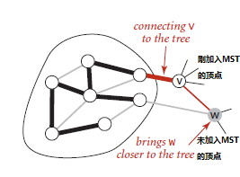

每次将一个点加入到MST之后，就需要利用现有的信息更新所有为加入到MST顶点到MST权重距离。


最小生成树生成时间复杂度：$ElogV$

空间复杂度：$V$

```java
import edu.princeton.cs.algs4.In;
import edu.princeton.cs.algs4.IndexMinPQ;
import edu.princeton.cs.algs4.Queue;
import edu.princeton.cs.algs4.StdOut;

public class PrimMST {
    private Edge[] edgeTo;
    private double[] distTo;
    private boolean[] marked;
    private IndexMinPQ<Double> pq;

    /* 访问结点v的所有邻边，若该边有效且它的权重比现有w到最小生成树的权
        重还要低，则将其替换为最新边edgeTo[w]=...和权重值distTo[w]=... */
    private void visit(EdgeWeightedGraph G, int v) {
        marked[v] = true;
        for (Edge e : G.adj(v)) {
            /* 每加入一个顶点到MST之后，就遍历它的所有临近顶点，
	            更新加入到MST的权重路径信息 */
            int w = e.other(v);
            if (!marked[w] && e.weight() < distTo[w]) {
                edgeTo[w] = e;
                distTo[w] = e.weight();
                if (pq.contains(w)) pq.change(w, distTo[w]);
                else pq.insert(w, distTo[w]);
            }
        }
    }

    public PrimMST(EdgeWeightedGraph G) {
        edgeTo = new Edge[G.V()];
        distTo = new double[G.V()];
        marked = new boolean[G.V()];
        for (int v = 0; v < G.V(); ++v)
            distTo[v] = Double.POSITIVE_INFINITY;
        pq = new IndexMinPQ<Double>(G.V());

        distTo[0] = 0.0;
        pq.insert(0, 0.0);
        while (!pq.isEmpty())
            visit(G, pq.delMin());
    }

    //返回最小生成树中的所有边
    public Iterable<Edge> edges() {
        Queue<Edge> queue = new Queue<Edge>();
        for (Edge edge : edgeTo)
            if (edge != null)
                queue.enqueue(edge);
        return queue;
    }

    public double weight() {
        double ret = 0.0;
        for (Edge edge : edges())
            ret += edge.weight();
        return ret;
    }

    public static void main(String[] args) {
        EdgeWeightedGraph graph = new EdgeWeightedGraph(new In(args[0]));
        PrimMST mst = new PrimMST(graph);

        for (Edge edge : mst.edges())
            StdOut.println(edge);
        StdOut.printf("Total price: %.2f", mst.weight());
    }
}
```

过程图示：


#### 4.3.3 Kruskal算法

算法原理：按照权重顺序（从小到大）处理它们，将边加入到最小生成树MST之中，加入到的边不会形成环，直到树中不会含有V-1条边为止。即由一片森林变成一棵树。

时间复杂度：$ElogE$

空间复杂度：$E$

```java
import edu.princeton.cs.algs4.In;
import edu.princeton.cs.algs4.MinPQ;
import edu.princeton.cs.algs4.StdOut;
import edu.princeton.cs.algs4.UF;

import java.util.ArrayDeque;
import java.util.Queue;

public class KruskalMST {
    private Queue<Edge> mst;

    public KruskalMST(EdgeWeightedGraph G) {
        mst = new ArrayDeque<Edge>();
        MinPQ<Edge> pq = new MinPQ<Edge>();
        UF uf = new UF(G.V());//并查集用来检测换的存在性
        for (Edge e : G.edges()) pq.insert(e);

        while (!pq.isEmpty() && mst.size() < G.V() - 1) {
            Edge e = pq.delMin();
            int v = e.either(), w = e.other(v);
            /* 若这两条边之前就已经相连了，则此时再添加这条v-w的新边，
             *   必然会导致MST形成一个环，所以我们应该跳过这条边，将其
             *   从最小优先队列中删除 */
            if (uf.connected(v, w)) continue;
            uf.union(v, w);
            mst.add(e);
        }
    }

    public Iterable<Edge> edges() {
        return mst;
    }

    public double weight() {
        double ret = 0.0;
        for (Edge e : mst)
            ret += e.weight();
        return ret;
    }

    public static void main(String[] args) {
        EdgeWeightedGraph graph = new EdgeWeightedGraph(new In(args[0]));
        KruskalMST mst = new KruskalMST(graph);
        for (Edge edge : mst.edges())
            StdOut.println(edge);
        StdOut.printf("total weight: %.2f", mst.weight());
    }
}
```

各个最小生成树算法总结（假设为V个顶点E条边的连通图，在最坏情况下）：

| 算法           | 空间复杂度 | 时间复杂度 |
| -------------- | ---------- | ---------- |
| 延时的Prim算法 | $E$        | $ElogE$    |
| 即时的Prim算法 | $V$        | $ElogV$    |
| Kruskal算法    | $E$        | $ElogE$    |

其中即时的Prim算法是这里面最好的。

### 4.4 最短路径

加权有向图的数据结构表示:`public EdgeWeightDigraph`

- `EdgeWeightDigraph(int V)`
- `EdgeWeightDigraph(In in)`
- `void addEdge(DirectedEdge edge)`
- `int V()`
- `int E()`
- `Iterable<DirectedEdge> adj(int v)`
- `Iterable<DirectedEdge> edges()`

```java
import edu.princeton.cs.algs4.Bag;
import edu.princeton.cs.algs4.In;
import edu.princeton.cs.algs4.StdOut;

public class EdgeWeightDigraph {
    private final int V;
    private int E;
    private Bag<DirectedEdge>[] adj;

    public EdgeWeightDigraph(int V) {
        this.V = V;
        this.E = 0;
        adj = (Bag<DirectedEdge>[]) new Bag[V];
        for (int v = 0; v < V; ++v)
            adj[v] = new Bag<DirectedEdge>();
    }

    public EdgeWeightDigraph(In in) {
        this(in.readInt());
        this.E = in.readInt();
        while (!in.isEmpty()) {
            DirectedEdge edge = new DirectedEdge(in.readInt(), in.readInt(), in.readDouble());
            addEdge(edge);
        }
    }

    public int V() {
        return V;
    }

    public int E() {
        return E;
    }

    public void addEdge(DirectedEdge edge) {
        adj[edge.from()].add(edge);
//        E++;
    }

    public Iterable<DirectedEdge> adj(int v) {
        return adj[v];
    }

    public Iterable<DirectedEdge> edges() {
        Bag<DirectedEdge> bag = new Bag<DirectedEdge>();
        for (int v = 0; v < V; ++v)
            for (DirectedEdge edge : adj[v])
                bag.add(edge);
        return bag;
    }

    public static void main(String[] args) {
        EdgeWeightDigraph digraph = new EdgeWeightDigraph(new In(args[0]));

        for (int v = 0; v < digraph.V(); ++v) {
            for (DirectedEdge edge : digraph.adj(v))
                StdOut.print(edge + "  ");
            StdOut.println();
        }
    }
}
```


#### 4.4.1  Dijkstra算法

Dijkstra算法主要用来解决*非负加权有向图*的最路径问题，Dijkstra算法的核心思想其实与Prim算法类似，**Prim的核心在于每一次迭代的过程中添加离MST最近的未加入MST顶点，而Dijkstra算法的核心在于每次迭代的过程中添加离起点最近的未加入SPT的顶点**（其中MST指的是最小生成树，SPT指的是最短路径树）。

在Prim算法中，我们最重要的操作就是`visit()`：我们每次向最小生成树MST加入一个顶点之后，就会通过它的所有邻边去更新剩余未加入顶点到MST的距离信息distTo[]和edgeTo[]（distTo[]也必然是在索引最小优先队列IndexMinPQ之中）。完成这些更新操作之后，Prim算法就会从队列中取出下一个最小顶点重复上面的操作。这里的`visit()`操作的本质就是①加入一个顶点和②更新剩余的顶点信息

同样的，在Dijkstra算法中也有类似的操作，可以说基本上与Prim算法类似，即书中所谓的放松`relax()`操作：我们每次向最短路径树加入一个顶点之后，就会通过它的所有邻边去更新剩余未加入顶点到起点的距离信息distTo[]和指入边edgeTo[]（distTo[]同样的也是在索引最小优先队列IndexMinPQ之中）。完成这些操作之后，Dijkstra算法就会从队列中取出下一个最小顶点重复上面的操作。因此，我们可以认为Dijkstra算法其实本质上和Prim算法有很多相似的地方🧐。下面演示的是顶点v加入到SPT之后对distTo[w]和edgeTo[w]的`relax()`更新操作：


```java
import edu.princeton.cs.algs4.In;
import edu.princeton.cs.algs4.IndexMinPQ;
import edu.princeton.cs.algs4.Stack;
import edu.princeton.cs.algs4.StdOut;

public class DijkstraSP {
    private DirectedEdge[] edgeTo;
    private double[] distTo;
    private IndexMinPQ<Double> pq;

    public DijkstraSP(EdgeWeightDigraph G, int s) {
        edgeTo = new DirectedEdge[G.V()];
        distTo = new double[G.V()];
        pq = new IndexMinPQ<Double>(G.V());

        for (int v = 0; v < G.V(); ++v)
            distTo[v] = Double.POSITIVE_INFINITY;
        distTo[s] = 0.0;

        pq.insert(s, 0.0);
        while (!pq.isEmpty())
            relax(G, pq.delMin());
    }

    private void relax(EdgeWeightDigraph G, int v) {
        for (DirectedEdge e : G.adj(v)) {
            int w = e.to();
            if (distTo[w] > distTo[v] + e.weight()) {
                distTo[w] = distTo[v] + e.weight();
                edgeTo[w] = e;
                if (pq.contains(w)) pq.changeKey(w, distTo[w]);
                else pq.insert(w, distTo[w]);
            }
        }
    }

    public double distTo(int v) {
        return distTo[v];
    }

    public boolean hasPathTo(int v) {
//        return edgeTo[v]!=null;
        return distTo[v] < Double.POSITIVE_INFINITY;
    }

    public Iterable<DirectedEdge> pathTo(int v) {
        if (!hasPathTo(v)) return null;
        Stack<DirectedEdge> path = new Stack<DirectedEdge>();
        for (DirectedEdge e = edgeTo[v]; e != null; e = edgeTo[e.from()])
            path.push(e);
        return path;
    }

    public static void main(String[] args) {
        EdgeWeightDigraph digraph = new EdgeWeightDigraph(new In(args[0]));
        DijkstraSP dijkstraSP = new DijkstraSP(digraph, 0);

        for (int v = 1; v < digraph.V(); ++v) {
            StdOut.print(0 + "->" + v + ": ");
            double weight = 0.0;
            for (DirectedEdge edge : dijkstraSP.pathTo(v)) {
                weight += edge.weight();
                if (edge.from() != 0)
                    StdOut.printf("->%d", edge.to());
                else
                    StdOut.printf("%d->%d", edge.from(), edge.to());
            }
            StdOut.printf("   (total weight: %.2f)\n", weight);
        }
    }
}
```

计算过程图示：


#### 4.4.2 无环加权有向图中的最短路径算法

计算无环加权有向图中的最短路径的核心思想就是：按照无环图中的拓扑顺序对图中的所有顶点进行relax松弛操作（沿路更新distTo[w]和edgeTo[w]）。这样我们就可以简单的获得其中的最短路径。

```java
import edu.princeton.cs.algs4.*;
import edu.princeton.cs.algs4.DirectedEdge;

public class AcyclicSP {
    private DirectedEdge[] edgeTo;
    private double[] distTo;

    private void realx(EdgeWeightedDigraph G, int v) {
        for (DirectedEdge e : G.adj(v)) {
            int w = e.to();
            if (distTo[w] > distTo[v] + e.weight()) {
                distTo[w] = distTo[v] + e.weight();
                edgeTo[w] = e;
            }
        }
    }

    public AcyclicSP(EdgeWeightedDigraph G, int s) {
        edgeTo = new DirectedEdge[G.V()];
        distTo = new double[G.V()];
        for (int v = 0; v < G.V(); ++v)
            distTo[v] = Double.POSITIVE_INFINITY;
        distTo[s] = 0.0;

        /* 按照拓扑排序的顺序对每一个顶点进行relax放松操作，即
        沿着拓扑顺序对路径上的每一个顶点的distTo[w]和edgeTo[w]
        进行更新操作。 */
        Topological top = new Topological(G);
        for (int v : top.order())
            realx(G, v);
    }

    public double distTo(int v) {
        return distTo[v];
    }

    public boolean hasPathTo(int v) {
        return distTo[v] < Double.POSITIVE_INFINITY;
    }

    public Iterable<DirectedEdge> pathTo(int v) {
        if (!hasPathTo(v)) return null;
        Stack<DirectedEdge> stack = new Stack<DirectedEdge>();
        for (DirectedEdge e = edgeTo[v]; e != null; e = edgeTo[e.from()])
            stack.push(e);
        return stack;
    }

    public static void main(String[] args) {
        In in = new In(args[0]);
        int s = Integer.parseInt(args[1]);
        EdgeWeightedDigraph G = new EdgeWeightedDigraph(in);

        AcyclicSP sp = new AcyclicSP(G, s);
        for (int v = 0; v < G.V(); v++) {
            if (sp.hasPathTo(v)) {
                StdOut.printf("%d to %d (%.2f)  ", s, v, sp.distTo(v));
                for (DirectedEdge e : sp.pathTo(v)) {
                    StdOut.print(e + "   ");
                }
                StdOut.println();
            } else {
                StdOut.printf("%d to %d         no path\n", s, v);
            }
        }
    }
}
```

执行过程图示：


与上面相反的是，使用拓扑排序+松弛操作组合还可以计算无环加权有向图中的最长路径，它的操作基本上与前者相反，尽可能取大一点。如下所示：

```java
import edu.princeton.cs.algs4.*;
import edu.princeton.cs.algs4.DirectedEdge;

public class AcyclicLP {
    private DirectedEdge[] edgeTo;
    private double[] distTo;

    private void relax(EdgeWeightedDigraph G, int v) {
        for (DirectedEdge e : G.adj(v)) {
            int w = e.to();
            if (distTo[w] < distTo[v] + e.weight()) {
                distTo[w] = distTo[v] + e.weight();
                edgeTo[w] = e;
            }
        }
    }

    public AcyclicLP(EdgeWeightedDigraph G, int s) {
        edgeTo = new DirectedEdge[G.V()];
        distTo = new double[G.V()];
        for (int v = 0; v < G.V(); ++v)
            distTo[v] = Double.NEGATIVE_INFINITY;
        distTo[s] = 0.0;

        Topological top = new Topological(G);
        for (int v : top.order())
            relax(G, v);
    }

    public boolean hasPathTo(int v) {
        return distTo[v] > Double.NEGATIVE_INFINITY;
    }

    public double distTo(int v) {
        return distTo[v];
    }

    public Iterable<DirectedEdge> pathTo(int v) {
        if (!hasPathTo(v)) return null;
        Stack<DirectedEdge> stack = new Stack<DirectedEdge>();
        for (DirectedEdge e = edgeTo[v]; e != null; e = edgeTo[e.from()])
            stack.push(e);
        return stack;
    }

    public static void main(String[] args) {
        In in = new In(args[0]);
        int s = Integer.parseInt(args[1]);
        EdgeWeightedDigraph G = new EdgeWeightedDigraph(in);

        AcyclicLP lp = new AcyclicLP(G, s);

        for (int v = 0; v < G.V(); v++) {
            if (lp.hasPathTo(v)) {
                StdOut.printf("%d to %d (%.2f)  ", s, v, lp.distTo(v));
                for (DirectedEdge e : lp.pathTo(v)) {
                    StdOut.print(e + "   ");
                }
                StdOut.println();
            } else {
                StdOut.printf("%d to %d         no path\n", s, v);
            }
        }
    }
}
```


#### 4.4.3 Bellman-Ford算法(一般加权有向图)

##### 4.4.3.1  通用Bellman-Ford算法

Bellman-Ford算法主要是用来解决一般加权有向图中的最短路径问题。算法核心思想为：在任意含有V个顶点的加权有向图中给定起点s，从s无法到任何负权重环，则我们可以通过如下的方式计算单点最短路径问题：**将s->s的距离权重distT[s]初始化为0.0，其他的distTo[]元素初始化为无穷大，然后以任意顺序对有向图中的所有边进行发送`relax`操作，重复V轮。**

因此我们很容易的就可以推断出这样的算法的时间复杂度为：$EV$，空间复杂度为：$V$。我们可以按照这个算法进行实现，因为它没有任何严格的预处理、处理顺序的要求，代码如下：

```java
import edu.princeton.cs.algs4.DirectedEdge;
import edu.princeton.cs.algs4.EdgeWeightedDigraph;
import edu.princeton.cs.algs4.In;
import edu.princeton.cs.algs4.StdOut;

import java.util.Arrays;
import java.util.Stack;

public class BellmanFordSP {
    private double[] distTo;
    private DirectedEdge[] edgeTo;

    //对指定的边进行松弛操作
    private void relax(DirectedEdge e) {
        int w = e.to(), v = e.from();
        if (distTo[w] > distTo[v] + e.weight()) {
            distTo[w] = distTo[v] + e.weight();
            edgeTo[w] = e;
        }
    }

    //算法正常执行的前提是没有负权重环
    public BellmanFordSP(EdgeWeightedDigraph G, int s) {
        distTo = new double[G.V()];
        edgeTo = new DirectedEdge[G.V()];
        Arrays.fill(distTo, Double.POSITIVE_INFINITY);

        //VE次执行松弛操作
        distTo[s] = 0.0;
        for (int v = 0; v < G.V(); ++v)
            for (DirectedEdge e : G.edges())
                relax(e);
    }

    public boolean hasPathTo(int v) {
        return distTo[v] < Double.POSITIVE_INFINITY;
    }

    public double distTo(int v) {
        return distTo[v];
    }

    public Iterable<DirectedEdge> pathTo(int v) {
        if (!hasPathTo(v)) return null;
        Stack<DirectedEdge> stack = new Stack<DirectedEdge>();
        for (DirectedEdge e = edgeTo[v]; e != null; e = edgeTo[e.from()])
            stack.push(e);
        return stack;
    }

    public static void main(String[] args) {
        In in = new In(args[0]);
        int s = Integer.parseInt(args[1]);
        EdgeWeightedDigraph G = new EdgeWeightedDigraph(in);

        BellmanFordSP sp = new BellmanFordSP(G, s);

        for (int v = 0; v < G.V(); v++) {
            if (sp.hasPathTo(v)) {
                StdOut.printf("%d to %d (%5.2f)  ", s, v, sp.distTo(v));
                for (DirectedEdge e : sp.pathTo(v))
                    StdOut.print(e + "   ");
                StdOut.println();
            } else {
                StdOut.printf("%d to %d           no path\n", s, v);
            }
        }
    }
}
```

负权重环对加权有向图计算最短路径的影响：若一个一般性加权有向图中出现了负权重环，那么这样的图中显然是计算不出最终的最短路径，因为我们完全可以在其中的路径中通过无限次绕着这个负权重环来无限的趋于负无穷，最终得到任意数目的更短路径。因此在对一个一般加权有向图计算最短路径的时候一定要检测其中是否存在负权重环。若图中不存在负权重环，则我们就可以使用Bellman-Ford算法来计算最短路径。


#####  4.4.3.2  基于队列的Bellman-Ford算法

基于队列的Bellman-Ford算法不再粗暴的采用一个双重循环，而是基于一个基本事实：只有上一轮中的distTo[]值发生变化的顶点指出的边才能够改变其他distTo[]元素的值。它的意思就是说，**对于一个顶点w以及它的距离权重distTo[w]，只有在它的指入父亲顶点的distTo[v]发生改变的前提下才会发生改变，否则再多次的循环也对这个顶点最短路径的正确指入边没什么影响**。因此我们可以改进随机进行relax操作的Bellman-Ford算法，将其改成按照一定的“由父到子”的顺序（这里处理为队列顺序）执行relax操作。这样就可以加快最短路径算法的执行速度。（**其实你可以发现这种思想就是广度优先遍历BFS算法**，但不同的是这里的顶点可能被重新加入队列之中，被重新加入的原因只有一个，那就是图中有负权重边）

不过此时的时间复杂度仍然是：$EV$，空间复杂度为：$V$。

```java
import edu.princeton.cs.algs4.*;
import edu.princeton.cs.algs4.DirectedEdge;

import java.util.Arrays;
import java.util.Stack;

public class BellmanFordSPQ {
    private double[] distTo;
    private DirectedEdge[] edgeTo;
    private Queue<Integer> queue;
    private boolean[] onQ;

    //对v->w进行松弛操作
    private void relax(EdgeWeightedDigraph G, int v) {
        for (DirectedEdge e : G.adj(v)) {
            int w = e.to();
            if (distTo[w] > distTo[v] + e.weight()) {
                distTo[w] = distTo[v] + e.weight();
                edgeTo[w] = e;
                //若指出顶点没有在队列之中，那么就将其加入到队列中
                if (!onQ[w]) {
                    onQ[w] = true;
                    queue.enqueue(w);
                }
            }
        }
    }

    //正常执行的前提是该加权有向图中没有负权重环
    public BellmanFordSPQ(EdgeWeightedDigraph G, int s) {
        distTo = new double[G.V()];
        edgeTo = new DirectedEdge[G.V()];
        queue = new Queue<Integer>();
        onQ = new boolean[G.V()];
        Arrays.fill(distTo, Double.POSITIVE_INFINITY);

        /* 这里所用的算法思想（在图中不存在负权重环情况下）就是
            广度优先遍历BFS算法 */
        distTo[s] = 0.0;
        queue.enqueue(s);
        while (!queue.isEmpty()) {
            int v = queue.dequeue();
            onQ[v] = false;
            relax(G, v);
        }
    }

    public boolean hasPathTo(int v) {
        return distTo[v] < Double.POSITIVE_INFINITY;
    }

    public double distTo(int v) {
        return distTo[v];
    }

    public Iterable<DirectedEdge> pathTo(int v) {
        if (!hasPathTo(v)) return null;
        Stack<DirectedEdge> stack = new Stack<DirectedEdge>();
        for (DirectedEdge e = edgeTo[v]; e != null; e = edgeTo[e.from()])
            stack.push(e);
        return stack;
    }

    public static void main(String[] args) {
        In in = new In(args[0]);
        int s = Integer.parseInt(args[1]);
        EdgeWeightedDigraph G = new EdgeWeightedDigraph(in);
        BellmanFordSPQ sp = new BellmanFordSPQ(G, s);

        for (int v = 0; v < G.V(); v++) {
            if (sp.hasPathTo(v)) {
                StdOut.printf("%d to %d (%5.2f):  ", s, v, sp.distTo(v));
                for (DirectedEdge e : sp.pathTo(v))
                    StdOut.print(e + "   ");
                StdOut.println();
            } else {
                StdOut.printf("%d to %d           no path\n", s, v);
            }
        }
    }
}
```

算法执行过程图示：


##### 4.4.3.3  负权重环检测

在上面的讨论中我们已经提到过加权有向图中负权重环的存在会严重的影响最短路径的计算（对于上面没有负权重环检测能力的基于队列的Bellman-Ford算法，若用来计算一个含有负权重环有向图的话会陷入一个死循环）。因此我们必须在图最短路径计算的过程中需要证明负权重环的存在性。若存在则没有最短路径，我们此时应该从循环中退出并得到那个环的具体路径；否则我们可以获得最短路径树SPT。

对于负权重环的检测我们直接使用书中的结论：若将所有边放松V轮之后当且仅当队列非空时有向图中才存在从起点可达的负权重环。也就是说我们没调用V次relax()操作就应该检查下当前找到的最短路径树SPT中是否存在负权重环（这里只要检测到有环就必然是负权重环的，因为只有负权重环才会让一个最短路径树SPT从一点又回到自己本身）

```java
import edu.princeton.cs.algs4.*;
import edu.princeton.cs.algs4.DirectedEdge;

import java.util.Arrays;
import java.util.Stack;

public class BellmanFordSPQ1 {
    private double[] distTo;
    private DirectedEdge[] edgeTo;
    private Queue<Integer> queue;
    private boolean[] onQ;
    private Iterable<DirectedEdge> cycle;
    private int count;

    //松弛操作
    private void relax(EdgeWeightedDigraph G, int v) {
        for (DirectedEdge e : G.adj(v)) {
            int w = e.to();
            if (distTo[w] > distTo[v] + e.weight()) {
                distTo[w] = distTo[v] + e.weight();
                edgeTo[w] = e;
                if (!onQ[w]) {
                    queue.enqueue(w);
                    onQ[w] = true;
                }
            }
            //每V轮就调用一次findNegativeCycle()检测负权重环的存在
            if (++count % G.V() == 0)
                findNegativeCycle();
        }
    }

    //在Bellman-Ford算法当前找到的最短路径树SPT中寻找负权重环（使用深度优先遍历算法DFS）
    private void findNegativeCycle() {
        int V = edgeTo.length;
        EdgeWeightedDigraph spt = new EdgeWeightedDigraph(V);
        for (int v = 0; v < V; ++v)
            if (edgeTo[v] != null)
                spt.addEdge(edgeTo[v]);

        EdgeWeightedDirectedCycle finder = new EdgeWeightedDirectedCycle(spt);
        cycle = finder.cycle();
    }

    public BellmanFordSPQ1(EdgeWeightedDigraph G, int s) {
        distTo = new double[G.V()];
        edgeTo = new DirectedEdge[G.V()];
        queue = new Queue<Integer>();
        onQ = new boolean[G.V()];
        Arrays.fill(distTo, Double.POSITIVE_INFINITY);

        distTo[s] = 0.0;
        queue.enqueue(s);
        onQ[s] = true;
        while (!queue.isEmpty() && !hasNegativeCycle()) {
            int v = queue.dequeue();
            onQ[v] = false;
            relax(G, v);
        }
    }

    public boolean hasPathTo(int v) {
        return distTo[v] < Double.POSITIVE_INFINITY;
    }

    public double distTo(int v) {
        return distTo[v];
    }

    public Iterable<DirectedEdge> pathTo(int v) {
        if (!hasPathTo(v)) return null;
        Stack<DirectedEdge> stack = new Stack<DirectedEdge>();
        for (DirectedEdge e = edgeTo[v]; e != null; e = edgeTo[e.from()])
            stack.push(e);
        return stack;
    }

    public boolean hasNegativeCycle() {
        return cycle != null;
    }

    public Iterable<DirectedEdge> negativeCycle() {
        return cycle;
    }

    public static void main(String[] args) {
        In in = new In(args[0]);
        int s = Integer.parseInt(args[1]);
        EdgeWeightedDigraph G = new EdgeWeightedDigraph(in);
        BellmanFordSPQ1 sp = new BellmanFordSPQ1(G, s);

        if (sp.hasNegativeCycle()) {
            StdOut.println("Negative Cycle: ");
            for (DirectedEdge e : sp.negativeCycle())
                StdOut.print(e + "  ");
            StdOut.println();
        } else {
            for (int v = 0; v < G.V(); v++) {
                if (sp.hasPathTo(v)) {
                    StdOut.printf("%d to %d (%5.2f)  ", s, v, sp.distTo(v));
                    for (DirectedEdge e : sp.pathTo(v)) {
                        StdOut.print(e + "   ");
                    }
                    StdOut.println();
                } else {
                    StdOut.printf("%d to %d           no path\n", s, v);
                }
            }
        }
    }
}
```


最短路径算法总结：

| 算法             | 局限                   | 一般复杂度 | 最坏复杂度 | 空间复杂度 | 优势                     |
| ---------------- | ---------------------- | ---------- | ---------- | ---------- | ------------------------ |
| Dijkstra算法     | 边权重必须为正         | $ElogV$    | $ElogV$    | $V$        | 最坏情况下仍有较好的性能 |
| 拓扑排序         | 只适用于无环加权有向图 | $E+V$      | $E+V$      | $V$        | 是无环图中的最优算法     |
| Bellman-Ford算法 | 不能存在负权重环       | $E+V$      | $VE$       | $V$        | 适用领域广泛             |


## 5. 字符串

### 5.1 字符串排序

#### 5.1.1  键索引计数排序

键索引计数法实质上是一种排序方法，适用于小整数键的简单排序。执行4个步骤如下：

1. 使用一个int数组count[]计算出每一个键出现的频率；
2. 使用count[]来计算每一个键在排序结果中的起始索引位置；
3. 将原来数组中的元素移动到一个辅助数组aux[]之中进行排序，且每一个元素在aux[]中的位置是由它的键对应的count[]（此时count[i]表示该键当前在辅助数组中的起始下标位置）值决定；
4. 将在aux[]数组中排序好的数据回写到原来的数组之中。

代码如下所示：

```java
	int N = a.length;
    
    String[] aux = new String[N];
    int[] count = new int[R + 1];
    
	//计算键出现的频率
    for (int i = 0; i < N; i++)
        count[a[i].key() + 1]++;
    //将频率转换为索引
    for (int r = 0; r < R; r++)
        count[r + 1] += count[r];
    //将元素分类
    for (int i = 0; i < N; i++)
        aux[count[a[i].key()]++] = a[i];
    //回写
    for (int i = 0; i < N; i++)
        a[i] = aux[i];
```

下图演示了一组名字字符串按照组号（键）进行从小到大排序的过程：


而下面的过程演示了从原数组按照count[]移动到辅助数组的过程：


#### 5.1.2  低位优先的字符串排序

低位优先的字符串排序实际上就是针对字符串数组**从它们的低位开始到高位进行字符串长度次的键索引计数排序**。

```java
import edu.princeton.cs.algs4.StdOut;

public class LSD {
    public static void sort(String[] a, int W) {
        int N = a.length;
        int R = 256;
        String[] aux = new String[N];

        for (int d = W - 1; d >= 0; d--) {
            int[] count = new int[R + 1];
            for (int i = 0; i < N; i++)
                count[a[i].charAt(d) + 1]++;
            //count[a[i][d]+1]++;
            //count[i+1]=n表示字符码为i的字符出现了n次

            for (int r = 0; r < R; r++)
                count[r + 1] += count[r];
            //count[r+1]+=count[r];
            //此时count[i]表示字符码为i的字符要移动到辅助数组中的下标位置

            for (int i = 0; i < N; i++)
                aux[count[a[i].charAt(d)]++] = a[i];
            //aux[count[a[i][d]]++]=a[i]

            for (int i = 0; i < N; i++)
                a[i] = aux[i];
        }
    }

    public static void main(String[] args) {
        String[] a = new String[]{
                "4PGC938", "2IYE230",
                "3CIO720", "1ICK750",
                "1OHV845", "4JZY524"
        };

        for (String str : a)
            StdOut.println(str);
    }
}

```

C++实现：

```c++
#include <algorithm>
#include <cstring>
#include <iostream>
#include <string>
#include <vector>
using namespace std;

const vector<string> &
strsort(vector<string> &strvec, int w) {
	size_t N = strvec.size(), R = 256;
	vector<string> aux(N);
	int *count = new int[R + 1];

	for (int d = w - 1; d >= 0; --d) {
		memset(count, 0, sizeof(int) * (R + 1));
		for (int i = 0; i < N; ++i)
			count[strvec[i][d] + 1]++;
		for (int r = 0; r < R; ++r)
			count[r + 1] += count[r];
		for (int i = 0; i < N; ++i)
			aux[count[strvec[i][d]]++] = strvec[i];
		copy(aux.begin(), aux.end(), strvec.begin());
	}
	delete[] count;
	return strvec;
}

int main() {
	vector<string> strvec{
	    "4PGC938", "2IYE230",
	    "3CIO720", "1ICK750",
	    "1OHV845", "4JZY524"};
	for (const string &str : strsort(strvec, strvec[0].size()))
		cout << str << endl;
	return 0;
}
```

图示：


#### 5.1.3  高位优先的字符串排序

高位优先的字符串排序的基本思想很简单：首先用键索引计数法将所有字符串按照首字母排序，然后（递归地）再将每个首字母所对应的子数组排序（忽略首字母，因为每一类中的所有字符串的首字母都是相同的）。

高位优先排序的难点在于处理不同长度的字符串。在这里我们使用的处理方法就是：不断地递归调用sort，而sort每一次都只根据子字符串中第一个字符对字符串数组进行排序，完成之后对首字符相同的字符串数组部分根据它们的首字符递归调用sort进行排序，直到遇到这个起始字符后面的子字符串数组为空。

如果字符串之间长度不同，那么随着递归的推进，最终总会有些字符串在sort函数中呈现出的子字符串为空（实际中，我们用字符下标>=字符串长度时，表示检测到子字符串为空），那么显然这些字符串应该自动地放到源字符串数组的前面位置。接着再对剩下的子字符串进行递归比较。如图所示：

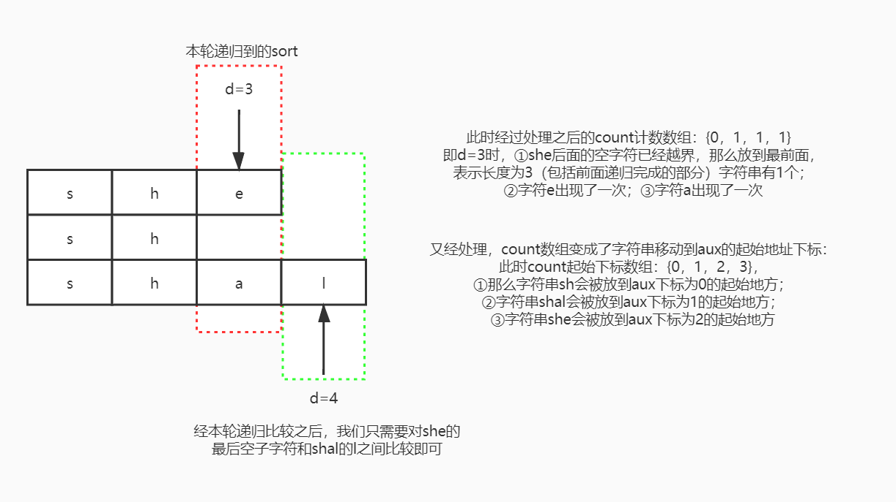

```java
import edu.princeton.cs.algs4.Alphabet;
import edu.princeton.cs.algs4.StdOut;

public class MSD {
    private static int R = Alphabet.EXTENDED_ASCII.R();//256
    private static final int M = 10;
    private static String[] aux;

    private static void swap(String[] a, int i, int j) {
        String temp = a[i];
        a[i] = a[j];
        a[j] = temp;
    }

    /* 若下标d已经超过了str的最大下标，则返回-1，这样count[1]这个位置
        就可以记录在本轮不再比较的字符串数量。它是String charAt方法的改造
        而原来的方法在越界之后会直接抛出一个异常 */
    private static int charAt(String str, int d) {
        if (d < str.length()) return str.charAt(d);
        return -1;
    }

    private static boolean less(String v, String w, int d) {
        return v.substring(d).compareTo(w.substring(d)) < 0;
    }

    /* 要知道插入排序是可以一次就将字符串数组进行排序，不需要像最高位优先
        字符串排序那样对每一位字符都进行一次键索引计数排序 */
    public static void insertion_sort(String[] a, int low, int high, int d) {
        for (int i = low, j; i <= high; ++i) {
            String temp = a[i];
            for (j = i; j > low && less(temp, a[j - 1], d); --j)
                a[j] = a[j - 1];
            a[j] = temp;
        }
    }

    public static void msd_sort(String[] a, int low, int high, int d) {
        if (high - low <= M) {
            insertion_sort(a, low, high, d);
            return;
        }

        int[] count = new int[R + 2];
        for (int i = low; i <= high; ++i)
            count[charAt(a[i], d) + 2]++;
        for (int r = 0; r < R; ++r)
            count[r + 1] += count[r];
        for (int i = low; i <= high; ++i)
            aux[count[a[i].charAt(d) + 1]++] = a[i];
        for (int i = low; i <= high; ++i)
            a[i] = aux[i - low];

        //递归根据下一个字符位置进行比较
        for (int r = 0; r < R; ++r)
            msd_sort(a, low + count[r], low + count[r + 1] - 1, d + 1);
    }

    public static void msd_sort(String[] a) {
        int N = a.length;
        aux = new String[N];
        msd_sort(a, 0, N - 1, 0);
    }

    public static void main(String[] args) {
        String[] strarr = new String[]{
                "she", "shells", "seashells",
                "by", "what", "how", "code", "look",
                "the", "the", "are", "surely", "talk",
                "cheap", "joker", "bubble", "fuck"
        };
        msd_sort(strarr);
        for (String str : strarr)
            StdOut.println(str);
    }
}
```

这个算法妙就妙在count[]数组的设计上！count[]在不同阶段下其元素表示的意义如下图所示：


下图演示了一次键索引计数排序前后发生的过程：


#### 5.1.4  三向字符串快速排序

三向字符串快速排序的思想和普通的三切分快速排序没什么太大的不同，仍然是将字符串数组切分成3个部分，第一部分放置当前字符小于中枢字符的字符串；第二部分放置当前字符串等于中枢字符的字符串；第三部分放置当前字符大于中枢字符的字符串。我将快速排序中使用过的一张图放置在这里会很好的加深理解：


Java实现：

```java
import edu.princeton.cs.algs4.StdOut;

public class Quick3String {
    private static int charAt(String s, int d) {
        if (d < s.length()) return s.charAt(d);
        return -1;
    }

    private static void swap(String[] a, int i, int j) {
        String temp = a[i];
        a[i] = a[j];
        a[j] = temp;
    }

    private static void sort(String[] a, int low, int high, int d) {
        if (high <= low) return;

        int lt = low, gt = high, i = low + 1;
        int v = charAt(a[low], d);//中枢字符

        /**  i的起始位置
         *    |
         *    v     gt
         * [v,......]
         *
         * */
        while (i <= gt) {
            int t = charAt(a[i], d);
            if (t < v) swap(a, lt++, i++);
            else if (t > v) swap(a, i, gt--);
            else i++;
        }

        sort(a, low, lt - 1, d);
        if (v >= 0) sort(a, lt, gt, d + 1);
        sort(a, gt + 1, high, d);
    }

    public static void sort(String[] a) {
        sort(a, 0, a.length - 1, 0);
    }

    public static void main(String[] args) {
        String[] strarr = new String[]{
                "she", "shells", "seashells",
                "by", "what", "how", "code", "look",
                "the", "the", "are", "surely", "talk",
                "cheap", "joker", "bubble", "fuck"
        };
        sort(strarr);
        for (String str : strarr)
            StdOut.println(str);
    }
}
```

C++实现：（其实我更喜欢用C写😂）

```cpp
#include <algorithm>
#include <iostream>
#include <string>
#include <vector>
using namespace std;

class Quick3String {
public:
	static const vector<string> &
	sort(vector<string> &strvec) {
		return (sort(strvec, 0, strvec.size() - 1, 0), strvec);
	}

private:
	static void sort(vector<string> &strvec, int low, int high, int d) {
		if (low >= high)
			return;

		int lt = low, gt = high, i = low + 1;
		int key = (d < strvec[low].size()) ? strvec[low][d] : -1;//中枢字符

		while (gt >= i) {
			if (strvec[i][d] < key)
				swap(strvec, lt++, i++);
			else if (strvec[i][d] > key)
				swap(strvec, i, gt--);
			else
				i++;
		}

		sort(strvec, low, lt - 1, d);
		if (key >= 0)
			sort(strvec, lt, gt, d + 1);
		sort(strvec, gt + 1, high, d);
	}

	static void swap(vector<string> &strvec, int i, int j) {
		::swap(strvec[i], strvec[j]);
	}
};

int main() {
	vector<string> strvec{
	    "she", "shells", "seashells",
	    "by", "what", "how", "code", "look",
	    "the", "the", "are", "surely", "talk",
	    "cheap", "joker", "bubble", "fuck"};
	for (const string &str : Quick3String::sort(strvec))
		cout << str << endl;
	return (0);
}
```

如下是三向字符串快速排序一次完整的过程图演示：


总结：各种字符串排序算法的性能特点

|         算法         | 是否稳定 | 是否原地排序 | 时间复杂度  | 空间复杂度 |                    适用领域                    |
| :------------------: | :------: | :----------: | :---------: | :--------: | :--------------------------------------------: |
|       插入排序       |    ✔     |      ✔       |  $N$~$N^2$  |    $1$     |            小数组或者已经有序的数组            |
|       归并排序       |    ✔     |      ❌       |  $Nlog^2N$  |   $logN$   |               稳定的通用排序算法               |
|       快速排序       |    ❌     |      ✔       |  $Nlog^2N$  |    $N$     |      通用排序算法，特别适合空间不足的情况      |
|     三向快速排序     |    ❌     |      ✔       | $N$~$NlogN$ |   $logN$   |                   大量重复键                   |
|  低位优先字符串排序  |    ✔     |      ❌       |    $NW$     |    $N$     |                较短的定长字符串                |
|  高位优先字符串排序  |    ✔     |      ❌       |  $N$~$Nw$   |   $N+WR$   |                   随机字符串                   |
| 三向字符串字符串排序 |    ❌     |      ✔       |  $N$~$Nw$   |  $W+logN$  | 通用排序算法，特别适合含有较长公共前缀的字符串 |


### 5.2 单词查找树

#### 5.2.1 单词查找树

以字符串为键的符号表API：`public class StringST<Value>`

- `StringST()`
- `void put(String key,Value val)`
- `Value get(String key)`
- `void delete(String key)`
- `boolean contains(String key)`
- `boolean isEmpty()`
- `String longestPrefixOf(String s)`
- `Iterable<String> keysWithPrefix(String s)`
- `Iterable<String> keysThatMatch(String s)`
- `int size()`
- `Iterable<String> keys()`

结构图示：


这种数据结构的关键原理在于：让每一个单词的字符挂接在基于字符集的R（拓展ASCII为256）叉树上，若树上的某一个字符所对应的值非null，那么表示该字符与之前路径上所有字符组成的字符串存在，且对应值就是这个字符结点所对应的值。

```java
import edu.princeton.cs.algs4.Queue;
import edu.princeton.cs.algs4.StdOut;


public class TrieST<Value> {
    private static int R = 256;
    private Node root;

    private static class Node {
        private Object val;
        private Node[] next = new Node[R];
    }

    private Node put(Node x, String key, Value val, int d) {
        if (x == null) x = new Node();
        if (d == key.length()) {
            x.val = val;
            return x;
        }

        char c = key.charAt(d);
        x.next[c] = put(x.next[c], key, val, d + 1);
        return x;
    }

    private Node delete(Node x, String key, int d) {
        if (x == null) return null;
        if (d == key.length())
            x.val = null;
        else {
            //递归查找并删除
            char c = key.charAt(d);
            x.next[c] = delete(x.next[c], key, d + 1);
        }

        if (x.val != null) return x;
        for (char c = 0; c < R; c++)
            if (x.next[c] != null) return x;
        return null;
    }

    private Node get(Node x, String key, int d) {
        if (x == null) return null;
        if (d == key.length()) return x;

        char c = key.charAt(d);
        return get(x.next[c], key, d + 1);
    }

    private void collect(Node x, String pre, Queue<String> queue) {
        if (x == null) return;
        if (x.val != null) queue.enqueue(pre);
        for (char c = 0; c < R; c++)
            collect(x.next[c], pre + c, queue);
    }

    /* pre表示先前经由单词查找树找到的前缀字符串，只有当这个前缀字符串与
     * 匹配字符串长度相同且结点值不为null时才表示匹配成功，故将其加入到队列中 */
    private void collect(Node x, String pre, String pat, Queue<String> queue) {
        int d = pre.length();
        if (x == null) return;
        if (d == pat.length() && x.val != null)
            queue.enqueue(pre);
        if (d == pat.length()) return;

        char next = pat.charAt(d);
        for (char c = 0; c < R; c++)
            if (next == '.' || next == c)
                collect(x.next[c], pre + c, pat, queue);
    }

    private int search(Node x, String s, int d, int length) {
        if (x == null) return length;
        if (x.val != null) length = d;
        if (d == s.length()) return length;
        char c = s.charAt(d);
        return search(x.next[c], s, d + 1, length);
    }

    private int size(Node x) {
        if (x == null) return 0;

        int cnt = 0;
        if (x.val != null) cnt++;
        for (char c = 0; c < R; c++)
            cnt += size(x.next[c]);
        return cnt;
    }

    public int size() {
        return size(root);
    }

    public boolean isEmpty() {
        return size() == 0;
    }

    public boolean contains(String key) {
        return get(key) != null;
    }

    public void put(String key, Value val) {
        root = put(root, key, val, 0);
    }

    public void delete(String key) {
        root = delete(root, key, 0);
    }

    public Value get(String key) {
        Node x = get(root, key, 0);
        if (x == null) return null;
        return (Value) x.val;
    }

    public Iterable<String> keysWithPrefix(String pre) {
        Queue<String> queue = new Queue<String>();
        collect(get(root, pre, 0), pre, queue);
        return queue;
    }

    public Iterable<String> keys() {
        return keysWithPrefix("");
    }

    public Iterable<String> keysThatMatch(String pat) {
        Queue<String> queue = new Queue<String>();
        collect(root, "", pat, queue);
        return queue;
    }

    public String longestPrefixOf(String s) {
        int length = search(root, s, 0, 0);
        return s.substring(0, length);
    }

    public static void main(String[] args) {
        String[] strarr = new String[]{
                "sea", "what", "fuck", "show",
                "how", "good", "code", "dance"
        };
        TrieST<Integer> trieST = new TrieST<Integer>();

        for (int i = 0; i < strarr.length; ++i)
            trieST.put(strarr[i], i);
        StdOut.println(trieST.size());
        for(String str: trieST.keys())
            StdOut.println(str);
    }
}
```


##### 5.2.1.1  相关操作分析

###### 5.2.1.1.1  插入操作

为了达到插入的目的，我们必须解决先前路径上的字符结点不存在的问题。若先前路径上的字符结点不存在，虽然我们不会为这样的结点赋值，但是我还是必须要创建这样的结点。再创建之后必须检查字符的长度是否与指定插入键字符串的长度相同，若是则将值赋予；否则递归处理到下一个结点（若先前的结点是新建的，那么下一个结点也必然需要新创建）。

```java
	private Node put(Node x, String key, Value val, int d) {
        if (x == null) x = new Node();//若当前字符结点不存在，则新建
        if (d == key.length()) {	  //若到达了指定的字符结点，则赋值
            x.val = val;
            return x;
        }
									//否则递归处理到下一个结点再处理
        char c = key.charAt(d);
        x.next[c] = put(x.next[c], key, val, d + 1);
        return x;
    }

	public void put(String key, Value val) {
        root = put(root, key, val, 0);
    }
```

下面演示了一个简单单词查找树的构造过程：


###### 5.2.1.1.2  查找操作

查找操作和插入操作类似，也是使用递归，我们可以用下面一个简单的算法指示完成相应的操作：

```
NodeType get(NodeType x, Key key):
	若当前结点 ==null: 返回null
	
	若当前结点复合要求: 返回当前结点
	否则 get(x.next[c], key)
```

实际真正的代码如下，在这里结点是否符合要求完全依赖的是字符串的长度是否等于先前路径上字符的个数，若相等，我们直接返回这个结点并不管这个结点的值是否为null，是否是null这个工作可以交给下面的封装函数完成。

```java
	private Node get(Node x, String key, int d) {
        if (x == null) return null;
        if (d == key.length()) return x;

        char c = key.charAt(d);
        return get(x.next[c], key, d + 1);
    }

	public Value get(String key) {
        Node x = get(root, key, 0);
        if (x == null) return null;
        return (Value) x.val;
    }
```

下面演示了一些实际的查找过程：


###### 5.3.1.1.3  删除操作

删除操作实际上很简单，只需要将单词查找树中对应字符串最后一个字符的结点的值设置为null即可，不过若这个结点在删除之前就没有任何子结点，那么就需要对这个结点本身以及其父字符结点+祖先结点中不再有孩子的结点（且自己本身的值为null）沿路径向上一并删除，这里主要由递归的return返回null起作用。（**这里的套路与左倾红黑树中的删除方法相同！**🤓）

```java
    private Node delete(Node x, String key, int d) {
        if (x == null) return null;
        
        //1、若当前结点即是指定结点，则值置为null
        if (d == key.length())
            x.val = null;
        //2、否则，递归查找
        else {
            char c = key.charAt(d);
            x.next[c] = delete(x.next[c], key, d + 1);
        }

        /* 置结点值为null后，在返回的路径上对每一个字符结点
        	进行处理。将没有子结点且自己的值为null的结点删除 */
        if (x.val != null) return x;
        for (char c = 0; c < R; c++)
            if (x.next[c] != null) return x;
        return null;
    }

    public void delete(String key) {
        root = delete(root, key, 0);
    }
```

下图展示了一个指定字符串删除的递归前、低轨到指定字符结点将其值置为null以及递归返回的过程中沿路径向上对结点的尾后处理过程：


###### 5.2.1.1.3  返回具有指定前缀键

返回具有指定前缀键的作用就是可以将一个单词查找树中存储的具有指定前缀的字符串加入到一个容器之中，然后将这个容器的引用进行返回。在上述类中对应的方法就是`keyWithPrefix()`。

为了完成这一目标我们引入了一个收集函数`collect()`，它是一个类中的私有辅助方法，它可以从指定的字符结点开始将路径上（直到最后的末尾）具有指定前缀的、且存在于单词查找树中的字符串加入到一个容器之中。这里使用的方法仍然是递归！下面的算法指示描述了这个递归方法的范式：

```
NodeType collect(NodeType x, Key key, Queue queue):
	若当前结点 == null: return
	
	若当前结点值非空: 加入这个结点前面路径所有字符组成的字符串到容器之中
	否则 collcet(x.next[c], key, queue)
```

根据上面这个`collect()`辅助方法我们可以轻易的让封装函数将单词查找树的根结点root和前缀字符串、容器传入到这个方法之中，最终通过递归将所有符合的字符串加入到容器之中，从而返回具有指定前缀键的容器引用。

更进一步，若我们向这个函数传入的前缀字符串是一个空字符串""，那么我们就可以让`keyWithPrefix()`方法实际返回单词查找树中的所有字符串键！我们将这个方法命名为`keys()`。

```java
    private void collect(Node x, String pre, Queue<String> queue) {
        if (x == null) return;
        if (x.val != null) queue.enqueue(pre);
        for (char c = 0; c < R; c++)
            collect(x.next[c], pre + c, queue);
    }

	//返回所有单词查找树中存在的具有指定前缀的字符串键
    public Iterable<String> keysWithPrefix(String pre) {
        Queue<String> queue = new Queue<String>();
        collect(get(root, pre, 0), pre, queue);
        return queue;
    }

	//返回所有单词查找树中存在的字符串键
    public Iterable<String> keys() {
        return keysWithPrefix("");
    }
```

下图演示了一次对具有指定前缀“sh”的字符串查找：


###### 5.2.1.1.4  通配符匹配

通配符匹配的思想其实也很简单，类似于上面的查找过程。例如对于一个单词查找树{"shell","she","what"}，我们试图从中找出符合下面通配符字符串，即pattern，“shel..”，那么我们必然知道指定通配符需要查找的字符串长度必然与统配字符串的长度相同（这里为5）！，显然我们只需要沿着前面“she”字符串前缀找剩下路径中长度为5的字符结点，若这个结点的值非空，那么将其加入到实现安排的容器之中即可，否则不加入。我们可以用如下的伪代码指示这一过程：

```
NodeType collect(NodeType x, String pattern, Queue queue):
	若当前结点为空: return
	
	若当前结点表示字符串长度与通配模式字符串长度相同 && 结点值非空:
		将这个字符串加入到容器之中
	若当前结点表示的字符串长度与通配模式字符串长度相同但结点值为空:
		return
	对当前结点中符合要求下一个字符要求的子结点:
		collect(x.next[c], pattern, queue)
```

具体的代码如下所示：

```java
    private void collect(Node x, String pre, String pat, Queue<String> queue) {
        int d = pre.length();
        if (x == null) return;
        if (d == pat.length() && x.val != null)
            queue.enqueue(pre);
        if (d == pat.length()) return;

        char next = pat.charAt(d);
        for (char c = 0; c < R; c++)
            if (next == '.' || next == c)
                collect(x.next[c], pre + c, pat, queue);
    }

    public Iterable<String> keysThatMatch(String pat) {
        Queue<String> queue = new Queue<String>();
        collect(root, "", pat, queue);
        return queue;
    }
```


######  5.2.1.15  最长前缀

最长前缀问题指的是给定一个字符串从单词查找树中找出最长的前缀，且这个前缀字符串本身也存储于单词查找树中，一种最特别的情况就是给定字符串本身就是最大前缀，那么可以料想这个单词字符串本身也必然是存储于单词查找树中。

解决这个问题的最好方法仍然是递归，不过递归方法的目的是为了找到那个最长前缀字符串的长度，而不是直接获取最长前缀字符串。这个递归式有如下几种情况需要处理：①若当前结点为空，则返回之前保存的最长前缀字符串长度；②若当前结点非空，则将保存的最长前缀字符串长度修改为当前字符串的长度；③若当前结点的长度已经等于指定字符串的长度，则直接返回这个保存的最长前缀字符串长度；④剩下的情况就是递归了。算法流程如下所示：

```
int search(NodeType x, String s, int d, int length):
	若当前结点为空: return length
	
	若当前结点值非空: 修改length长度
	若当前结点表示的字符串长度等于查找字符串的长度: return length 
	return search(x.next[c], s, d, length)
```

```java
    private int search(Node x, String s, int d, int length) {
        if (x == null) return length;
        if (x.val != null) length = d;
        if (d == s.length()) return length;
        char c = s.charAt(d);
        return search(x.next[c], s, d + 1, length);
    }

    public String longestPrefixOf(String s) {
        int length = search(root, s, 0, 0);
        return s.substring(0, length);
    }
```


##### 5.2.1.2 单词查找树性质

- 会命中的查找在单词查找树中所访问的字符结点数最多为键的长度+1，而与单词查找树中键的数量无关；
- 不会命中的查找在单词查找树中的随机模型中需要访问$~log_R{N}$（$N$表示总随机键数，$R$表示所基于的字符数量）个字符节点数，也就是说查找未命中的成本与键的长度无关；
- 一棵单词查找树中的链接总数在$RN$到$RNw$之间，其中$w$为键的平均长度。这意味着所有键比较短时，链接的总数接近于$RN$；当所有键比较长时，链接的总数接近于$RNw$。所以缩小$R$可以节省大量的空间。

总结就是：**命中查找时间成本与字符串的长度有关，而未命中查找时间成本与单词查找树中的键数量有关；而整个单词查找树的空间成本与键的数量、所基于字符集中的字符数量有关**。


#### 5.2.2 三向单词查找树

三向单词查找树可以认为是R向单词查找树的紧凑表示，其最大的好处在于可以很好的解决R向单词查找树所允许空间严重依赖于字符集中的字符R数量而造成的巨大空间需求。在三向单词查找树中，每个结点都含有一个字符、三条链接和一个值。这3条链接分别对应着当前字符小于、等于和大于结点字母的所有键。按照我们R向单词查找树的实现我们可以很好的完成上述数据结构的实现：

```java
public class TST<Value> {
    private Node root;

    private class Node {
        char c;
        Node left, mid, right;
        Value val;
    }

    private Node get(Node x, String key, int d) {
        if (x == null) return null;

        char c = key.charAt(d);
        if (c < x.c)
            return get(x.left, key, d);
        else if (c > x.c)
            return get(x.right, key, d);
        else if (d < key.length() - 1)
            return get(x.mid, key, d + 1);
        else return x;
    }

    public Value get(String key) {
        Node x = get(root, key, 0);
        if (x == null) return null;
        else return (Value) x.val;
    }

    private Node put(Node x, String key, Value val, int d) {
        char c = key.charAt(d);
        if (x == null) {
            x = new Node();
            x.c = c;
        }

        if (c < x.c)
            x.left = put(x.left, key, val, d);
        else if (c > x.c)
            x.right = put(x.right, key, val, d);
        else if (d < key.length() - 1)
            x.mid = put(x.mid, key, val, d + 1);
        else x.val = val;
        return x;
    }

    public void put(String key, Value val) {
        root = put(root, key, val, 0);
    }
}
```

三向单词查找树的形状如下：


对于三向单词查找树有如下的性质：

- 由$N$个平均长度为$w$的字符串构造的三向单词查找树中的链接总数在$3N$到$3Nw$之间；
- 在一棵由$N$个随机字符串构造的三向单词查找树中，查找未命中平均需要比较字符$~InN$次。除了$~InN$次外，一次插入或命中的查找会比较一次被查找的键中的每个字符。


**各种字符串查找算法的性能比较**：

|       算法(数据结构)       | 未命中查找检查的字符数量 |        内存使用        |             优点             |
| :------------------------: | :----------------------: | :--------------------: | :--------------------------: |
|      二叉树查找(BST)       |       $c_1(lgN)^2$       |         $64N$          |      适用于随机排列的键      |
|     2-3树查找(红黑树)      |       $c_2(lgN)^2$       |         $64N$          |          有性能保障          |
|    线性探测法(并行数组)    |           $w$            |      $32N$~$128N$      |     内置类型，缓存散列值     |
| 字典树查找(R向单词查找树)  |        $log_R{N}$        | $(8R+56)N$~$(8R+56)Nw$ | 适用于较短的键和较小的字母表 |
| 字典树查找(三向单词查找树) |        $1.39lgN$         |      $64N$~$64Nw$      |       适用于非随机的键       |


### 5.3 子字符串查找

#### 5.3.1  暴力子字符串查找算法

时间复杂度：$NM$

空间复杂度：$N+M$

```java
import edu.princeton.cs.algs4.StdOut;

public class StrSearch {
    public static int BFSearch(String txt, String pat) {
        int M = txt.length(), N = pat.length();
        for (int i = 0; i <= M - N; ++i) {
            int j;
            //并不显式的回溯跟踪文本串的下标
            for (j = 0; j < N; ++j)
                if (txt.charAt(i + j) != pat.charAt(j))
                    break;
            if (j == N) return i;
        }
        return -1;
    }

    public static int BFSearch1(String txt, String pat) {
        int i, M = txt.length();
        int j, N = pat.length();
        for (i = 0, j = 0; i < M && j < N; ++i) {
            if (txt.charAt(i) == pat.charAt(j)) ++j;
            else {
                /* 若未匹配成功，显式回溯跟踪文本串的下标，
                    并复位跟踪匹配模式串的下标 */
                i -= j;
                j = 0;
            }
        }
        if (j == N) return i - N;
        else return -1;
    }

    public static void main(String[] args) {
        String txt = "hello world", pat = "world";
        StdOut.println(BFSearch1(txt, pat));
        StdOut.println(txt.substring(BFSearch1(txt, pat)));
    }
}
```


#### 5.3.2  KMP字符串查找算法

因为算法4中使用的有限状态自动机的方式来讲解KMP算法，我个人不是很喜欢那种理解方式，所以采用一般算法书籍中常用的“最大公共前后缀计算”的方式来讲解这一内容，并使用C++实现。

> 在这里推荐一个up主讲解的视频：[KMP字符串匹配算法](https://www.bilibili.com/video/BV1Px411z7Yo?from=search&seid=13799977324547539020)

时间复杂度：$N/M$~$NM$

空间复杂度：$N+M$

```c++
#include <iostream>
#include <string>
#include <vector>
using namespace std;

//计算模式字符串的最大公共前缀表
void prefix_table(const string &pattern, int prefix[], int n) {
	int len = 0, i = 1;
	prefix[0] = 0;
	while (i < n) {
		if (pattern[i] == pattern[len]) {
			len++;
			prefix[i] = len;
			i++;
		} else {
			/* 若当前最大公共前后缀无法虽然i的增加而增长，而退而寻找它之前的
			 * 第二大公共前后缀字符串，若当len为0时也找不到则直接将最大公共
			 * 前后缀数组prefix中的当前位置设置为0即可 */
			if (len > 0)
				len = prefix[len - 1];
			else {
				prefix[i] = len;
				i++;
			}
		}
	}
}

//向后移动一位最大公共前缀表，并将第0位设置为-1
void move_prefix(int prefix[], int n) {
	for (int i = n - 1; i > 0; --i)
		prefix[i] = prefix[i - 1];
	prefix[0] = -1;
}

//kmp算法执行子字符串查找
int kmp_search(const string &txt, const string &pat) {
	int i, M = txt.size();
	int j, N = pat.size();
	int *next = new int[N];
	prefix_table(pat, next, N);
	move_prefix(next, N);

	for (i = 0, j = 0; i < M && j < N;) {
		if (txt[i] == pat[j]) {
			i++;
			j++;
		} else {
			j = next[j];
			if (j == -1) {
				j = 0;
				i++;
			}
		}
	}
	delete[] next;
	if (j == N)
		return i - N;
	else
		return -1;
}

int main() {
	string txt("hello world"), pat("world");
	cout << kmp_search(txt, pat) << endl;
	cout << txt.substr(kmp_search(txt, pat), pat.size()) << endl;
	return 0;
}
```


##### 5.3.2.1  最大公共前后缀

众所周知，KMP算法的核心就是避免在文本串中的下标（指向当前待判的字符）在与模式字符串发生比较失败的时候进行回溯，防止不必要的重复比较。下面演示了KMP使用最大公共前后缀数组生成的next数组进行匹配时发生的前后两步：


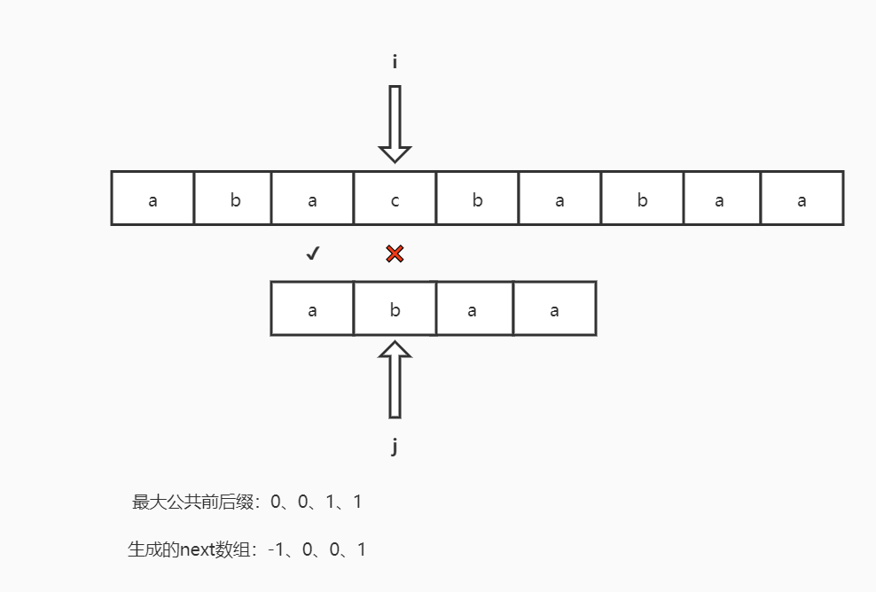

从上面的kmp匹配的过程中你可以看到文本串中的i在匹配的过程中并没有像暴力排序那样发生指针回溯的过程，其中两个最主要与BF算法不同的两个细节在于：①模式字符串pattern跳过了对文本串txt第2、3个字符开始的匹配；②模式字符串pattern中的下标j移动到了一个另一个位置。

对于第一个细节，如此操作的理由在于：由于模式字符串和上面的文本字符串在最后一个a字符前面的部分已经执行过了比较，我们知道下面abaa中前三个字符aba与上面的abac中的aba相同，而模式字符串第一个字符a却与后面的b不相同，因此我们显然可以知道若按照暴力匹配，下一步的abaa与bacb比较必然在第一个字符就会失败。因此我们可以直接跳过这个字符，让abaa与acba进行比较。

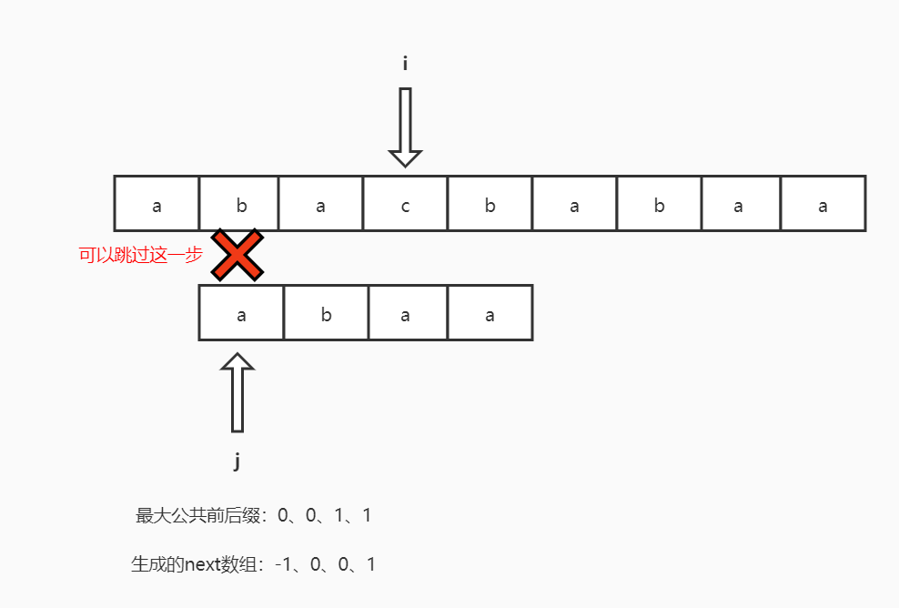

对于第二个细节，如此操作的理由在于：由于根据上面的推断abaa现在应该让文本串中的acba进行比较，但是由于aba这个字符串有着最大公共前后缀“a”。因此上一步的abaa与abac比较已经可以让我们知道前缀“a”和acba的第一个字符a的比较也是可以跳过的！所以我们可以直接将j设置成最大前后缀后边字符的下标，即：j=len(当前j前面字符串的最大前后缀)。

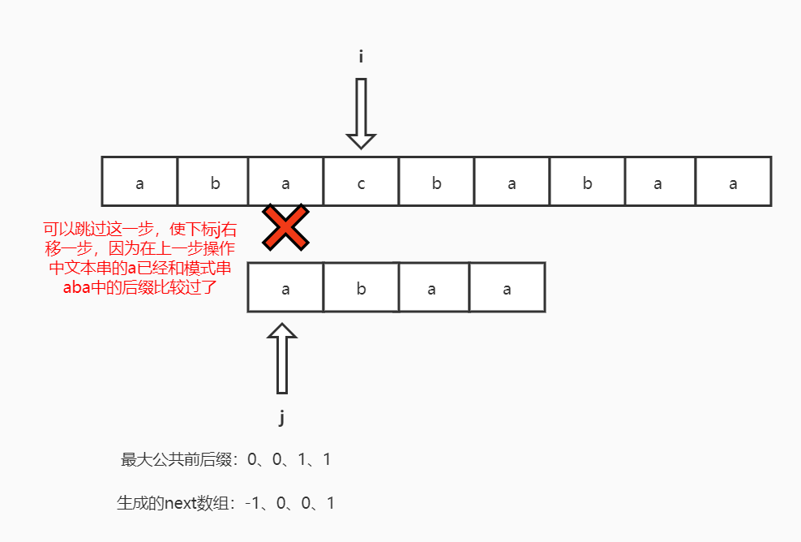

由上我们可以知道只要，只要我们计算出一个模式字符串的最大公共前后缀数组，我们可以使得在子字符串匹配的过程中只发生模式字符串中的下标j回退而不发生文本字符串下标i的回退。而真正绝对j到底回退到那个模式字符串数组中的哪一个位实际上取决于由最大公共前后缀数组prefix_table生成的next数组。其算法伪代码大致如下：

```python
def kmp(txt,pattern):
	根据pattern生成最大公共前后缀数组prefix
	进而由prefix生成next数组
	
	for i < txt.len && j < pattern.len:
		if 当前字符与模式串中的字符相同:
            i++, j++
		#当前字符没有成功，试试模式串中最大公共前后缀后面开始的字符
		#我们规定若next[j]等于-1表示这个当前字符串前面的部分没有
		#最大公共前后缀，此时直接开始试文本串中下一个字符串，j复位
		else
			j = next[j]
			if j == -1:
            	i++, j = 0
     
	if j == pattern.len:
    	return i - pattern.len
    else return -1;
```


##### 5.3.2.2  计算最大公共前后缀

计算最大公共前后缀需要用到动态规划的思想。通过下面逐步计算最大公共前后缀数组的过程可以发现：当前最大公共前后缀的值可以通过前一个子字符串的结果进一步计算得到。

例如**①**“aba”的下一个最大前缀前后缀值若想成为2，那么只需要比较位置为1的b和当前字符（aba后面的那个字符）是否相等，若相等则将前一个最大公共前后缀的值+1放置到当前位置；**②**否则用前面字符串的第二长公共前后缀字符串后的第一个字符与当前字符比较，若相同用这个第二公共前后缀字符串长度+1放置到当前prefix数组位置。例如”**aba**cd**aba**b“需要计算当前位置的prefix值，而“abacdaba”的最大公共前后缀为“aba”，既然当前的“b”与“aba”后面的“c”不相同，那么当前最大公共前后缀显然不能+1。只能退而求其次看看“abacdaba”的第二公共前后缀“a”后面的b是否与当前字符相同，显然这里是相同的，所以我们可以用第二公共前后缀长度1+1放置到当前的prefix之中。如果上面的都不成立，则继续比较第3大公共前后缀。。。直到没有子前后缀就从头比较。

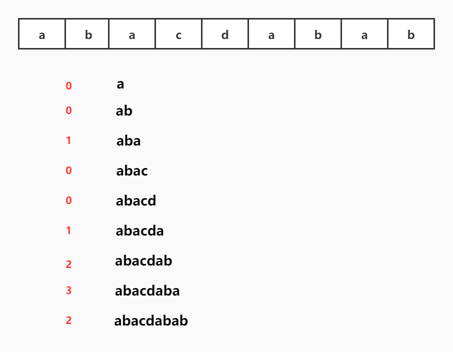

我们可以用下面的伪代码来描述这一算法：

```
def prefix(str,prefixArr):
	prefixArr[0]
	当前最大公共前后缀len=0
	
	while i < len(str):
		if str[len] == str[i]:
			将当前prefixArr的最大公共前后缀值设置为len+1
			增加len、i
		else
			将len设置前面字符串的次公共前后缀长度
			if 前面已经没有次公共前后缀:
				prefixArr[i++] == 0
```

使用C++语言对此进行实现：

```c++
void prefix_table(const string &pattern, int prefix[], int n) {
	int len = 0, i = 1;
	prefix[0] = 0;
    
	while (i < n) {
		if (pattern[i] == pattern[len]) {
			len++;
			prefix[i] = len;
			i++;
		}
        else {
			if (len > 0)
				len = prefix[len - 1];
			else
				prefix[i++] = len;
		}
	}
}
```


##### 5.3.2.3  计算next数组

只需要对上面的prefix数组每一个元素右移一位即可，不过第一个元素需要设置为-1，表示当前模式字符串第一个字符和文本字符串当前字符不相同，此时需要对文本字符串中的下标i+1，使得游标向前进一格。


#### 5.3.3 Boyer-Moore字符串查找算法

Boyer-Moore字符串查找算法的核心就是**基于模式串的字符集合生成一个字符不匹配时的跳跃表（辅助数组），这个表可以告诉程序在字符发生不匹配时文本串的下标该跳跃到哪一个位置，然后再开始从右向左的匹配**（注意：Boyer-Moore算法是从右向左开始匹配的）。虽然程序看起来文本串的下标i一直都是处在跳跃的状态，但实际上由于文本串中的字符是基于i+j进行匹配的，所以Boyer-Moore算法是存在文本串字符重复比较（即真正的回溯）的现象的。


> 下面是以前不好的甚至是错误的观点：
>
> 与KMP算法类似，这些算法都是**基于模式字符串中生成一个辅助数组**（KMP中是next数组，告诉模式字符串在不匹配的时候下标该跳到哪里；对于Boyer-Moore数组指的是跳跃表，它用来告诉文本串在发生不匹配的时候该跳到哪个位置）**，并在发生字符不匹配的时候避免文本串下标回溯。两者的算法核心的不同在于：KMP利用的是模式串最大公共前后缀有无的特点，而Boyer-Moore利用的是当前未匹配成功的字符是否存在于模式字符串这一特点**。其表现形式的不同在于：KMP中下标跳跃的模式串中的下标（向前跳），而在Boyer-Moore算法中跳跃的是文本串中的下标（向后跳）。

##### 5.3.3.1  跳跃的过程

该算法的另一个特点在于它的比较过程是从右向左的，而不是从左向右的！在比较的过程中，若当前文本串中的字符和模式串中的字符不同，则需要通过如下的处理让文本串中的下标进行跳跃式步进，而模式串中的下标也可能发生更新：

1. **若当前匹配文本串字符存在于模式串的字符集合中，且模式串当前位置-跳跃表查询结果>0，则让文本串下标增大这个差值**；
2. **若当前匹配文本串字符存在于模式串的字符集合中，但模式串当前位置-跳跃表查询结果<0，则让文本串下标递增1步**；
3. **若当前匹配文本串字符不存在于模式串的字符集合中，故跳跃表查询结果为-1，则让文本串下标递增1步**。

下图展示了当前字符没有匹配成功，但该字符在模式串的字符集合之中，此时本文串下标跳跃的情况：


下图展示了当前字符没有匹配成功，且该字符不在模式串的字符集合之中，此时的文本串下标跳跃情况：


##### 5.3.3.2  跳跃表的计算

跳跃表其实就是一个字符集合数组，若模式字符串出现了哪一个字符（遍历时最后出现）就在相应的额下标位置上记录该字符在模式字符串中的下标即可。若没有出现则在数组中初始化-1即可。


java代码实现：

```java
import edu.princeton.cs.algs4.StdOut;
import java.util.Arrays;

public class BoyerMoore {
    private int[] right;
    private String pat;

    //计算跳跃表
    BoyerMoore(String pat) {
        this.pat = pat;
        int M = pat.length();
        int R = 256;
        right = new int[R];
        Arrays.fill(right, -1);
        for (int j = 0; j < M; j++)
            right[pat.charAt(j)] = j;
    }

    public int search(String txt) {
        int M = txt.length();
        int N = pat.length();
        int skip;//文本串需要向右步进的量

        for (int i = 0; i <= M - N; i += skip) {
            skip = 0;
            for (int j = N - 1; j >= 0; j--)
                /* 若不匹配，则skip会被设置为正整数
                 * 1. 一种情况是当前匹配的文本串字符存在于模式串字符集合中，
                 *    且模式串当前位置-跳跃表查询得到的值>0；
                 * 2. 一种情况是当前匹配的文本串字符存在于模式串字符集合中，
                 *    但模式串当前位置-跳跃表查询得到的值<0；
                 * 3. 一种情况是当前匹配的文本串字符不存在于模式串字符集合中，
                 *    则查询跳跃表的结果<0。
                 * */
                if (pat.charAt(j) != txt.charAt(i + j)) {
                    skip = j - right[txt.charAt(i + j)];
                    if (skip < 1) skip = 1;
                    break;
                }
            if (skip == 0) return i;
        }
        return -1;
    }

    public static void main(String[] args) {
        String txt = "hello world", pat = "world";
        BoyerMoore boyerMoore = new BoyerMoore(pat);
        int b = boyerMoore.search(txt);
        StdOut.println(b);
        if (b != -1) StdOut.println(txt.substring(b));
    }
}

```

下面展示了一次完整的匹配过程：


C++实现：

```c++
#include <iostream>
#include <string>
#include <vector>
using namespace std;

static void jump_table(const string &pat, vector<int> &jump) {
	fill(jump.begin(), jump.end(), -1);
	for (int i = 0; i < pat.length(); ++i)
		jump[i] = static_cast<int>(pat[i]);
}

int BoyerMooreSearch(const string &txt, const string &pat) {
	int M = txt.size(), N = pat.size();
	vector<int> jump(256);
	int skip;

	jump_table(pat, jump);
	for (int i = 0; i < M - N; i += skip) {
		skip = 0;
		for (int j = N - 1; j >= 0; --j)
			if (txt[i + j] != pat[j]) {
				skip = jump[txt[i + j]];
				if (skip < 1)
					skip = 1;
				break;
			}
		if (skip == 0)
			return i;
	}
	return -1;
}

int main() {
	string txt("talk is cheap, show me the code"), pat("show");
	int res = BoyerMooreSearch(txt, pat);
	cout << res << endl;
	if (res >= 0)
		cout << txt.substr(res, pat.size());

	return 0;
}
```


#### 5.3.4 Rabin-Karp字符串查找算法

Rabin-Karp算法是一种基于Hash函数的字符串查找算法。其核心思想就是：**计算模式字符串的Hash值，然后用相同的Hash函数计算文本中所有可能的M个字符长度的子字符串的Hash值并一一匹配。若匹配成功，则再进行一次检验**（可能两两计算使用更大质数得到的Hash值）**，然后返回对应的子字符串起始下标。**

对于Hash值的计算主要是通过Horner算法逐位累加计算：
$$
当前字符串的Hash值=(上一个子字符串Hash值*R+当前位置字符值) \% Q
$$
而对于文本串中的Hash值是通过滑动窗口来计算得到的

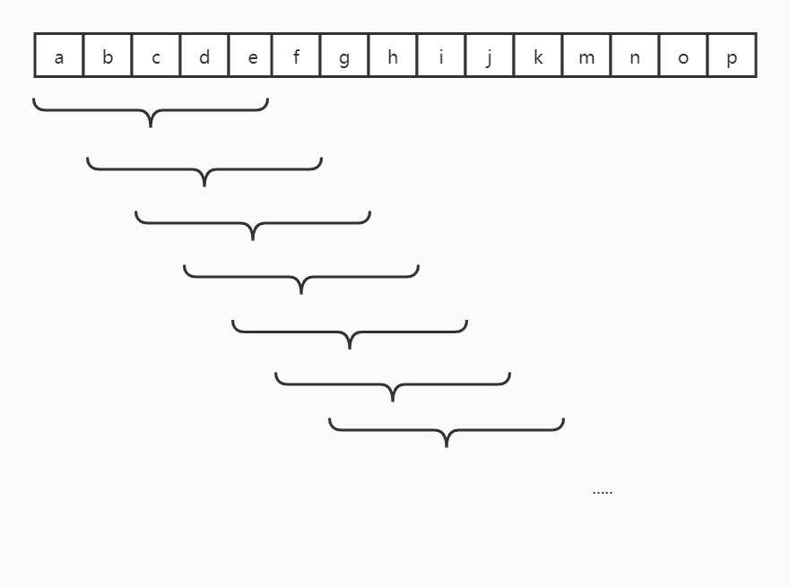

我们可以将其中一串子字符串的数值通过如下的表达式进行表达：
$$
x_i=t_iR^{M-1}+t_{i+1}R^{M-2}+...+t_{i+M-1}*R^0
$$
而通过滑动窗口得到的下一个字符串的数值表达式为：
$$
x_{i+1}=x_iR-t_iR^{M-1}R+t_{i+M}R^0\\
=(x_i-t_iR^{M-1})+t_{i+M}
$$
因此我们可以从上面推导出来的表达式得知：我们可以从之前计算得到关于$x_i$的hash值，进而通过上述的公式计算下一个子字符串的hash值。

这样我们就可以根据模式字符串的hash和文本串在滑动过程产生的hash值一一比较，然后找到那个想要的子字符串的起始下标位置。

```java
import edu.princeton.cs.algs4.StdOut;

import java.math.BigInteger;
import java.util.Random;

public class RobinKarp {
    private long patHash;
    private int R = 256;
    private long Q;
    private int M;
    private long RM;    //R^(M-1) % Q

    //对Hash值匹配一致的字符串再次执行检验，不过我们这里并没有真正这么做
    private boolean check(int i) {
        return true;
    }

    //计算一个长素数
    private static long makeprime() {
        BigInteger prime = new BigInteger(31, new Random());
        return prime.longValue();
    }

    //使用Horner方法计算R进制M长字符串的Hash值
    private long hash(String str, int M) {
        long h = 0;
        for (int i = 0; i < M; ++i)
            h = (R * h + str.charAt(i)) % Q;
        return h;
    }

    RobinKarp(String pat) {
        M = pat.length();
        Q = makeprime();
        RM = 1;
        for (int i = 1; i < M; ++i)
            RM = (R * RM) % Q;
        patHash = hash(pat, M);
    }

    public int search(String txt) {
        int N = txt.length();
        long txthash = hash(txt, M);

        //若txt中的第一个子字符串就是想要找的，那么直接检验后返回
        if (txthash == patHash && check(0)) return 0;
        for (int i = M; i < N; ++i) {
            //计算：[(x_i + R^(M - 1)) * R + t_(i + M)] mode Q
            txthash = (txthash + Q - RM * txt.charAt(i - M) % Q) % Q;
            txthash = (txthash * R + txt.charAt(i)) % Q;
            if (txthash == patHash && check(i - M + 1))
                return i - M + 1;
        }
        return -1;
    }

    public static void main(String[] args) {
        String txt = "hello world", pat = "world";
        RobinKarp robinKarp = new RobinKarp(pat);
        int index = robinKarp.search(txt);

        StdOut.println(index);
        if (index != -1)
            StdOut.println(txt.substring(index));
    }
}
```


各种子字符串查找算法对比总结：

|    算法     | 时间复杂度（最坏） | 时间复杂度（一般） | 空间复杂度 | 是否存在文本重复比较（回溯） |
| :---------: | :----------------: | :----------------: | :--------: | :--------------------------: |
|  暴力匹配   |        $MN$        |       $1.1N$       |    $1$     |              ✔               |
|     KMP     |        $3N$        |       $1.1N$       |    $M$     |              ✘               |
| Boyer-Moore |        $MN$        |       $N/M$        |    $R$     |              ✘               |
| Rabin-Karp  |        $7N$        |        $7N$        |    $1$     |              ✔               |

其中KMP和Rabin-Karp算法的时间复杂度在线性阶，Boyer-Moore算法的时间复杂度在亚线性阶，但两者都需要额外的辅助空间。


### 5.4 正则表达式

常见的正则表达式符号：

|  \|   |                      或操作                      |
| :---: | :----------------------------------------------: |
| （）  |                       括号                       |
|   *   |        闭包操作：前面字符串重复0次或多次         |
|   +   |         闭包操作：前面字符串至少重复1次          |
|  ？   |         闭包操作：前面字符串重复0次或1次         |
|  {n}  |         闭包操作：前面字符串重复指定n次          |
| {m-n} |          闭包操作：前面字符串重复m到n次          |
|   .   |             通配符，表示一个任意字符             |
|  []   |             指定的字符集合中的任一个             |
|   -   | 范围指示，表示从哪个字符开始到哪个字符结束的范围 |
|   ^   |    补集，\[^ab\]表示不包括a、b的所有字符集合     |
|   \   |                     转义符号                     |


NFA代码：

```java
import edu.princeton.cs.algs4.*;

public class NFA {
    private char[] re;
    private Digraph G;
    private int M;

    public NFA(String regexp) {
        Stack<Integer> ops = new Stack<Integer>();
        re = regexp.toCharArray();
        M = re.length;
        G = new Digraph(M + 1);

        for (int i = 0; i < M; i++) {
            int lp = i;
            if (re[i] == '(' || re[i] == '|')
                ops.push(i);
            else if (re[i] == ')') {
                int or = ops.pop();
                if (re[or] == '|') {
                    lp = ops.pop();
                    G.addEdge(lp, or + 1);
                    G.addEdge(or, i);
                } else lp = or;
            }
            if (i < M - 1 && re[i + 1] == '*') {
                G.addEdge(lp, i + 1);
                G.addEdge(i + 1, lp);
            }
            if (re[i] == '(' || re[i] == '*' || re[i] == ')')
                G.addEdge(i, i + 1);
        }
    }

    public boolean recognizes(String txt) {
        Bag<Integer> pc = new Bag<Integer>();
        DirectedDFS dfs = new DirectedDFS(G, 0);
        for (int v = 0; v < G.V(); v++)
            if (dfs.marked(v)) pc.add(v);

        for (int i = 0; i < txt.length(); ++i) {
            Bag<Integer> match = new Bag<Integer>();
            for (int v : pc)
                if (v < M)
                    if (re[v] == txt.charAt(i) || re[v] == '.')
                        match.add(v + 1);
            pc = new Bag<Integer>();
            dfs = new DirectedDFS(G, match);
            for (int v = 0; v < G.V(); ++v)
                if (dfs.marked(v)) pc.add(v);
        }

        for (int v : pc) if (v == M) return true;
        return false;
    }

    public static void main(String[] args) {
        String regexp = "(.*" + args[0] + ".*)";
        NFA nfa = new NFA(regexp);
        In in = new In(args[1]);

        while (in.hasNextLine()) {
            String txt = in.readLine();
            if (nfa.recognizes(txt))
                StdOut.println(txt);
        }
    }
}
```


### 5.5 数据压缩

#### 5.5.1 读写二进制

将文本中的数据以01形式二进制的形式展示：

```java
import edu.princeton.cs.algs4.BinaryIn;
import edu.princeton.cs.algs4.StdOut;

public class BinaryDump {
    public static void main(String[] args) {
        int cnt, width = Integer.parseInt(args[0]);
        BinaryIn bin = new BinaryIn(args[1]);

        for (cnt = 0; !bin.isEmpty(); cnt++) {
            if (width != 0) {
                if (cnt != 0 && cnt % width == 0)
                    StdOut.println();
                if (bin.readBoolean())
                    StdOut.print("1");
                else StdOut.print("0");
            } else bin.readBoolean();
        }
        StdOut.println();
        StdOut.println(cnt + " bits");
    }
}
```

将文本中的数据以十六进制形式输出展示：

```java
import edu.princeton.cs.algs4.BinaryIn;
import edu.princeton.cs.algs4.StdOut;

public class HexDump {
    public static void main(String[] args) {
        int i, bytesPerLine = Integer.parseInt(args[0]);
        BinaryIn binaryIn = new BinaryIn(args[1]);

        for (i = 0; !binaryIn.isEmpty(); ++i) {
            if (i == 0) StdOut.print("");
            else if (i % bytesPerLine == 0)
                StdOut.println();
            else
                StdOut.print(" ");

            char c = binaryIn.readChar();
            StdOut.printf("%02x", c & 0xff);
        }
        StdOut.println("\n" + (i * 8) + " bits");
    }
}
```

将文本中的数据以图片形式展示其中的每一个比特位：

```java
import edu.princeton.cs.algs4.BinaryIn;
import edu.princeton.cs.algs4.Picture;

import java.awt.*;

public class PictureDump {
    public static void main(String[] args) {
        int width = Integer.parseInt(args[0]);
        int height = Integer.parseInt(args[1]);
        BinaryIn bin = new BinaryIn(args[2]);
        Picture picture = new Picture(width, height);

        for (int row = 0; row < height; ++row) {
            for (int col = 0; col < width; ++col) {
                if (!bin.isEmpty()) {
                    boolean bit = bin.readBoolean();
                    if (bit) picture.set(col, row, Color.BLACK);
                    else picture.set(col, row, Color.WHITE);
                } else picture.set(col, row, Color.RED);
            }
        }
        picture.show();
    }
}
```


##### 5.5.1.1  基因数据双位编码

由于生物学中使用ACTG这4个字符来表示DNA中不同的碱基，因此我们对于每一个字符实际上只需要用2个比特就可以实现数据的表示。这样压缩的原理就是：遍历原先表示DNA的字符串，找出每一个字符在ACTG字母表中的下标，然后对这个下标进行2位编码，并在编码后的数据头部加入字符总数以方便解码使用。由于原先每一个字符需要8个比特进行，现在却只需要2个比特就可以完成相同的功能，因此压缩比接近25%.

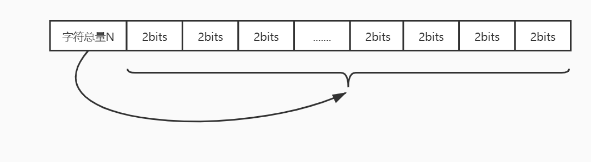

不过这种编码方式压缩和解码的所需要的字母表都是实现两者约定好的，但是在实际的一些情况下可能未必如此，很有可能对方并不知道这些字母表，因此实际编码后的数据中不仅需要指出压缩数据的总量，还需要指出字母表的内容等。

```java
import edu.princeton.cs.algs4.*;

public class Genome {
    public static void compress(BinaryIn bin, BinaryOut bout) {
        Alphabet DNA = new Alphabet("ACTG");
        String s = bin.readString();
        int N = s.length();

        bout.write(N);
        for (int i = 0; i < N; ++i) {
            /* 按照DNA的基数对字符在字母表中的下标进行编码，在这里
             *  基数为2，表示只需要2个比特就可以表示一个原始的字符，
             *  然后将这2个比特写入到比特流中  */
            int d = DNA.toIndex(s.charAt(i));
            bout.write(d, DNA.lgR());
        }
        bout.close();
    }

    public static void expand(BinaryIn bin) {
        Alphabet DNA = new Alphabet("ACTG");
        int w = DNA.lgR();
        int N = bin.readInt();

        for (int i = 0; i < N; ++i) {
            //从bin中读入2位比特，然后将其按照DNA字母表的下标返回原始的字符
            char c = bin.readChar(w);
            StdOut.print(DNA.toChar(c));
        }
    }

    public static void main(String[] args) {
        BinaryIn bin = new BinaryIn(args[1]);
        if (args[0].equals("+"))
            expand(bin);
        if (args[0].equals("-")) {
            BinaryOut bout = new BinaryOut(args[2]);
            compress(bin, bout);
        }
    }
}
```


#### 5.5.2 游程编码

游程编码的思想非常简单，就是依次记录连续的0或者连续的1的个数，例如000000011111111000，则可以被游程编码压缩成用783（其中这些压缩后的每一个数根据实际情况采用多少位来表示，书中假设用8位bits来表示一个数）。

由于游程编码本身就非常依赖数据文件中存在大量连续0或者连续1事实条件，因此在实际中并不适合文本文件的压缩，因为文本文件出现连续0或者连续1的情况太少了，采用游程编码反而会产生更大的压缩文件。

```java
import edu.princeton.cs.algs4.BinaryIn;
import edu.princeton.cs.algs4.BinaryOut;

public class RunLength {
    public static void expand(BinaryIn bin, BinaryOut bout) {
        boolean b = false;
        while (!bin.isEmpty()) {
            char cnt = bin.readChar();
            for (int i = 0; i < cnt; ++i)
                bout.write(b);
            b = !b;//翻转比特值
        }
        bout.close();
    }

    public static void compress(BinaryIn bin, BinaryOut bout) {
        char cnt = 0;//相同比特计数
        for (boolean b, old = false; !bin.isEmpty(); ++cnt) {
            b = bin.readBoolean();
            if (b != old) {
                bout.write(cnt);
                cnt = 0;
                old = !old;
            } else {
                if (cnt == 255) {
                    bout.write(cnt);
                    cnt = 0;
                    bout.write(cnt);
                }
            }
        }
        bout.write(cnt);
        bout.close();
    }

    public static void main(String[] args) {
        BinaryIn bin = new BinaryIn(args[1]);
        BinaryOut bout = new BinaryOut(args[2]);
        if (args[0].equals("-"))
            compress(bin, bout);
        else if (args[0].equals("+"))
            expand(bin, bout);
    }
}
```


#### 5.5.3 霍夫曼编码

霍夫曼树的核心思想很简单，即：不再使用7位或8位的二进制数表示每一个字符，而是使用较少的比特表示表示频率较高的字符，用较多的比特表示出现频率较低的字符。并使用变长前缀码来避免表示不同字符的编码前缀重复的问题。

##### 5.5.3.1 构建霍夫曼树

实现霍夫曼编码的关键在于根据字符的频率构建霍夫曼树。在霍夫曼树中，出现频率较低的字符所处的叶节点距离树的根结点更远，出现频率较高的字符所处的叶节点距离树的根结点更近，且这些字符绝对不会位于树中间路径上的结点中，这样就可以防止某些字符的编码变成了其他字符编码的前缀。


为了构建霍夫曼树，我们必须先遍历一遍整个文本，将文本中的字符频率进行统计。然后根据这个频率表依次为每一个字符创建一个树节点（即一个森林），每一个树节点记录着表示字符的出现频率，然后加入到一个优先队列之中。然后每一次从优先队列中取出频率最小的两个树进行合并成新的树（同时频率也进行相加），然后重新加入到队列之中，直到优先队列中只剩下一个树。此时这个剩下的树便是霍夫曼树。下面演示了霍夫曼树的构建过程：


```java
    /* 构建霍夫曼树 */
    private static Node buildTries(int[] freq) {
        MinPQ<Node> pq = new MinPQ<Node>();

        /* 为频率数组中的每一个（频率）元素构建一群单树节点
          （或者说是一群树，即森林），并将其加入到优先队列之中 */
        for (char c = 0; c < R; ++c)
            if (freq[c] > 0)
                pq.insert(new Node(c, freq[c], null, null));
        /* 从优先队列中取出两棵树合并成一颗新的树，然后重新加入到
        优先队列之中。需要注意的是：其中的两颗树的频率也需要合并 */
        while (pq.size() > 1) {
            Node x = pq.delMin();
            Node y = pq.delMin();
            Node parent = new Node('\0', x.freq + y.freq, x, y);
            pq.insert(parent);
        }
        return pq.delMin();
    }
```


##### 5.5.3.2  构建字符-变长前缀码映射表

为了方便将文本中的字符编码成边长前缀码而不至于为每一个字符去霍夫曼树中查找相应的字符，我们需要为每一个霍夫曼中的字符构建一个字符->变长前缀码的映射表。其实际的操作就是前序遍历，记录每一个到叶节点路径上的编码，然后保存在一个数组之中（我们实际上还是以0101的字符去记录）。

```java
    /* 建立一个字符到二进制编码（仍然以字符形式保存）的映射表格 */
    private static void buildCode(String[] st, Node x, String s) {
        if (x.isLeaf()) {
            st[x.ch] = s;
            return;
        }
        buildCode(st, x.left, s + '0');
        buildCode(st, x.right, s + '1');
    }

    private static String[] buildCode(Node root) {
        String[] st = new String[R];
        buildCode(st, root, "");
        return st;
    }
```


##### 5.5.3.3  写入/读入霍夫曼树二进制数据

为了能够让解码端能够根据压缩后的变长前缀码集合反向解压出原始的文本数据，霍夫曼压缩算法需要将构建的霍夫曼树一同写入到压缩文件之中，并且放置在文件的头部处。同样的，对于解压的一方，解压算法需要从解压文件中获取霍夫曼树的二进制数据，反向构建出霍夫曼树。

对于霍夫曼树的写入，其所采用的方法为：采用**前序遍历**。每当访问到一个中间路径的树节点就向压缩输出文件写入一个比特0；当它访问当一个叶节点，就会写入一个比特1，紧接着写入叶节点中记录的8位ASCII码。

```java
    /* 将构建的霍夫曼树以二进制数据写入到压缩文件中。写入方式为
     * 中序遍历，若遍历到的结点为中间路径节点，就写入一个0；若
     * 遍历到的结点是叶节点，则写入一个1，然后写入对应的字符 */
    private static void writeTries(Node x, BinaryOut bout) {
        if (x.isLeaf()) {
            bout.write(true);
            bout.write(x.ch);
            return;
        }
        bout.write(false);
        writeTries(x.left, bout);
        writeTries(x.right, bout);
    }
```

对于反向构建霍夫曼树，其所采用的方法为：首先读取一个比特以获知当前树节点的类型，若是1则表示是叶节点，此时就创建一个叶节点然后读取后面8位比特获得字符信息然后返回引用；若是0则表示是中间路径节点，此时就创建一个中间路径节点然后递归的构造它的左子树和右子树。这里的代码还是值得学习的

```java
    /* 从压缩文件中读取出数据并构建霍夫曼树 */
    private static Node readTries(BinaryIn bin) {
        /* 碰到1，则表示后面的数据是叶节点的字符数据，
            此时新建一个叶节点返回给上一层 */
        if (bin.readBoolean())
            return new Node(bin.readChar(), 0, null, null);
        //碰到0，递归处理下一个二进制数
        return new Node('\0', 0, readTries(bin), readTries(bin));
    }
```

##### 5.5.3.4  压缩/解压算法流程

霍夫曼编码的大致过程：

1. **构建频率表**：遍历文本中的所有字符，记录每一个出现字符的频率
2. **构建霍夫曼树**：遍历文本中所有的字符，根据字符频率使用优先队列构建霍夫曼编码树；
3. **建立字符-编码映射表**：根据上述编码树构建出字符到变长前缀码（仍以字符串形式记录）的对应表；
4. **将霍夫曼树比特化写入到输出文件头部**：对树使用前序遍历，将霍夫曼编码树比特化，方便解压的一方获取编码树信息；
5. **将文本中的字符数量写入到压缩文件**；
6. **为每一个字符执行编码工作**：将变长前缀码写入到压缩文件之中。

霍夫曼解压缩的大致过程：

1. **根据重建霍夫曼树**：根据压缩文件头部信息反向构建霍夫曼编码树；
2. **读取文件字符串长度**；
3. **根据霍夫曼树解码剩余的文件数据**。

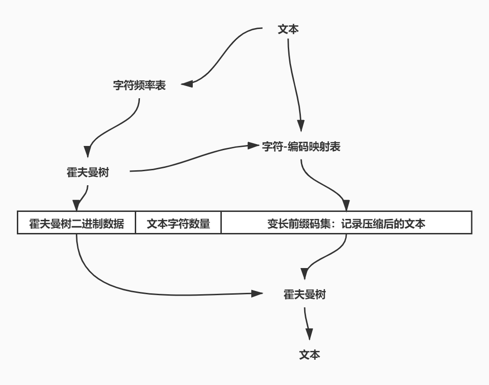

```java
import edu.princeton.cs.algs4.BinaryIn;
import edu.princeton.cs.algs4.BinaryOut;
import edu.princeton.cs.algs4.MinPQ;

public class Huffman {
    private static int R = 256;

    private static class Node implements Comparable<Node> {
        private char ch;        //当前结点表示字符，若为中间路径结点则直接设置为‘\0’
        private int freq;       //当前字符出现的频率
        private final Node left, right;

        Node(char ch, int freq, Node left, Node right) {
            this.ch = ch;
            this.freq = freq;
            this.left = left;
            this.right = right;
        }

        public boolean isLeaf() {
            return left == null && right == null;
        }

        public int compareTo(Node that) {
            return this.freq - that.freq;
        }
    }

    /* 构建霍夫曼树 */
    private static Node buildTries(int[] freq) {
        MinPQ<Node> pq = new MinPQ<Node>();

        /* 为频率数组中的每一个（频率）元素构建一群单树节点
          （或者说是一群树，即森林），并将其加入到优先队列之中 */
        for (char c = 0; c < R; ++c)
            if (freq[c] > 0)
                pq.insert(new Node(c, freq[c], null, null));
        /* 从优先队列中取出两棵树合并成一颗新的树，然后重新加入到
        优先队列之中。需要注意的是：其中的两颗树的频率也需要合并 */
        while (pq.size() > 1) {
            Node x = pq.delMin();
            Node y = pq.delMin();
            Node parent = new Node('\0', x.freq + y.freq, x, y);
            pq.insert(parent);
        }
        return pq.delMin();
    }

    /* 将构建的霍夫曼树以二进制数据写入到压缩文件中。写入方式为
     * 中序遍历，若遍历到的结点为中间路径节点，就写入一个0；若
     * 遍历到的结点是叶节点，则写入一个1，然后写入对应的字符 */
    private static void writeTries(Node x, BinaryOut bout) {
        if (x.isLeaf()) {
            bout.write(true);
            bout.write(x.ch);
            return;
        }
        bout.write(false);
        writeTries(x.left, bout);
        writeTries(x.right, bout);
    }

    /* 从压缩文件中读取出数据并构建霍夫曼树 */
    private static Node readTries(BinaryIn bin) {
        /* 碰到1，则表示后面的数据是叶节点的字符数据，
            此时新建一个叶节点返回给上一层 */
        if (bin.readBoolean())
            return new Node(bin.readChar(), 0, null, null);
        //碰到0，递归处理下一个二进制数
        return new Node('\0', 0, readTries(bin), readTries(bin));
    }

    /* 建立一个字符到二进制编码（仍然以字符形式保存）的映射表格 */
    private static void buildCode(String[] st, Node x, String s) {
        if (x.isLeaf()) {
            st[x.ch] = s;
            return;
        }
        buildCode(st, x.left, s + '0');
        buildCode(st, x.right, s + '1');
    }

    private static String[] buildCode(Node root) {
        String[] st = new String[R];
        buildCode(st, root, "");
        return st;
    }


    /* 压缩 */
    public static void compress(BinaryIn bin, BinaryOut bout) {
        String s = bin.readString();
        char[] input = s.toCharArray();
        int[] freq = new int[R];

        //1、构建字符出现频率数组
        for (int i = 0; i < input.length; ++i)
            freq[input[i]]++;
        //2、根据频率数组构建霍夫曼树
        Node root = buildTries(freq);
        //3、根据霍夫曼树构建字符到二进制编码（该编码还是以字符串的形式记录）的映射表
        String[] st = new String[R];
        buildCode(st, root, "");

        //4、先向压缩文件中写入霍夫曼树
        writeTries(root, bout);
        //5、再向压缩文件写如实际记录的字符数量
        bout.write(input.length);
        //6、最后正式写入由字符翻译成的变长前缀码
        for (int i = 0; i < input.length; ++i) {
            String code = st[input[i]];
            for (int j = 0; j < code.length(); ++j) {
                if (code.charAt(j) == '1')
                    bout.write(true);
                else bout.write(false);
            }
        }
        bout.close();
    }

    /* 解压 */
    public static void expand(BinaryIn bin, BinaryOut bout) {
        //1、先从压缩文件中头部读入二进制数据，构建霍夫曼树
        Node root = readTries(bin);
        //2、再从压缩文件中读入数据字符数量值
        int N = bin.readInt();
        //3、此时根据霍夫曼树翻译其中存储的变长前缀码
        for (int i = 0; i < N; i++) {
            Node x = root;
            while (!x.isLeaf()) {
                if (bin.readBoolean())
                    x = x.right;
                else x = x.left;
            }
            bout.write(x.ch);
        }
        bout.close();
    }

    public static void main(String[] args) {
        BinaryIn bin = new BinaryIn(args[1]);
        BinaryOut bout = new BinaryOut(args[2]);
        if (args[0].equals("-")) compress(bin, bout);
        else if (args[0].equals("+")) expand(bin, bout);
    }
}
```


#### 5.5.4 LZW编码

LZW编码压缩的大致过程，图示见下：

1. **使用128个ASCII字符初始化LZW编译表**（使用三向单词查找树）；
2. **读入输入文件，找到输入字符串在单词查找树中的最长前缀匹配，然后输出（这个前缀字符串）对应的LZW编码**；
3. **使用匹配的键和前瞻字符相连得到一个新键，将其与下一个LZW编码相关联并加入到三项查找树中**。重复上述过程直到输入文本字符串的末尾。


LZW编码解压的大致过程，图示见下：

1. **读入当前编码，查找编译表，输出当前编码对应的字符或者字符串**；
2. **读入下一个编码**（它一定能在编译表中找到）**，然后找到其对应的字符串，取其首字母**；
3. **将当前编码对应的字符或字符串与上面的首字符相连，产生新的字符，然后将下一个LZW编码与之对应**，加入到编译表中；
4. 将当前编码设置为下一个编码的值，重新迭代。


```java
import edu.princeton.cs.algs4.BinaryIn;
import edu.princeton.cs.algs4.BinaryOut;
import edu.princeton.cs.algs4.TST;

public class LZW {
    private static final int R = 156;
    private static final int L = 4096;
    private static final int W = 12;

    public static void compress(BinaryIn bin, BinaryOut bout) {
        String input = bin.readString();
        TST<Integer> st = new TST<Integer>();

        /* 1、将128个字符与其对应的编码加入到三向单词查找树中 */
        for (int i = 0; i < R; i++)
            st.put("" + (char) i, i);
        int code = R + 1;//code记录当前编译表的最大编码

        while (input.length() > 0) {
            /* 2、读入输入文件数据，找到输入在单词查找树中的最长匹配，
             *  然后将对应的编码写入到压缩文件之中， */
            String s = st.longestPrefixOf(input);
            bout.write(st.get(s), W);

            /* 3、然后将匹配字符串+前瞻（下一个）字符合成的字符串加入到
             *  单词查找树中，并为其编入新的LZW码 */
            int t = s.length();
            if (t < input.length() && code < L)
                st.put(input.substring(0, t + 1), code++);
            input = input.substring(t);//将输入字符串的起始位置向后移动
        }

        bout.write(R, W);
        bout.close();
    }

    public static void expand(BinaryIn bin, BinaryOut bout) {
        String[] st = new String[L];
        int i;

        /* 1、构建LZW编码到ASCII字符的反向映射表 */
        for (i = 0; i < R; ++i)
            st[i] = "" + (char) i;
        st[i++] = " ";

        /* 2、从压缩文件中读取第一个LZW编码，并从反向映射表中
         *  查询相应的ASCII字符 */
        int codeward = bin.readInt(W);
        String val = st[codeward];
        while (true) {
            /* 3、将当前LZW编码对应的字符写入到解压文件之中 */
            bout.write(val);

            /* 4、读入下一个LZW编码，根据反向映射表查询其表示字符
             *  或字符串，然后取其第一个字符与当前字符组成新的字符串
             *  加入到反向映射表（并为其编码，这个反向映射表也即编译表） */
            codeward = bin.readInt(W);
            if (codeward == R) break;
            String s = st[codeward];
            if (i == codeward)
                s = val + val.charAt(0);
            if (i < L)
                st[i++] = val + s.charAt(0);
            /* 5、将下一个字符串的设置为当前字符串，重新迭代 */
            val = s;
        }

        bout.close();
    }

    public static void main(String[] args) {
        BinaryIn bin = new BinaryIn(args[1]);
        BinaryOut bout = new BinaryOut(args[2]);
        if (args[0].equals("-"))
            compress(bin, bout);
        else if (args[0].equals("+"))
            expand(bin, bout);
    }
}
```

